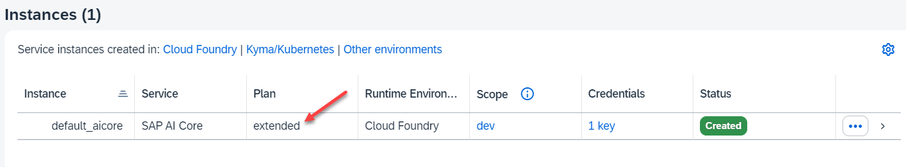

# Setup Generative AI Hub in an Enterprise Account

SAP AI Core is a service in the SAP Business Technology Platform that is designed to handle the execution and operations of your AI assets.

SAP AI Launchpad is a multitenant software as a service (SaaS) application in the SAP Business Technology Platform. You can use SAP AI Launchpad to manage AI use cases (scenarios) across multiple instances of AI runtimes (such as SAP AI Core). 

SAP AI Launchpad also provides generative AI capabilities via the Generative AI Hub.

### Check your Entitlements for AI Core and AI Launchpad

You can set up AI Core and AI Core with different service plans. 

 - With Free Plans with limited capabilities and only community support.
 - Standard for "classic" AI.
 - **Extended** for using the Generative AI Hub

In order to check your global entitlements of your Enterprise Account, open SPA BTP Cockpit and access your Global Account. 

Select "Entitlements" --> "Service Assignments" and search for "AI".

In this case, you see, that you are entitled to the SAP AI Core Service Plan "extended", which allows you to use Generative AI Hub. You can go on with this tutorial.

In addition, you need a **Cloud Foundry Runtime** entitlement.

### Setup AI Core with a Booster

You can set up AI Core either manually or with a BTP booster. In this tutorial, you use the booster. 

For a manual setup, follow this guide [Initial Setup on SAP Help Portal](https://help.sap.com/docs/sap-ai-core/sap-ai-core-service-guide/initial-setup?locale=en-US&q=generative)

**Procedure**

1. In your Global Account, select "Boosters" and search for "AI".

   Select the booster "Set Up Account for SAP AI Core".

    

2. Start the booster "Set Up Account for SAP AI Core".

    

3. Booster Step 1: Check Prerequisites.

    The booster checks your authorizations and entitlements. Note, that he cannot check if you are entitled to the Service Plan "extended".

    

4. Booster Step 2: Select Scenario

    You can either create a new Subaccount or use an existing one. In this example step, you create a new Subaccount.

    

5. Booster Step 3: Provide details for your Subaccount.

    Select Service Plan "Extended". If the booster does not support extended so far, select "Standard". You can fix this later.

    If you create a new Subaccount you have to provide a name and select Provider and Region.

    Choose "Next".

    

6. Booster Step 4: Review and execute booster. 

    It will take some minutes.

    

7. When done a "Success" popup appears. Select "Navigate to Subaccount" (which you just created).

    

8. In your Subaccount navigate to "Services" --> "Instances and Subscriptions". 
 
    You can see the newly created SAP AI Core Instance with Service Plan "Extended" (or "Standard") and the new Cloud Foundry Environment.

    

### Optional: Change the AI Core Service Plan to "Extended"

In case you selected the service plan "Standard", you have to add the service plan "Extended".

1. In You Subaccount go to "Entitlements" and search for "AI". 

    You see that the booster could not select the Service plan "extended". So you have "Standard".

    In order to change this, select "Configure Entitlements" and then "Add Service Plans".

    

2. In the Entitlement popup of your Subaccount, search for "AI" and select "SAP AI Core".

    Select "extended" if you want to use Generative AI Hub and select "Add Service Plans"

    

3. Do not forget to save.

    

4. Now you can change the plan in your AI Core Instance.

   Go to "Services" --> "Instances and Subscriptions", select your AI core Instance and select "Update":

   

5. Change the plan to "extended".

    

    Select "Next" and the "Update Instance" (you don´t need parameters here).

    

6. Updating the Service Plan will take a minute. The result will be:

    
