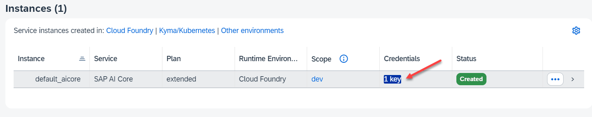

# Setup SAP AI Launchpad for Generative AI Hub

SAP AI Launchpad is a multitenant software as a service (SaaS) application in SAP Business Technology Platform. You can use SAP AI Launchpad to manage AI use cases (scenarios) across multiple instances of AI runtimes (such as SAP AI Core). 

SAP AI Launchpad also provides generative AI capabilities via the Generative AI Hub.

### Setup AI Launchpad with a Booster

You can setup AI Launchpad either manually or with a BTP booster. In this tutorial you use the booster. 

For a manual setup, follow this guide [Initial Setup on SAP Help Portal](https://help.sap.com/docs/ai-launchpad/sap-ai-launchpad/initial-setup?locale=en-US)

**Procedure**

1. In your Global Account, select "Boosters" and search for "AI".

   Select the booster "Set Up Account for SAP AI Launchpad".

    

2. Start the booster "Set Up Account for SAP AI Launchpad".

3. Booster Step 1: Check Prerequisites.

    The booster checks your authorizations and entitlements.
  
     

    Choose "Next".

4. Booster Step 2: Select Scenario

    You can either create a new Subaccount or use an existing one. In this example step, you select the Subaccount you just created.

    Choose "Next".

    

5. Booster Step 3: Configure Subaccount.

    Choose "Standard" as Service Plan. Keep the values for your Subaccount: 

    Choose "Next".

    

6. Booster Step 4: Review and execute booster. 

    It will take some minutes. When done a "Success" popup appears. Select "Navigate to Subaccount".

7. In your Subaccount navigate to "Services" --> "Instances and Subscriptions" you can see the newly created SAP AI Launchpad Subsciption with Service Plan "Standard".

    

8. Optional: Check your Role Assignments

    In your Subaccount, navigate to "Security" --> "Users". Select your user and select "Role Collections" tab.

    You may add additional role collections and replace deprecated role collections, like "ailaunchpad_functions_explorer_editor" with "ailaunchpad_functions_explorer_editor_v2"

    Repeat the same for your User.

    

10. Go back to your "Instances and Subscriptions" and start AI Launchpad.

    You see, that your AI Launchpad does not have yet a connection to an AI Core service.

    

### Create a Connection between AI Launchpad and AI Core

1. Switch back to your Subaccount.

    In your SAP AI Core Instance, click on "key" and download this key.

    

2. Switch back to your AI Launchpad and click on "Add" to add an AI API Connection.

    In the popup, give your connection a name and select the upload symbol in "Service Key"

    

3. Upload the AI Core key-file you just downloaded into the field "Service Key" and click "Save".

    Result: Your connection is established.

    

4. Check your enablement for Generative AI Hub.

    Navigate to "ML Operations" --> "Sceanrios". You should see the "foundation-models" for Generative AI Hub.

    
