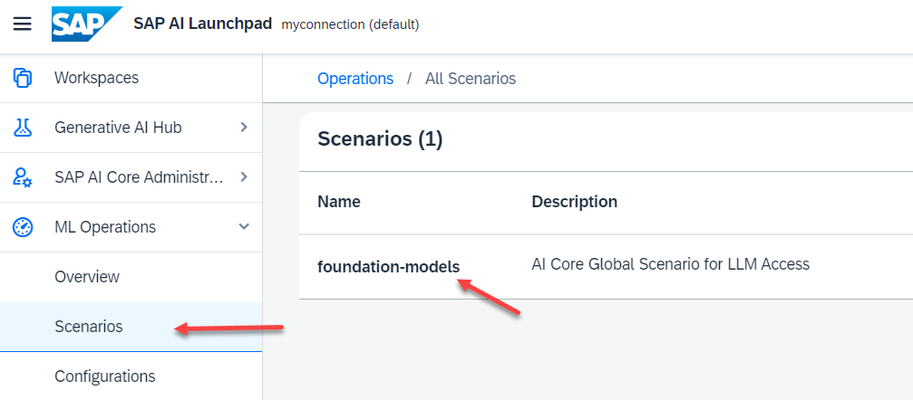
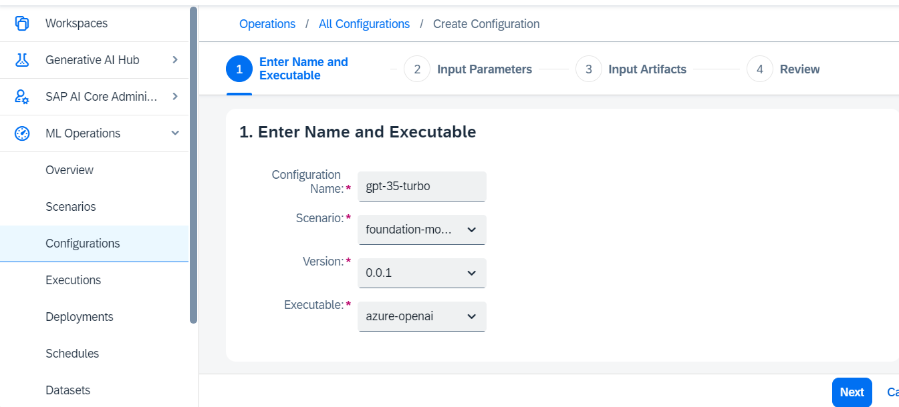

# Setup Generative AI Hub in SAP AI Launchpad

SAP AI Launchpad provides generative AI capabilities via the Generative AI Hub.

On order to use it, you have to set up Generative AI Hub.

### Create a Configuration for Generative AI Hub

**Procedure**

1. Enter your Subaccount for AI Launchpad and open "Services" --> "Instances and Subscriptions" in the Navigation pane. Open your AI Launchpad.

2. Navigate to "ML Operations" --> "Scenarios". Make sure you see the "foundation-models" for Generative AI Hub.

   

3. Open "ML Operations" --> "Configuration" and click "Create"

   

4. Provide a name of your choice. Select Scenario, Version and the "Executable".   

    For more information on Executables, see [SAP Help Portal](https://help.sap.com/docs/sap-ai-core/sap-ai-core-service-guide/models-and-scenarios-in-generative-ai-hub?locale=en-US&q=generative)
    
    

5. Provide the model name (see list of [available models on SAP Help Portal](https://help.sap.com/docs/sap-ai-core/sap-ai-core-service-guide/models-and-scenarios-in-generative-ai-hub?locale=en-US&q=generative)). 

    Keep preset "latest" for model version.

    

6. You cannot provide input artifacts for this executable. Click "Next" --> "Review" and "Create".

### Create a Deployment

You can make LLM available for use by creating a virtual LLM deployment. You can do so once for each model and model version.

1. After having the configuration created , click on "Create Deployment" in your just created Configuration.

    

2. Scenario, Executable and Configuration is already pre-filled if you create your deployment from your configuration.

    Keep the "Standard" Duration. 
    
    Click "Review" and "Create"

    

3. Wait until the "Current Status" switches from "UNKNOWN" over "PENDING" to "RUNNING". This will take a minute.

    

    After deployment you can switch to your Prompt Editor and try your LLM.

### Make a sample Prompt

1. Switch to "Generative AI Hub" --> "Prompt Editor".

2. Make a sample prompt. For example:

    

    

For more samples, see next tutorial or access it directly [Prompt LLMs in the generative AI hub in SAP AI Core & Launchpad](https://developers.sap.com/tutorials/ai-core-generative-ai.html).