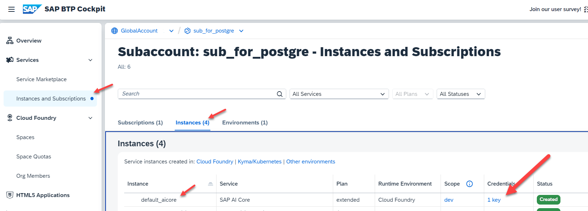
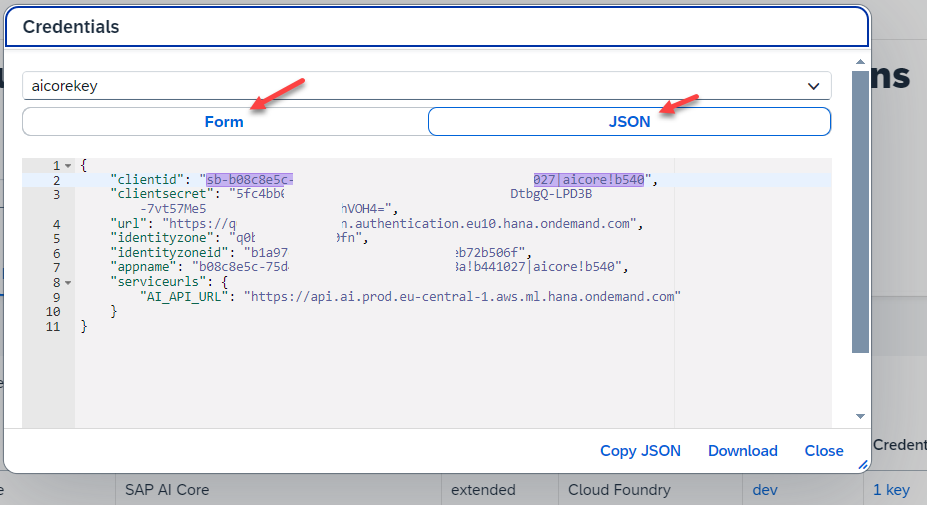
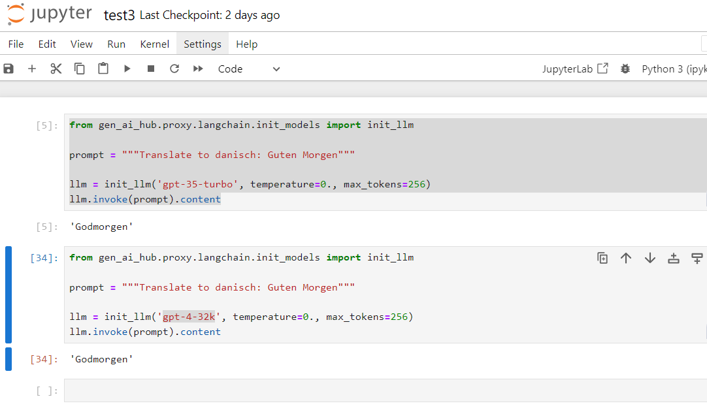

# Set Up Generative AI Hub SDK


### Prerequistes

You need to install required tools on your local client first:

1. Download and install [Python 3](https://www.python.org/downloads/).  

    During installation, choose "Add Python 3.10 to PATH".

    Python 3 includes the command line tool **pip** as python package installer.

2. Use **pip** to install **Jupyter Notebook**. Jupyter is used to execute python code pieces in the form of reusable cells.

    ```Python
    pip install notebook
    ```

    You start Jupyter notebook in your terminal or command prompt:

    ```Python
    jupyter notebook
    ```

For more information, see also the SAP tutorial [Set Up Tools to Connect With and Operate SAP AI Core](https://developers.sap.com/tutorials/ai-core-setup.html#5d9f2539-e1ce-4804-9baa-52a4b8e995d5).


### Install Generative AI Hub SDK

1. To install the [generative-ai-hub-sdk](https://pypi.org/project/generative-ai-hub-sdk/) package in your system, open your terminal or command prompt and run the following command:

    ```Python
    pip install generative-ai-hub-sdk
    ```
    Wait until ist finished.

2. After having installed generative-ai-hub-sdk installed in your system, you need to configure endpoints and credentials in order to access your BTP AI Core instance with Generative AI Hub. 

    You get our endpoints and credentials in the key of your SAP AI Core instance:

 
    

    Click on the key. You have 2 views, either as form or as json format. Choose what you like.

    


3. Optional: Download the key.

    It will look like this:

    ```JSON
    {
        "clientid": "sb-b43nb3n454vb5v435-f34rt433r|aicore!b540",
        "clientsecret": "5fc4d32232r-3d-234-22-3d3d22d2323VOH4=",
        "url": "https://q4r3443f4ewhcfhcbfuu.authentication.eu10.hana.ondemand.com",
        "identityzone": "q4r3443f4ewhcfhcbfuu",
        "identityzoneid": "f32df3f723fd23d23d23dffd7",
        "appname": "b08cfh1873gf3fßg1348fgß83g3f!1027|aicore!b540",
        "serviceurls": {
            "AI_API_URL": "https://api.ai.prod.eu-central-1.aws.ml.hana.ondemand.com"
        }
    }
    ```


4. Set these values as environment variables for AI core credentials using a config file. 

    The default location for this file is **~/.aicore/config.json**. For example in windows the user ~ root directory is "C:/Users/myUser/". The full path is then "C:/Users/myUser/.aicore/config.json".


    ```JSON
    {
      "AICORE_AUTH_URL": "https:// ... .authentication.sap.hana.ondemand.com",
      "AICORE_CLIENT_ID": " ...clientid... ",
      "AICORE_CLIENT_SECRET": " ...clientsecret... ",
      "AICORE_RESOURCE_GROUP": "default",
      "AICORE_BASE_URL": "https://api.ai. ...your region... .cfapps.sap.hana.ondemand.com/v2"
    }
    ```

    For example, yours could like: 

    ```JSON
    {
      "AICORE_AUTH_URL": "https://grhmmnzzzs2343.authentication.eu10.hana.ondemand.com",
      "AICORE_CLIENT_ID": "sb-rtt32434--32e4343-g3h4g3h4!b44342347|aicore!b540",
      "AICORE_CLIENT_SECRET": "3r4r4-65f3-32e3e-8240-23e23e$3e32e-LPD3B-3e23e23e32e3=",
      "AICORE_RESOURCE_GROUP": "default",
      "AICORE_BASE_URL": "https://api.ai.prod.eu-central-1.aws.ml.hana.ondemand.com/v2"
    }
    ```

5. Start Jupyter notebook in command line. 

    ```Python
    jupyter notebook
    ```

6. Run in Jupyter

    **Note:** This will only work, if you have already configured and deployed the `gpt-35-turbo` model in your Generative AI Hub!

    ```PYTHON
    from gen_ai_hub.proxy.langchain.init_models import init_llm

    prompt = """Translate to danish: Guten Morgen"""

    llm = init_llm('gpt-35-turbo', temperature=0., max_tokens=256)
    llm.invoke(prompt).content
    ```

    Optional: You can also try out model `gpt-4-32k`.


    

7. The result should be:

    ```PYTHON
    'Godmorgen'
    ```

Congratulations! You have set up the generative-ai-hub-sdk.
