# Set up API Test Client Postman


### Prerequisites

You need to install an API client first or you use a web-based API Client. There are a lot of API Clients to test APIs. For example [CURL](https://curl.se/) or clients with an UI.

This short tutorial uses Postman. You will need information about the AI Core API.


1. Go to SAP Business Accelerator Hub and open the [AI_CORE_API](https://api.sap.com/api/AI_CORE_API/overview) Overview page.

    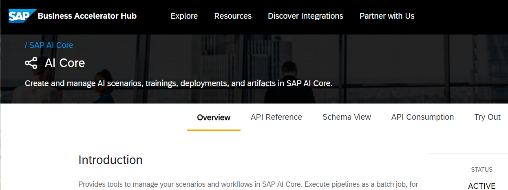

2. Scroll down and download the API Specification as `AI_CORE_API.json` file. In some API Clients, you can import this as an OpenAPI collection.

    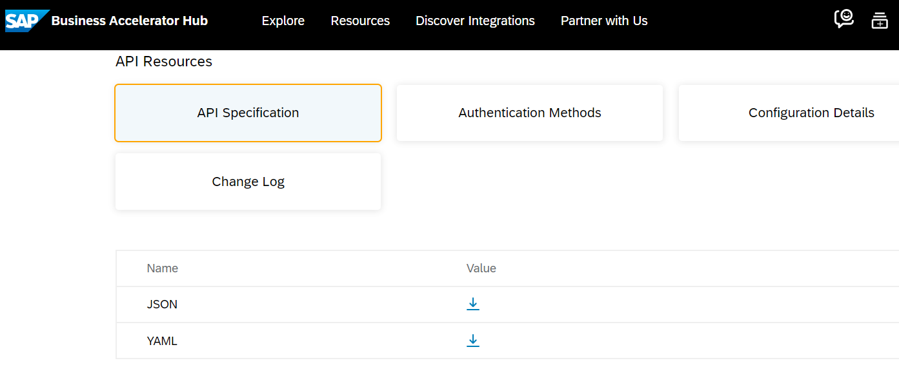

3. Check the Authentication Methods: It is "OAuth 2.0 Application Flow".

   Check the Configuration Details. You see there is no Sandbox URL. You will have to configure access to your production landscape.

4. Click on "API Reference". Open the first entry, "Scenario" and check the first API: **/lm/scenarios**

    You see you will need a header parameter called **AI-Resource-Group** (which is typically "default").


5. Go to SAP BTP Cockpit and open your AI Core subaccount. 

    Open Instances and Subscriptions and open (or download) your AI Core service key.

    

    This is what your key looks like:

    


<br>

### Test AI Core API with the Postman Desktop App

1. Download and install [Postman](https://www.postman.com/downloads/).  

2. Look up in SAP Business Accelerator Hub, for example, the url for "Scenario" and "Get list of scenarios": `/lm/scenarios`.


3. Look up in your AI Core service key your "serviceurls", for example, if you run in EU: "AI_API_URL": https://api.ai.prod.eu-central-1.aws.ml.hana.ondemand.com. 

    You can look up all production urls in [Business Accelerator Hub](https://api.sap.com/api/AI_CORE_API/overview) --> "Configuration Details".

4. Create the API URL. The current version is **`V2`**. 
    The URL is: `https://api.ai.prod.eu-central-1.aws.ml.hana.ondemand.com/V2/lm/scenarios`.

5. Paste the URL in the Postman request bar.

    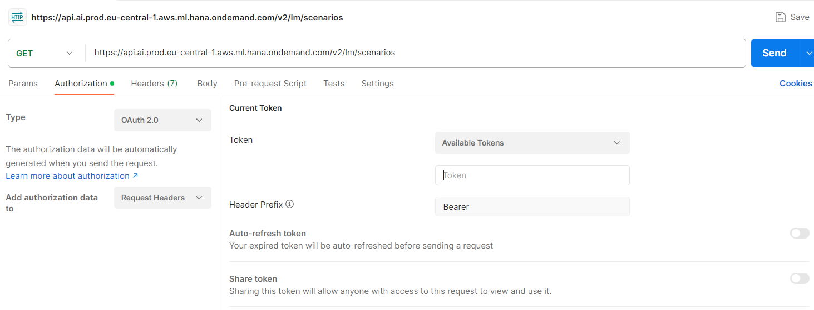

6. Select the tab "Authorization". 

    Select Type **OAuth 2.0**. You know this from the Business Accelerator Hub --> Overview --> Authentication Methods. This type uses "Bearer" tokens. You can see you have no Bearer tokens yet.

7. Scroll down to "Configure a New Token". 

    Select "Grant Type" and "Client Credentials".

    Provide your AI Core service key credentials to Postman.

    - Postman "Client ID": Service key value for "clientid"
    - Postman "Client Secret": Service key value for "clientsecret"
    - Postman "Access Token URL": Service key value for "Url" + `/oauth/token`

    Note: you have to extend the service key URL with `/oauth/token`
    
    for example https://mypersonalid.authentication.eu10.hana.ondemand.com/oauth/token

    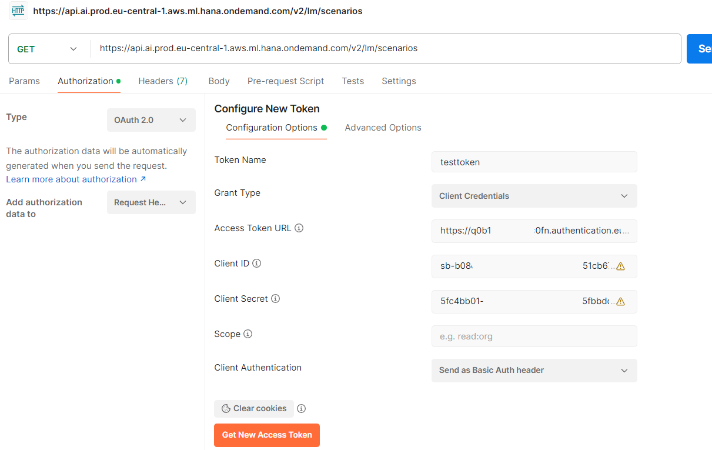

8. Click "Get New Access Token". 

    This will send a request to your authentication endpoint and create a bearer token.

    After successful authentication, you will see a success popup.

    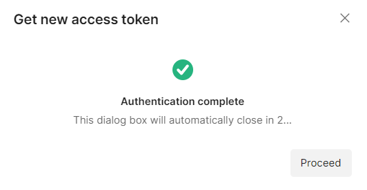

9. Select "Use Token". Postman is now copying the Bearer Token to your "Current Token". 

    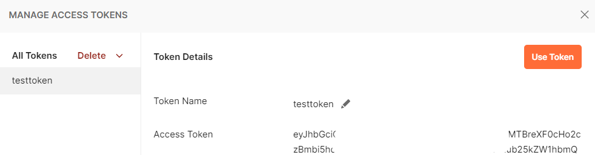

10. Select the tab "Headers".

    Add the key `AI-Resource-Group` and your value, typically `default`.

    You know from Business Accelerator Hub --> `AI Core --> lm --> scenarios --> Get list of scenarios` that you need this additional header parameter.

    
     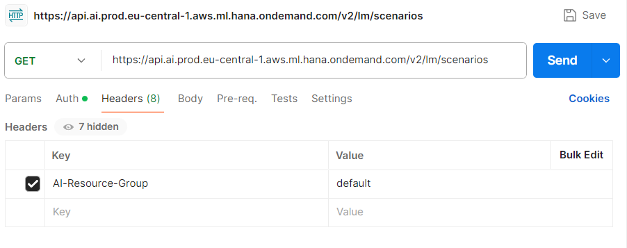

11. Click **Send** and check the result. You should see the scenario ID "foundation-models" in the response body.

     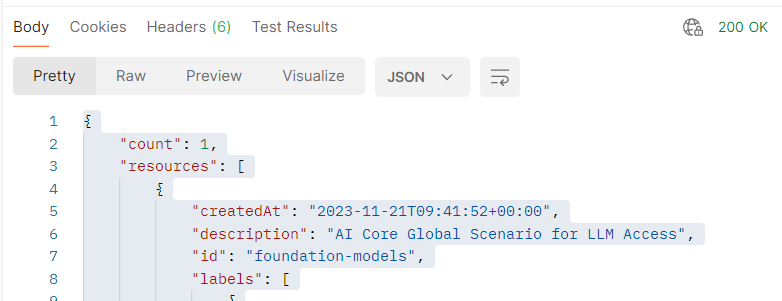


### Get your AI CORE Deployments via API

1. Query your AI CORE deployments. For example for region eu-central-1:

    https://api.ai.prod.eu-central-1.aws.ml.hana.ondemand.com/V2/lm/deployments

2. In this example, there a 3 deployments from previous tutorials. 

    One of them is named "gpt-4". Note down the "deploymentUrl":

    `"deploymentUrl": "https://api.ai.prod.eu-central-1.aws.ml.hana.ondemand.com/v2/inference/deployments/someid"`

    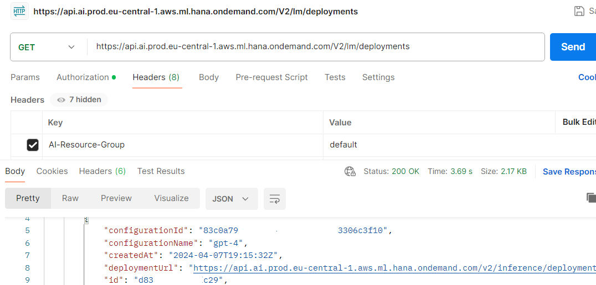


### Access Chat Completions API of your LLM Deployment

1. Choose one of your deployments that you want to access. Note down your "deploymentUrl"

2. Create your **POST** request: {{deploymentUrl}}/chat/completions?api-version=2023-05-15

    For example: `https://api.ai.prod.eu-central-1.aws.ml.hana.ondemand.com/v2/inference/deployments/dt263d6t33t239/chat/completions?api-version=2023-05-15`

    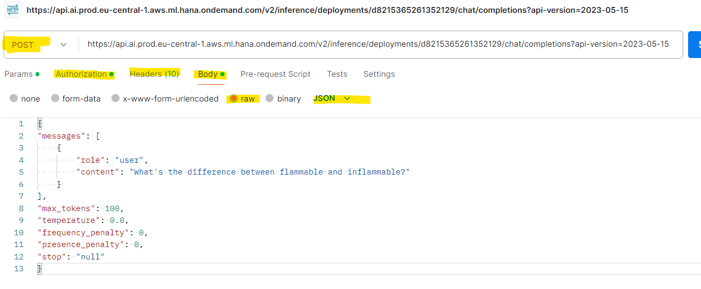

    As "Authorization" choose "Type" "Bearer Token" and provide a valid Bearer Token. E.g. the one you generated in the previous steps.


    As "Body" provide your question message, for example:
    
    ```JSON
    {
    "messages": [
        {
            "role": "user",
            "content": "What's the difference between flammable and inflammable?"
        }
    ],
    "max_tokens": 100,
    "temperature": 0.0,
    "frequency_penalty": 0,
    "presence_penalty": 0,
    "stop": "null"
    }
    ```

    The model parameters "max_tokens", "temperature", etc. are optional. For more information see [SAP Help Portal](https://help.sap.com/docs/sap-ai-core/sap-ai-core-service-guide/consume-generative-ai-models-using-sap-ai-core).

3. The result is for example:

    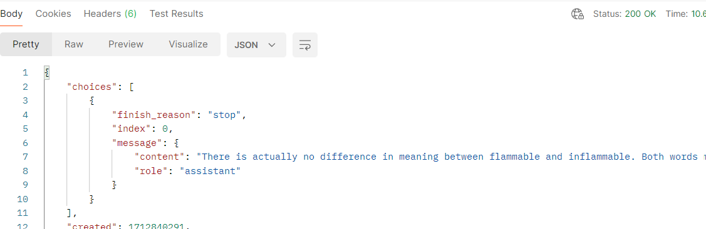


4. For more api-versions from Open AI, see [REST API Completions from Azure OpenAI ](https://learn.microsoft.com/en-us/azure/ai-services/openai/reference#chat-completions)

    Try out `{{deploymentUrl}}/chat/completions?api-version=2024-02-01`. Note the differences in the model. 


