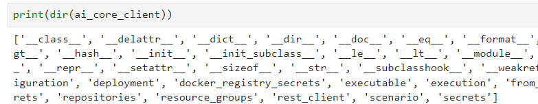
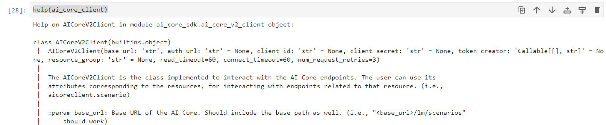

# Set Up AI Core SDK

<!--- Author: Oliver Stiefbold  --->


### Prerequistes

You need to install required tools on your local client first:

1. Download and install [Python 3](https://www.python.org/downloads/).  

    During installation, choose "Add Python 3.10 to PATH".

    Python 3 includes the command line tool **pip** as python package installer.

2. You can use the preferred Python environment of your choice. If you want to use Jupyter Notebook, use **pip** to install **Jupyter Notebook**. 

    Jupyter is used to execute python code pieces in the form of reusable cells.

    ```Python
    pip install notebook
    ```

    You start Jupyter notebook in your terminal or command prompt:

    ```Python
    jupyter notebook
    ```

    

For more information, see also the SAP tutorial [Set Up Tools to Connect With and Operate SAP AI Core](https://developers.sap.com/tutorials/ai-core-setup.html#5d9f2539-e1ce-4804-9baa-52a4b8e995d5).


### Install Generative AI Hub SDK

1. To install the [ai-core-sdk](https://pypi.org/project/ai-core-sdk/) package in your system, open your terminal or command prompt and run the following command:

    ```BASH
    pip install ai-core-sdk
    ```
    Wait until ist finished.

2. After having installed ai-core-sdk installed in your system, you need to configure endpoints and credentials in order to access your BTP SAP AI Core instance.

    You get our endpoints and credentials in the key of your SAP AI Core instance:

 
    

    Click on the key. You have 2 views, either as form or as json format. Choose what you like.

    


3. Download the key and save it in your home directory (for example in the root directory of your Jupyter notebook). Name it 'aic_service_key.json'. Thats the name you use in the examples later.

    It will look like this:

    ```JSON
    {
        "clientid": "sb-b43nb3n454vb5v435-f34rt433r|aicore!b540",
        "clientsecret": "5fc4d32232r-3d-234-22-3d3d22d2323VOH4=",
        "url": "https://q4r3443f4ewhcfhcbfuu.authentication.eu10.hana.ondemand.com",
        "identityzone": "q4r3443f4ewhcfhcbfuu",
        "identityzoneid": "f32df3f723fd23d23d23dffd7",
        "appname": "b08cfh1873gf3fßg1348fgß83g3f!1027|aicore!b540",
        "serviceurls": {
            "AI_API_URL": "https://api.ai.prod.eu-central-1.aws.ml.hana.ondemand.com"
        }
    }
    ```


### Run ai-core-sdk in Jupyter Notebook

1. Start Jupyter notebook in command line. 

    ```Python
    jupyter notebook
    ```

2. Connect to SAP AI Core in Jupyter notebook

    Note, this will only work, if your `aic_service_key.json` is in the same directory as your Jupyter notebook.

    ```PYTHON
    from ai_core_sdk.ai_core_v2_client import AICoreV2Client
    import json

    # Your service key JSON file relative to this notebook
    aic_service_key_path = 'aic_service_key.json'

    # Loads the service key file
    with open(aic_service_key_path) as ask:
        aic_service_key = json.load(ask)

    # Creating an AI API client instance
    ai_core_client = AICoreV2Client(
        base_url = aic_service_key["serviceurls"]["AI_API_URL"] + "/v2", # The present AI API version is 2
        auth_url=  aic_service_key["url"] + "/oauth/token",
        client_id = aic_service_key['clientid'],
        client_secret = aic_service_key['clientsecret']
    )

    response = ai_core_client.repositories.query()
    print(response)
    ```

    The result is for example "0" if you haven't worked yet with AI Core.

3. For more information about attributes of ai_core_sdk.ai_core_v2_client run:
    
    ```PYTHON
    print(dir(ai_core_client))
    ```

    


4. For help information about ai_core_sdk.ai_core_v2_client run: 

    ```PYTHON
    help(ai_core_client)
    ```
    
    The result is:

    


### Queries for AI Core Generative AI Hub

1. Check your Resource Groups if you have already set up your Generative AI Hub:

    ```PYTHON
    response2 = ai_core_client.resource_groups.query()
    print(response2)
    ```
  
    The result is:
    
    `Resources: [{Resource group id: default}], Count: 1` 

2. Check your scenarios:

    ```PYTHON
    response3 = ai_core_client.scenario.query(resource_group = 'default')
    print(response3)
    ```
    
    The result is: 

    `Resources: [{Scenario id: foundation-models, Scenario description: AI Core Global Scenario for LLM Access}], Count: 1`

3. Check you configurations:

    ```PYTHON
    response4 = ai_core_client.configuration.query(resource_group = 'default')
    print(response4)
    ```
    
    The result is e.g.:

    ```bash
    Resources: [{Configuration id: ..., Configuration name: gpt4}, {Configuration id: ..., Configuration name: text-embed}, {Configuration id: ..., Configuration name: gpt-3}], Count: 3
    ```

4. Check you deployments:

    ```PYTHON
    response5 = ai_core_client.deployment.query(resource_group = 'default', scenario_id = 'foundation-models')
    print(response5)
    ```

    The result is e.g.:

    ```bash
    Resources: [{Deployment id: 123265z356z13}, {Deployment id: 54z656z6z6456}, {Deployment id: 3245z56z6325353}], Count: 3
    ```


Congratulations! You have set up the generative-ai-hub-sdk.
