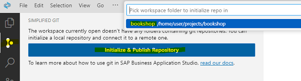
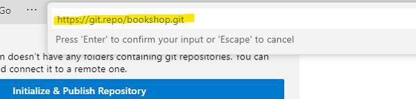

# Optional: Add your project to a Git repository

This step is optional for this tutorial. However it is recommended for tracking changes.

1. Open your Business Application Studio Dev Space .

2. Open the root folder your project, for example "bookshop".

3. Open the Simplified Git View. Click on **Initialize & Publish Repository**.

4. Provide the local project folder.

   

5. Provide the link to your completely **empty** remote repository.

   

6. Hit "Enter" and explore the results in your remote repo.

