# Create a CAP application with Fiori UI in minutes


This tutorial guides you through the process of creating a CAP application, including database and service definition, adding a SAP HANA Cloud database for deployment, adding a SAP Fiori app and deploying it to SAP BTP Cloud Foundry Subaccount.

>Make sure the Prerequisites are fulfilled and a SAP HANA instance is in place.

### Create a Dev Space in SAP Business Application Studio

1. Open your Business Application Studio (BAS).

2. Click on **Create Dev Space** on the SAP Business Application Studio home page.

3. Select **Full-Stack Application** and provide a name of your choice (for example, "CAP") in the upper left corner. 

    Add **SAP HANA Tools** to your Dev Space. This allows you to manage your connection to your SAP HANA Instance and Database.

    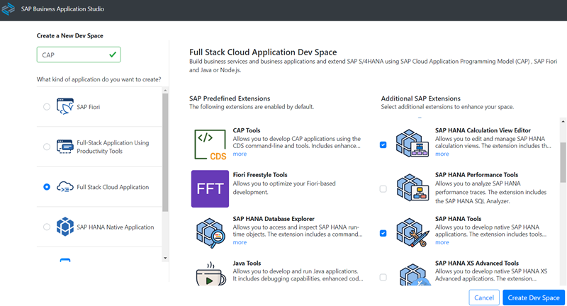

4. Click again **Create Dev Space** in the lower right corner. 

    You will be forwarded to an overview of your dev space(s). It may take some time until the newly created dev space is started. 

    Once started the status changes from "STARTING" to "RUNNING” and the dev space name (in this case "CAP") will turn into a blue hyperlink.

    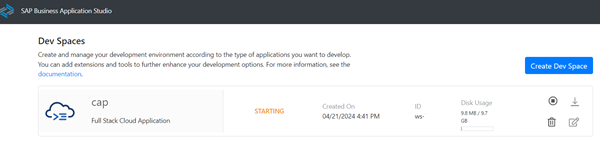

5. Click on your Dev Space name (e.g. "CAP") to enter your space.

    After a few seconds ... you will see the **Home** page of your dev space. 


### Create a new project

1. Click on **Open Folder** in your Dev Space. Select `/home/user/projects/`.

   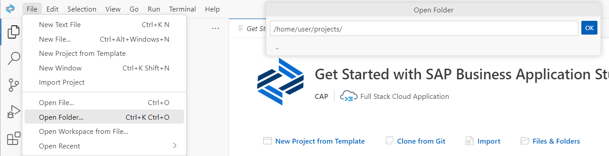

2. You can create a new CAP project either with "New Project from Template" (where you would choose the CAP template) or via "Terminal" (command line). 
   
   This tutorial uses command line, which gives you better insights into the necessary steps.

   Create a new project from command line:

   - In the BAS **menu bar**, select "Terminal" --> "New Terminal".
   - Make sure you are in your projects root folder: `/home/user/projects/`.
   - In the terminal type 
      
      ```
      cds init tinybookshop
      ```

      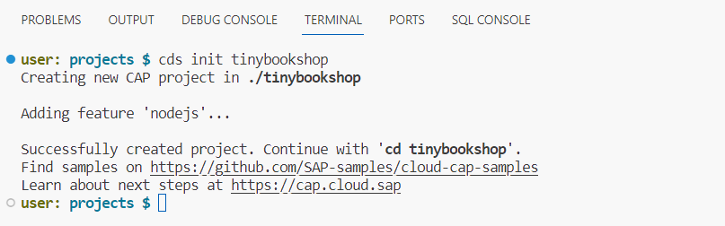

   The **bookshop** project will be created.

3. Change the root directory of your terminal bash. 

    ```bash
    cd tinybookshop
    ```

4. Optional: This is good moment to add git source control. If you submit after each step you can easily reproduce what happens in each step.

    Choose **Source Control** in the left bar (Ctrl+Shift+G) and click "Initialize Repository".

    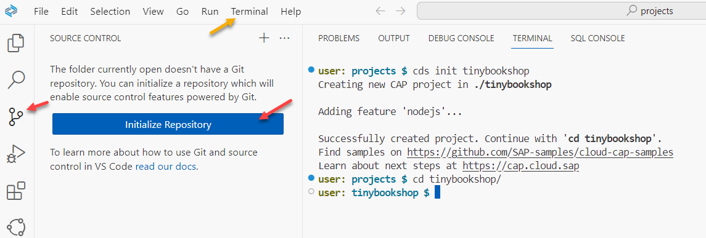

    Enter a message and click **Commit**. 

    Click **Yes** that you want to commit directly.

    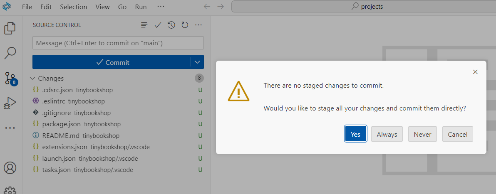

    Switch back to the Explorer view.


5. Create a basic data model with sample data and a service in your terminal.

    ```bash
    cds add tiny-sample
    ```

    Optional: Explore the generated files in bookshop/db and bookshop/srv or in your source control view

6. For the production database, use SAP managed HANA database. 

    It is important to add "--for production", otherwise CAP will not use its built-in in-memory database SQLite anymore in your development environment.

    ```
    cds add hana --for production
    ```

    Optional: Add already the hybrid test configuration, which allows to use a HANA Database in your IDE.

    ```shell
    cds add hana --for hybrid
    ```

7. Add Cloud Foundry [MultiApps Controller "mta.yaml"](https://github.com/cloudfoundry/multiapps-controller) for deployment to SAP BTP Cloud Foundry.

   ```
   cds add mta
   ```

   Optional: Now is a good time to commit your changes to git.

8. Install npm. Use the short version of `npm install`.

   ```
   npm i
   ```

   A `package-lock.json` file will be created.

<br>

### Preview your CAP Application

1. Run your app with development profile in terminal.

   ```
   cds watch
   ```

2. Either start your browser via the link in the terminal log or use the link in the popup.

    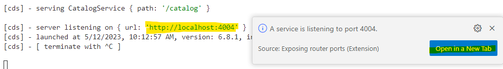

3. Explore the links and the data provided by your CAP service (4 links).

    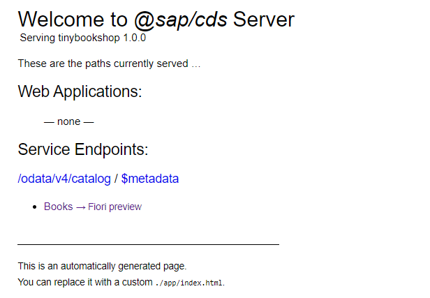

    Optional: Stop the preview in terminal with **CTRL + C**.

4. If you run the "Fiori Preview" on your index page, it is initially empty. 
   Choose "Settings" and configure the columns you want to see.

     Note: This is **not** a Fiori app, it is a build-in preview functionality using Fiori.
     
     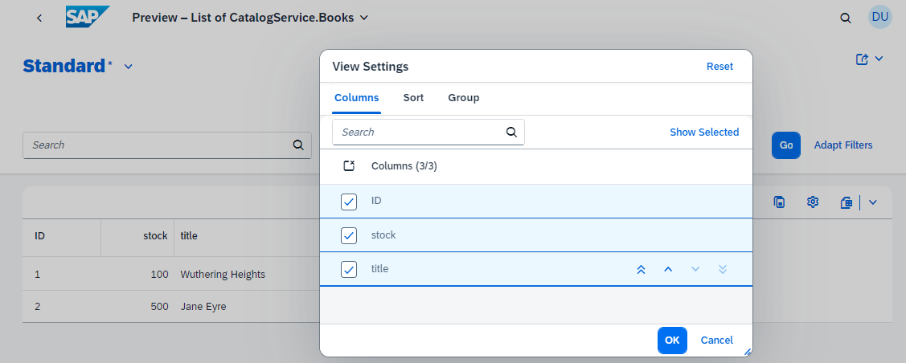


Your CAP service is up and running. It is not yet ready for deployment to Cloud Foundry.


### Add SAP Managed Application Router for Fiori UI

The application router is used to serve static content, authenticate users, rewrite URLs, and forward or proxy requests to other micro services while propagating user information.

This tutorial uses **SAP Managed Application Router**, which requires a subscription to the SAP Build Work Zone service.

The application router is needed for CAP projects if you want to add Fiori apps.

1. Right-click on the file **`mta.yaml`** of your bookshop project. 

    Select "Create MTA Module from Template". 

    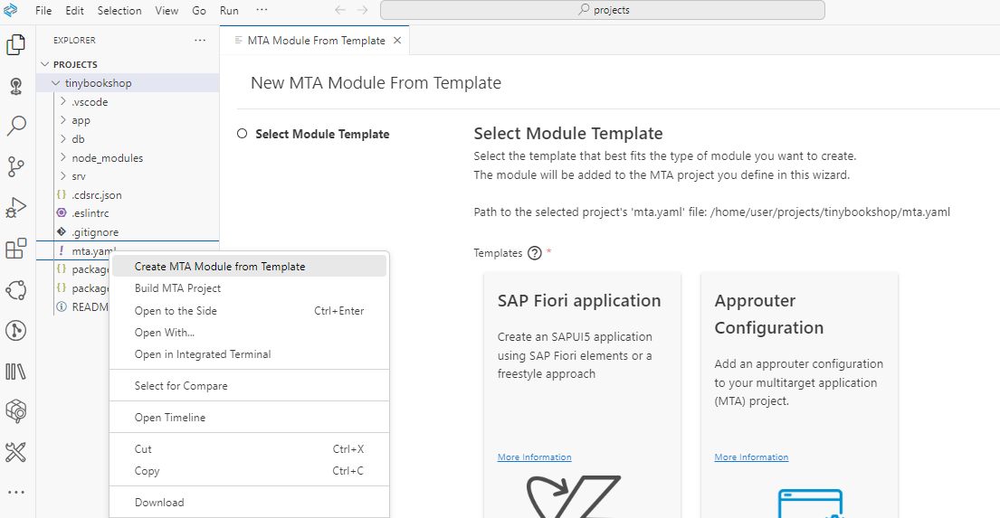

2. A new template page opens, select the module template **"Approuter Configuration"** and click **Start**.

3. Provide the Approuter Configuration:

    - Keep `Managed Approuter` (important).
    - Provide a name for the Approuter, which will be part of the URL. For example `tinysamplerouter`. 
    - Select "Yes", you plan to add a Fiori UI.

    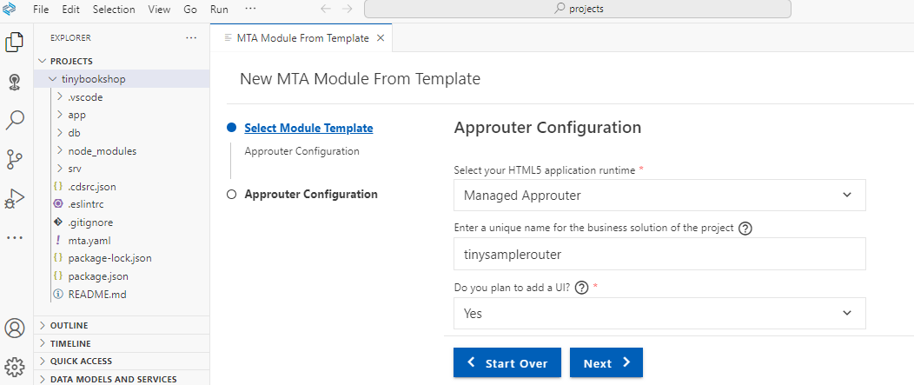
   
4. Click next, this will generate the approuter configuration in `mta.yaml` and you will get a `xs-security.json` file.  

    Optional: Investigate the changes in git and commit.


### Add XSUAA configuration

Add **now** missing [xsuaa](https://sap.github.io/cloud-sdk/docs/java/guides/cloud-foundry-xsuaa-service) dependencies. **Otherwise, deployment will fail**.
    
**Note:** Do not add xsuaa before you added the managed application router. Otherwise, the cds xsuaa configurations will be incompatible with Fiori Tools. 

**Note:** Do not add xsuaa **after** you created your first Fiori app.
   
1. Type in terminal of your project root:

    ```
    cds add xsuaa --for production
    ```
   
    and run npm i to add the new packages:

    ```
    npm i
    ```

2. Optional: "cds add xsuaa" does the following changes:
 
   - In file package.json it adds additional dependencies:

     ```json
     "dependencies": {
       "@sap/xssec": "^3",
       "passport": "^0"
     },
     ```
     
     and in production profile:
     
     ```json
     "auth": {
       "kind": "xsuaa"
     }
     ```
  
    - In file mta.yaml it adds name: uaa_bookshop:

      ```yaml
      requires:
        - name: bookshop-db
        - name: uaa_bookshop
      ``` 
  
      and in parameters a new config part.
    
      ```yaml
      parameters:
        path: ./xs-security.json
        service: xsuaa
        service-name: bookshop-xsuaa-service
        service-plan: application 
        config:
          xsappname: bookshop-${org}-${space}
          tenant-mode: dedicated
      ``` 

3. Optional run `cds watch`.


### Generate a Fiori app

1. Right-click on the file **`mta.yaml`** of your bookshop project.

    Select "Create MTA Module from Template". 

2. A new template page opens, this time select **SAP Fiori application** and click **Start**.
   
    Optional: you can also start from command palette: Fiori: Open Application Generator.

3. Select template **List Report Page** and click **Next**. 

4. In step "Data Source and Service Selection", select:

    - Data Source: Use a Local CAP Project
    - Choose your CAP project: tinybookshop
    - OData service: CatalogService (Node.js) 

    Click **Next**.

    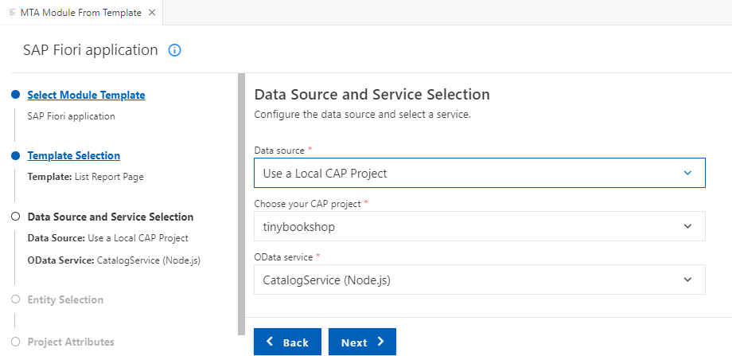

5. Keep your **Main Entity** "*Books*". It is anyways the only one in the project.
   
    Keep **Yes** for "Automatically add table columns to the list page". 

    Otherwise you will not get automatically Fiori annotations for your app and you will have an empty Fiori app, which you have to configure first.

    Click **Next**.

6. In step "Project Attributes", provide:

    - **Module name:** tinybooksui
    - Application title: A tiny Fiori UI for tiny books service (for example)
    - **Application namespace:** my
    - Add deployment configuration to MTA project: Yes 
    - Add FLP configuration: Yes (if you want to deploy to SAP Build Work Zone later, otherwise "No"). 
    - Configure advanced options: No

    Click **Next**.

    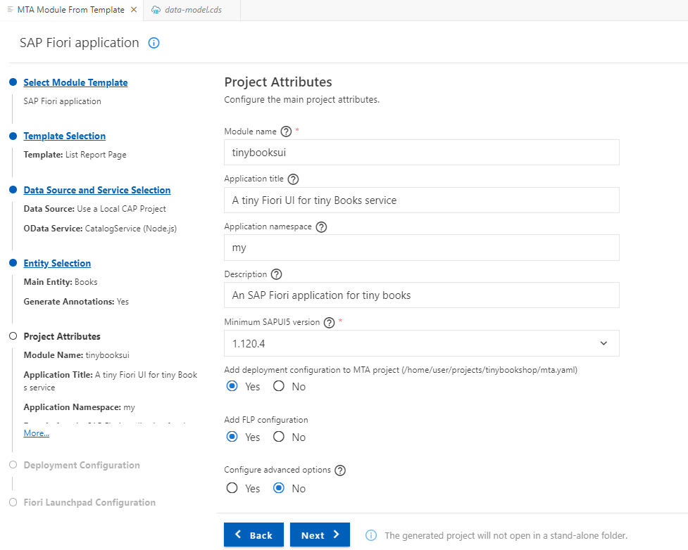

7. In the next step, "Deployment Configuration", provide:

    - Please choose the target: Cloud Foundry
    - Destination name: Local CAP Project API (Instance Based Destination)

    If you have choose add Fiori Launchpad Configuration, provide:
   
    - Semantic Object: semanticobjecttinybooks
    - Action: show
    - Title: showtinyBooks (for example)

    Click "Finish". 
    
    Wait until the files are generated...


8. Run `cds watch` in terminal and open your "local" preview.

9. You have a new entry in "Web Applications", your Fiori app `/booksui/webapp/index.html`. 
   
    Click on it. 

    In the Fiori app, click on **`Go`** to get the data. (this is how initial Fiori apps work)

    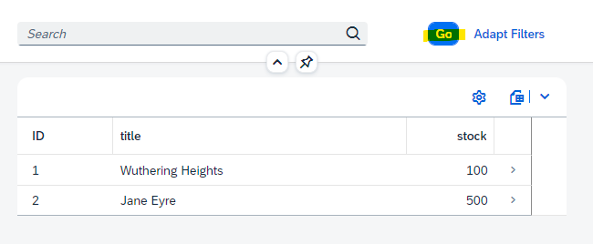

    Optional: stop cds watch.

    Optional: Commit changes.


### Optional: Enable Draft Support

CAP, as well as SAP Fiori elements, provide out-of-the-box support for drafts. You can use draft when your application needs data input by end users.

1. Open your service definition `cat-service.cds`.
 
    You see the tiny sample just provides "readonly".
 
    ```bash
    using my.bookshop as my from '../db/data-model';

    service CatalogService {
        @readonly entity Books as projection on my.Books;
    }
    ```

2. Replace the `@readonly` annotion with `@odata.draft.enabled`:

    ```bash
    using my.bookshop as my from '../db/data-model';

    service CatalogService {
        @odata.draft.enabled entity Books as projection on my.Books;
    }
    ```

3. Run "cds watch" and select your web application on the index page to see your a Fiori app.

    You can now create and delete entries. In the detail view, you can edit existign entries. Try it out.
    
    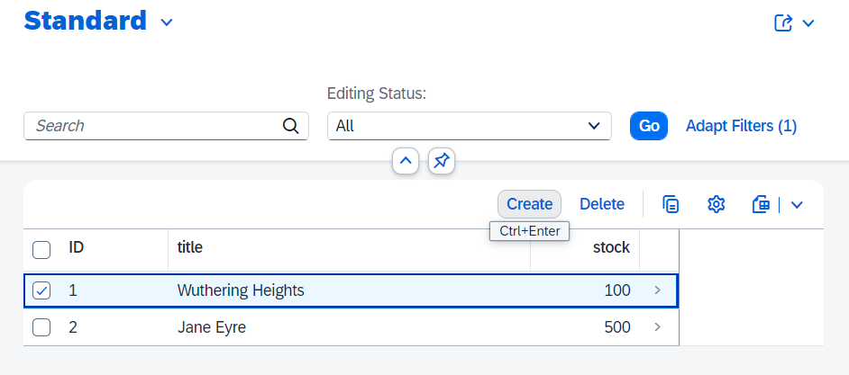
        


### Appendix

A second option to create a new project is to run "new project from template" in BAS.
   
1. On the **Get Started** page click Click "Start from Template". 

   Hint: You can always reopen the page in the menu bar, select "Help" --> "Get Started.

2. Select **CAP Project** and click **Start**

3. Provide the project name **tinybookshop**. Keep the Node.js Runtime and leave all other options not checked..
   
4. **Finish**. Same result as `cds init`.

 
Congratulations! You have just developed your first CAP app with an SAP Fiori UI!


