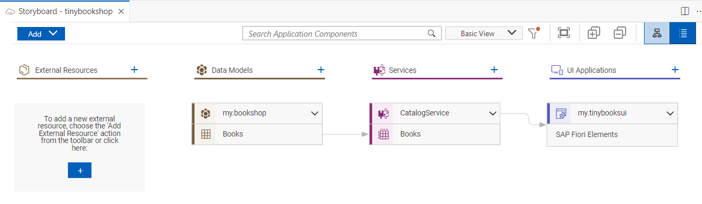
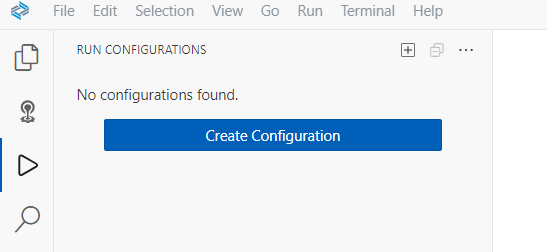

# Use Storyboard and Run Configurations

## Prerequisites

Make sure you have finished the previous tutorial.

1. Open your Business Application Studio (BAS).

2. Open your Full-Stack Application Dev Space.

3. Open your project "tinybookshop"

### Optional: Use Storyboard

1. Open in BAS menu bar: "View" --> "Command Palette" (Shortcut Ctrl+Shift*P) and type **Open Storyboard**. 

    The Storyboard opens:

    

2. Open Graphical Modeler from Storyboard. 

    Right-click on your service and select **Open in Graphical Modeler**. 

    

    You can browse, extend and change your service here.

    And you can do the same with your data model.
   

3. If you click into the header of the Service "Books" you can select "Show Details"

    
   
4. In the Details view you can for example change the Settings of your service.

    

4. Note: you can open the Graphical Modeler also from your schema.cds or your service.cds with right-click and "Open With..." and the select the Graphical Modeler.

### Optional: Use run configurations

1. From the left side menu, open the **Run Configurations** view.

   Alternatively you can open it in Command Palette. Type: "View: Open Run Configurations".
   
   

2. Click **Create Configurations** at the top of the view to add a new configuration.

3. Select `tinybookshop (development profile)` as the runnable application from the command palette prompt.

    

4. Hit `Enter` to use the default name for the configuration. 
   A new configuration **Run tinybookshop-1** is added to the run configuration tree.

5. Click the right green arrow on the right of the configuration name to run the application.

    Make sure you do not run another preview command already.

    

6. A popup appears, click **Open in New Tab**. 

   The application opens in the browser. 

   Unlike using *cds watch* there is no link provided in the log.

7. Stop your application by clicking on the red square.

   

Congratulations! You have finished this tutorial!

