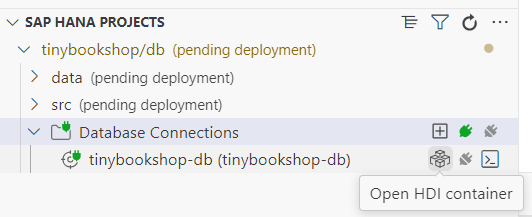

# Build and Deploy your Tiny-Sample App to Cloud Foundry
        


### Login to your Cloud Foundry Subaccount


1. Login to Cloud Foundry. Open Command Palette (`CTRL + Shift + P`) and search for "CF: Login to Cloud Foundry" and select it.


2. Important: Make sure you use the correct **API Endpoint** from your CF Subaccount. You find it in the Overview page of your Subaccount.

   

3. Enter username (email) and password or SSO Passcode.

4. You now have to select Cloud Foundry Organization and Space

    Option 1: Choose your CF Organization and Space (for example "dev"), where you have SAP HANA Cloud installed. 

    Option 2: In case you use SAP HANA Cloud Central (HANA is not deployed in Cloud Foundry), use the CF Organization and Space, which you mapped in your target HANA Cloud Database.
  
    Tip: If you skip the CF login, just run "CF: Login" again.

5. Choose **Apply**. 

Optional: Now is a good time to commit all changes in your project before you configure the database connection, build the project and deploy it.


### Check your Subaccount Entitlements for HANA Cloud 

These steps show the Enterprise Account steps. Trial Account might look different.

1. Open your Subaccount in BTP Cockpit which is your deployment target.

2. Go to `Entitlements` and search for `hana`.

3. Check, that you are entitled to use **SAP HANA Schemas & HDI Containers**: 

    

4. If your subaccount is not entitled, click **Edit** and **Add Service Plans**.

    - Search for `hana`
    - Click "SAP HANA Schemas & HDI Containers"
    - Add your entitlements
    - Click "Add Service Plans"

    

5. Do not forget to click "Save" back on the Entitlements page. Double check, that you are entitled.


### Configure your HANA Cloud Database

You can skip this procedure, if you deploy to a Cloud Foundry based HANA Database. 
It is mandatory if you use a HANA Cloud database, which runs outside Cloud Foundry.

1. In Explorer, open the outline **SAP HANA Projects**.

    Note: You will only see this outline if selected "HANA Tool" in the set up of your BAS Dev Space.

    

    You see, that you have defined a required database connection "tinybookshop-db" in your multiapps controller, but it is not yet connect to a database.

2. Click on your "tinybookshop-db" configuration and click "bind".

    A popup appears: Select "Bind to an HDI container".

    An SAP HANA HDI container consists of a design-time container and a corresponding run-time container.

    


    Note: If you get the error message "No hdi-shared plan available found in this space", you need to entitle your Subaccount first. Please refer to SAP HANA Cloud set-up tutorial. 

3. Select "+ Create a new service instance"

    

4. Name it `tinybookshop-db`. That's the name for the database in your mta.yaml which created Core Data Services (cds) for you.

    

5. Select "Enable" for automatic undeployment if the popup appears.

6. The binding starts with a progress bar
  
    

7. Once finished, you can see the connection in the HANA Database Explorer too.

    

    

    Note: Tables are empty, as you did not deploy yet anything

8. You have also the option to deploy you CAP database definition from here, which you could use for example for hybrid development:

    


If you need more training on SAP HANA Cloud try the tutorial mission [Jump Start Your SAP HANA Cloud, SAP HANA Database (free tier or trial)](https://developers.sap.com/mission.hana-cloud-database-get-started.html) or [Get Started with SAP HANA Cloud](https://developers.sap.com/mission.hana-cloud-get-started.html).

Now you are prepared to deploy your CAP application in SAP HANA Cloud Central.


### Build and Deploy to Cloud Foundry

1. Right-click on file `mta.yaml` and select "*Build MTA Project*". 

    Alternatively use terminal:

    ```
    mbt build
    ```

2. Right-click on file `mta_archives/tinybookshop_1.0.0.mtar` and select "*Deploy MTA Archive*". 

    Alternatively use terminal:

    ```
    cf deploy mta_archives/tinybookshop_1.0.0.mtar
    ```

    

3. Wait until deployment has finished. You can track progress in your terminal.

8. Go to your Cloud Foundry Subaccount. Check that deployment was successful.

    Open your Subaccount and your Cloud Foundry **Space**, where you deployed your application to.

    Under Applications, you see 2 new entries. Don't start the bookshop-db-deployer. Its sole purpose is to deploy the bookshop schema with an HDI-Container.

    

    You can open the service `tinybookshop-srv`. But it requires now authentication, which you can't provide in a plain browser.

    
9.  In your Subaccount Space, navigate to "Services" --> "Instances". You see 4 new entries.

     


10. In your Subaccount, navigate to "HTML5 Applications" in the left navigation pane.
  
     HTML5 Applications will only be available if you subscribed to SAP Build Work Zone. 

     Click on your app `mytinybooksui``:
 
     

11. The app should look the same as in your dev environment. 

     Note: It now consumes 1 unit of your Cloud Foundry Quota.

     


Congratulations! You have just deployed your first CAP app with an SAP Fiori UI!

