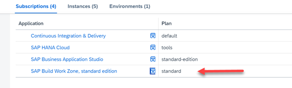

# Add your Fiori App to SAP Build Work Zone


## Prerequisites

Make sure you have finished the previous tutorial.


### Add FLP Configuration to your Project

1. Open your Business Application Studio (BAS), your Dev Space and your project "tinybookshop".

2. Check if you have created an FLP configuration. 
   
    Open in project explorer the file tinybookshop --> app --> tinybooksui --> webapp --> manifest.json. Search for `crossNavigation``.

    

3. If you have no FLP configuration, add one. Open View --> Command Palette (Ctrl + Shift + P) and type "Fiori: Add Fiori Launchpad Configuration".

    The Fiori Launchpad Configuration Generator opens. Provide the following parameters:

    - Semantic Object: semanticobjecttinybooks
    - Action: show
    - Title: showtinyBooks (for example)

4. Check the value of sap.cloud in your manifest.json. 

   In case you named your managed approuter for exmplae "tinysamplerouter", it should be:

    ```bash
    "sap.cloud": {
      "public": true,
      "service": "tinysamplerouter"
    }
    ```

5. Build and deploy your application if it has changed.


### Integrate your HelloWorld app into SAP Build Work Zone

1. Open your Subaccount in your SAP BTP Cockpit.

2. Navigate to Services --> Instances and Subscriptions in the left navigation pane.

3. Select in Subscriptions "SAP Build Work Zone, standard edition".

    

    The Launchpad Site Manager opens in a new window.

    Note: If you get the error message "Access Denied", your user has not been assigned the role collection Launchpad_Admin. Go to Security --> Users, click on your user and assign the Launchpad_Admin role collection to your user.

4. Create a new Site. Name it for example "Tiny Books"

    


5. Open the Channel Manager. 

    Refresh the Content Channel. Otherwise it will stay empty.

    

6. Open Content Manager, and the Content Explorer.

    

7. In Content Explorer, enter the Channel "HTML5 Apps".

    


8. In Content Explorer, add your Fiori UI to the Site Content Manager.

    


9. Go back to Content Manager and create a "Group".

    

10. Name it for example "tinyGroup" and assign your Fiori app to the group.

     Click "Save".

     

11. Go back to Content Manager and repeat the same for the Role "Everyone".

     

12. This should be the result:

     

13. Go Site Directory and enter your site "Tiny Books" by clicking on the small "Go To Site"-icon.

     

14. Click on your "showtinyBooks" tile.

     

15. You tiny Books app will open:

     
