# Optional: Consume a remote service from S/4HANA Cloud 

If you want to use data from other services, you need a connection to these remote services. 
As everything in CAP is a service, remote services are modeled the same way as internal services using CDS.


### Prerequisites 

You need next to BTP an S/4HANA Cloud system with an active **Communication Arrangement** for **Business Partner, Customer and Supplier Integration (SAP_COM_0008)**, short name **BUPA**. In this tutorial you use a **Communication System** for this Communication Arrangement  with **Basic Authentication**. Means you use a technical **Communication User** with password to access the BUPA service.

Prepare your service URL to your Business Partner service in S/4HANA Cloud. It should have a format like:

URL: https://my.......-api.s4hana.cloud.sap/sap/opu/odata/sap/API_BUSINESS_PARTNER/

Open it and verify your technical user and password.


If you don't know how to create such an Communication Arrangement, you can read corresponding SAP Tutorials:

* [Maintain a Communication Arrangement for Inbound Communication](https://developers.sap.com/tutorials/abap-environment-communication-arrangement.html)
* [Create Communication Objects for a Remote OData Service](https://developers.sap.com/tutorials/abap-environment-a4c-inbound-communication.html)
* [S/4HANA Cloud Communication Management Configuration](https://blogs.sap.com/2023/05/14/s-4hana-cloud-communication-management-configuration/)


### Create a new project for remote service consumption

**Procedure**

1. Open your full-stack Dev Space.

2. Create a new project for your external S/4HANA cloud service. Type in terminal:

   ```shell
   cds init consumebupa
   ```
   
   Open your consumebupa folder or workspace or change directory in your terminal.


3. Login to Cloud Foundry. Open in menue bar "View" --> "Command Palette" and select **CF: Login to Cloud Foundry**.

   Choose the right CF Endpoint, provide user and password (or SSO Passcode). Sign in and select your Cloud Foundry Space, for example "dev".

   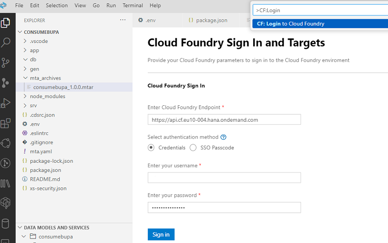


4. Open in Explorer the CAP View --> "External Data Models" --> right-click and select "Add External Service".

   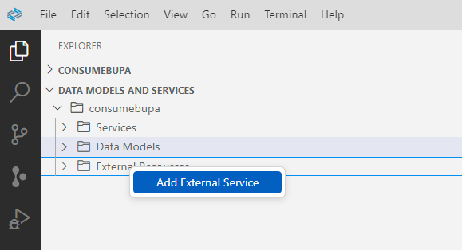

4. The BAS View **Service Center** opens. you can also open the Service Center via Command Palette --> "View: Show Service Center"

   Open **SAP SYSTEM**.

   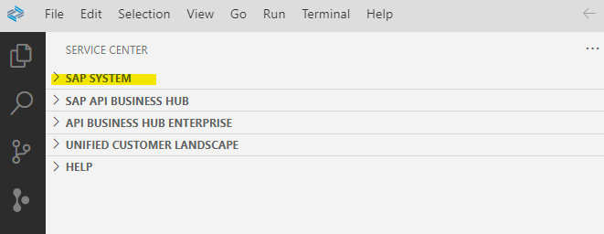


### Create a BTP destination within BA Studio

You can create your BTP destinition to S/4 HANA Cloud either in the SAP BTP Subaccount or here in the Business Application Studio. 

Creating the destination in BAS provides in additional parameters for the destination. You will see this later.

1. Open SAP System in Service Center and clikc "add"

   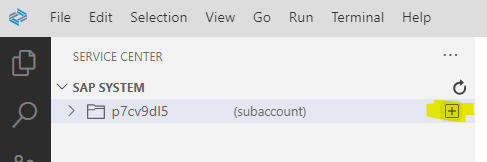


2. Provide the details for your BUPA service.

   Note: Typically you replace SID, with 3-digit SID of your S/4HANA Cloud system.

   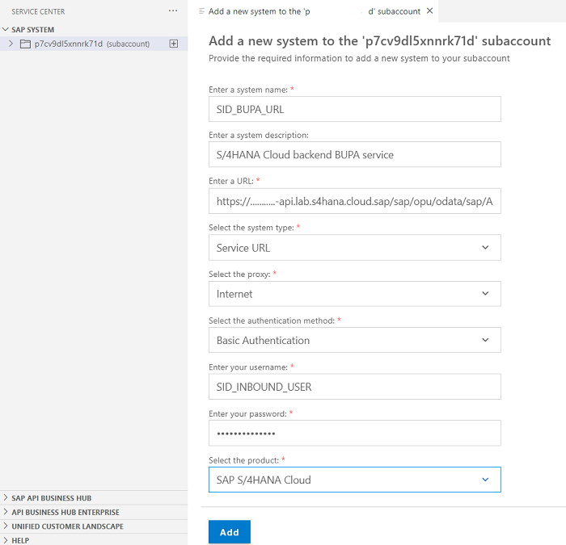


   Click "Add"

3. A new "SAP System" for BUPA will be created. This is how it looks in BAS:

   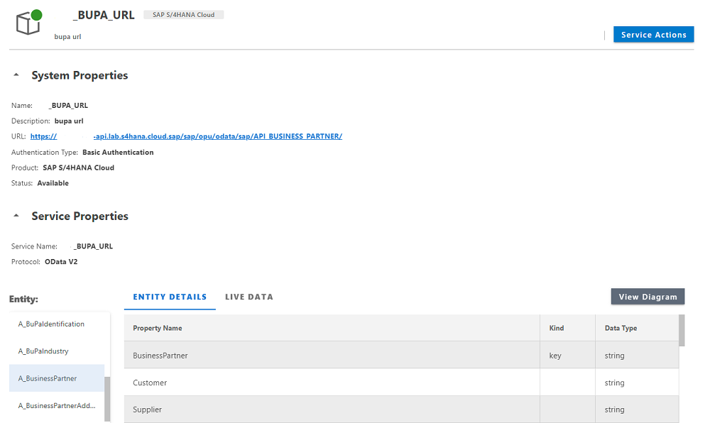


4. The desinition has been created in your BTP Subaccount. 

   Open your Subaccount and select "Desinitations" and your destinition "SID_BUPA_URL. Check the connection.

   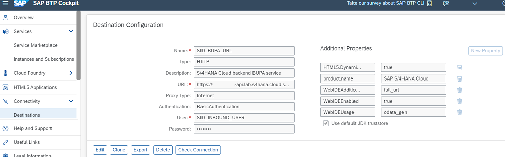


5. In Business Application Studio, open your new "SAP System" "SID_BUPA_URL".

   Click on **Service Actions** in your service page and select **Add Data Model to CAP Project**.

   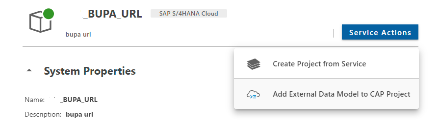


6. Select the project where you want to add the data model, for example `/home/user/projects/consumebupa/`.

   Choose **Yes** for "Do you want to add a sample service?"

   Select "A_BusinessPartner" and "A_BusinessPartnerAddress" and click **Add**.

   You get an info popup: "The data model was added to /home/user/projects/consumebupa/."


7. Close the windows and see what has been created in your CAP project. 

   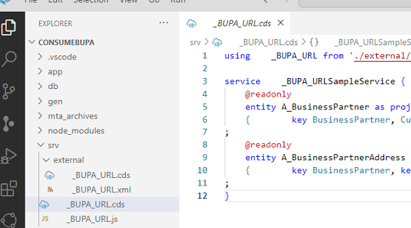

   - The SID_BUPA_URL.xml metadata has been imported to  /srv/externa/ and has been converted to SID_BUPA_URL.cds. 
   - As you selected to add "A_BusinessPartner" and "A_BusinessPartnerAddress" two service definitions have been created.
   - As this is an external service a custom event handler `SID_BUPA_URL.js` has been created.

   ```javascript
   const cds = require('@sap/cds');

   module.exports = async (srv) => 
   {        
      // Using CDS API      
      const SID_BUPA_URL = await cds.connect.to("SID_BUPA_URL"); 
         srv.on('READ', 'A_BusinessPartner', req => SID_BUPA_URL.run(req.query)); 
         srv.on('READ', 'A_BusinessPartnerAddress', req => SID_BUPA_URL.run(req.query)); 
   }
   ```

8. You also got a new entry in "cds-requires" of packages.json.
   However the `"destination"` refers to the backend destination.

   For development add a "sandbox"-destination:

   ```json
   "cds": {
     "requires": {
       "SID_BUPA_URL": {
         "kind": "odata-v2",
         "model": "srv/external/SID_BUPA_URL",
         "[production]": {
           "credentials": {
             "destination": "SID_BUPA_URL"
           }
         },
         "[sandbox]": {
           "credentials": {
             "url": "https://xxxxxxxxx-api.lab.s4hana.cloud.sap/sap/opu/odata/sap/API_BUSINESS_PARTNER",
             "authentication": "BasicAuthentication",
             "username": "SID_INBOUND_USER",
             "password": "mypassword"
           }
         }
      }
   }
   ```

   **Note:** Providing authentication, user and password here is an option, so it is shown as example, but not recommended. Use environment variable instead.

9. Create environment variables file.

   Create a new file in your project root, called **.env** . Add ".env" to gitignore.


   Provide authentication, user and password for the development environment 

   ```json
   cds.requires.SID_BUPA_URL.[sandbox].credentials.authentication=BasicAuthentication
   cds.requires.SID_BUPA_URL.[sandbox].credentials.username=SID_INBOUND_USER
   cds.requires.SID_BUPA_URL.[sandbox].credentials.password=mypassword
   ```

   There are also other authentication options, for more information see: [SAP Business Technology Platform > Extensions](https://help.sap.com/docs/btp/sap-business-technology-platform/btp-extensions?locale=a3142222d2cb40b0b473f53855f571b0.html)


### Test your remote service

Time to test the new application

1. Run in terminal

   ```shell
   npm i
   ```

2. Add missing dependencies and packages.

   ```shell
   npm install @sap-cloud-sdk/http-client @sap-cloud-sdk/util
   ```

3. Run in terminal

   ```shell
   cds watch --profile sandbox
   ```

4. Check the results.

   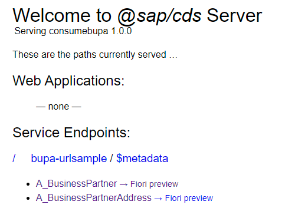

5. Select A_BusinessPartner or A_BusinessPartnerAddress. 
   You typically get some data. Check the result in your browser. It may look like:


   
   ```javascript
   {
      "@odata.context": "$metadata#A_BusinessPartner",
      "value": [
         {
            "BusinessPartner": "10100001",
            "Customer": "10100001",
            "Supplier": "",
            "AcademicTitle": "",

            (...)
   ```
   
   


### Prepare for production

1. Create an mta.yaml for build and deployment information. Run in terminal

   ```shell
   cds add mta
   ```

2. Use an SAP managed application router.

   Right-click on mta.yaml and select **Create MTA Module from Template**. 

   As and alternative open View --> Command Palette and select "Create MTA Module from Template".

3. Select Approuter Configuration and click **Start >**.

4. Optional: If you call the template from a parent folder, you have to specify the project location. 

   Select your project location and click **Next**.


5. Choose a unique name, for example,

   ```json
   consumebupamapprouter
   ```
   
   and "Yes" (recommended) or "No" depending on if you plan to add a custom Fiori UI.

   Click **Finish** the SAP managed approuter will be created.

6. Add now missing authentication dependencies in terminal

   ```shell
   cds add xsuaa --for production
   ```

   Run npm install in terminal to add the new dependencies

   ```shell
   npm i
   ```

7. You get 2 errors in BAS. One in `mta.yaml`.

   You have now 2 dependencies for authentication 
   (`cds add xsuaa` adds a additional `consumebupa-auth`, but does not generate it as an uaa-service is already there)

   ```yaml
   modules:
     - name: consumebupa-srv
    
     (...)

     requires:
       - name: consumebupa-auth
       - name: uaa_consumebupa
   ```

   In addition the "requires" definition for `consumebupa-destination-service` is missing. **Replace** the requires section with

   ```yaml
   modules:
     - name: consumebupa-srv
    
     (...)

     requires:
       - name: consumebupa-destination-service
       - name: uaa_consumebupa
   ```
   
8. Add the new npm packages from authentication. Run in terminal

   ```shell
   npm i
   ```

   3 packages will be added. This removes the errors in package.json.
   
   
9. Optional: Change temporarily your authentication strategy in `package.json`, if you want to test your service in the backend. 

   Set
   
   ```json
   "[production]": {
        "auth": "xsuaa"
      }
   ```
   to

   ```json
   "[production]": {
        "auth": "dummy"
      }
   ```


### Build and deploy

1. Right-click your `mta.yaml` and select **Build MTA Project**

2. Right-click `mta_archives/consumebupa_1.0.0.mtar` and select **Deploy MTA Archive".

   >Note: The .mtar archive will be deployed to cour Cloud Foundry target from your CF login.

3. After deployment has finished, open your SAP BTP Cockpit and open your deployment target, Subaccount and CF Space.

4. Click on your new service `consumebupa-srv`.

   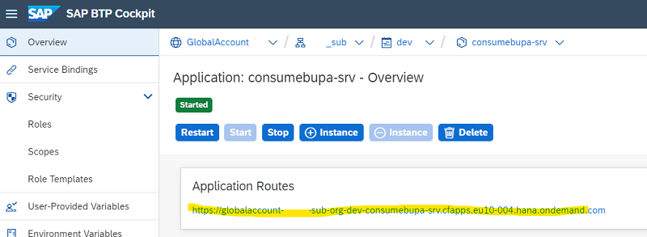

5. Click on the link provided in **Application Routes**

6. On your service home page, click on A_BusinessPartner service. It should look the same as in the dev environemnt.
   
   Well done!


Congratulations! You have finished this tutorial!

