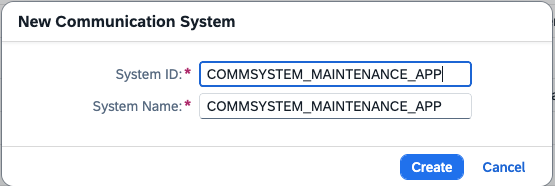

# Create a Communication Arrangement between SAP BTP adn SAP S/4HANA Cloud

The S/4HANA cloud communication management apps allow you to integrate SAP S/4HANA Cloud with SAP BTP (or others) to enable data exchange.

Predefined communication scenarios are available for different use case. For this mission, you use the sceanrio "Maintenance Processing Integration", technical identifier **```SAP_COM_0397```**.

There are different options to integrate SAP BTP with SAP S/4HANA Cloud. 
In this mission, you use a manual, minimalistic approach activating just one communication scenario with basic authentication. For more options, see [SAP Help Portal](https://help.sap.com/docs/SAP_S4HANA_CLOUD/0f69f8fb28ac4bf48d2b57b9637e81fa/2e84a10c430645a88bdbfaaa23ac9ff7.html?locale=en-US&version=LATEST).

Therefore you have to create a Communication User, a Communication System and a Communication Arrangement in S/4HANA Cloud and a destination in SAP BTP.


### Create a Communication Arrangement in S/4HANA Cloud

1. Click on search in your S/4Hana Cloud system and search for "Communication". You will see the three apps you will use.

    

2. Open "Maintain Communication Users". Select "New".

    

3. Create a unique user, e.g. "COMMUSER_MAINTENANCE_APP".

    Provide a password, or generate one (recommended).

    

4. Open the app "Communication Systems". Select "New".

    

5. Provide a System ID and System Name, e.g. COMMSYSTEM_MAINTENANCE_APP

    

6. Provide teh host of your S/4HANA system. Keep the other values.

    

7. Provide the user for Inbound Communication. the one you just created.

    

8. Open the app communication arrangements. Select "New".

    

9. Select the Scenario "SAP_COM_0397".

    

10. Provide the Communication System and the Communication User. Click "Save".

     


### Create a Destination in SAP BTP

Using the SAP destination service, you can retrieve and store technical information about the target resource (destination) that you want to connect with your application to a remote service or a system. For more information see SAP Help Portal [SAP BTP Connectivity, Destination Service](https://help.sap.com/docs/connectivity/sap-btp-connectivity-cf/destination-service).

In this mission you will connect to your S/4HANA Cloud backend system and enable it for consumption in SAP Build Code.

1. Open your SAP BTP subaccount, where you have activated SAP Build Code, navigate to "Connectivity" --> "Destinations".

    Select "Create" --> "From Scratch" and click "Create"

    

2. Provide a name, this mission uses "API_MAINTNOTIFICATION_CC7".

   Select the option "Basic Authentication" and provide User and Password from your S/4HANA Communication Arrangements.

   Provide the URL for your backend service. You find this in your S/4HANA communication arrangement under "Inbound Services" --> "Maintenance Notifications".
   The URL is ```https://myhost-api.s4hana.ondemand.com/sap/opu/odata/sap/API_MAINTNOTIFICATION``` (replace "myhost" with your host).
   
   Provide the following Additional Properties in order to use it in the Build Code development environment.

   - WebIDEUsage: odata_gen
   - WebIDEEnabled: true
   - WebIDEAdditionalData: full_url
   - HTML5.DynamicDestination: true

   Select "Create".

   

3. Check your Connection. 

   


You have setup your Communication Arrangement for this mission.