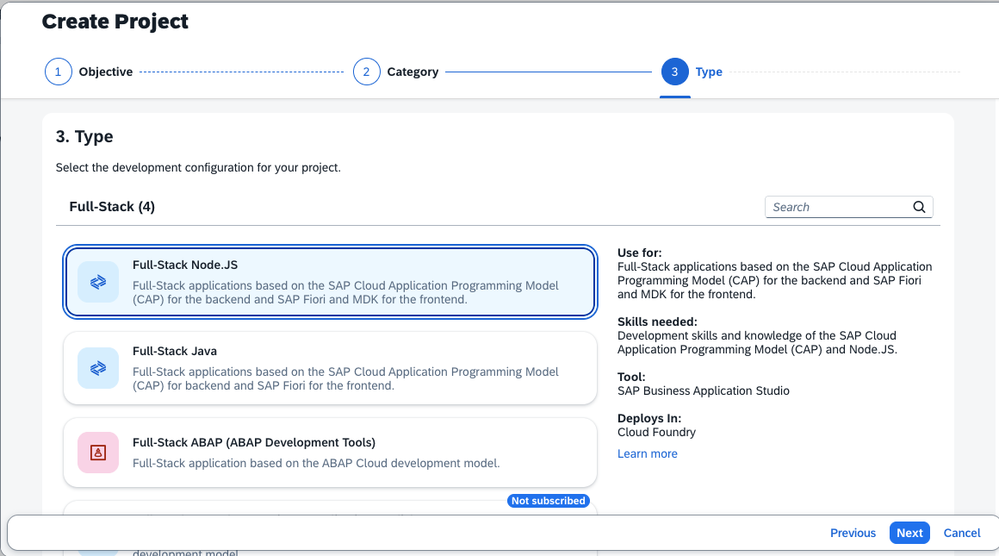
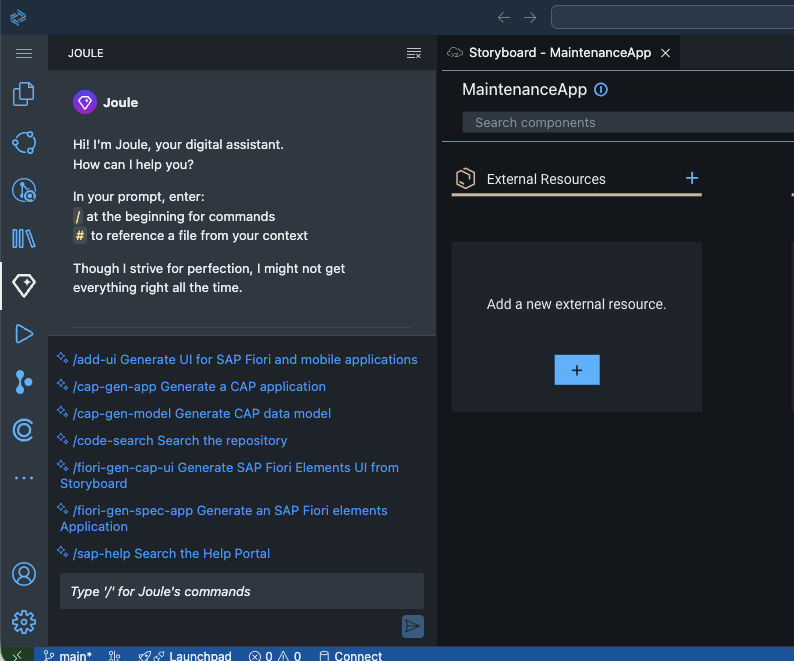

# Create a Maintenance Notifications App with SAP Build Code

Part 1, create the initial application.

### Create a Full-Stack Application Project from the Lobby

1. From your Subaccount open Services --> Instances and Subscription and start "SAP Build Code" (in this picture you see a trial account, which uses a "free" SAP Build Code Service Plan).

   

2. You enter the SAP Build Lobby. Choose "Create" in your Project overview list.

    

3. Choose "Application".

    

4. Choose "Full-Stack".

    

5. Choose "Full-Stack Node.JS".

    

6. Provide Name, e.g. "MaintenanceApp". Keep the Full_Stack Dev Space.

    Choose "Review" and create the project.

    

7. The Project MaintenanceApp will be created, this takes a minute.

    

8. Once the project has been created, click on it and enter the Business Application Studio (BAS).

    

### Create the Mainatenance Notification App

1. In the Studio, click the Joule icon and open the Joule Code Assistant.

    

2. Check available syntax and commands in Joule Code Assistant.

    

3. Enter this command in Joule using natural language and run it:

    ```/cap-gen-app Create a maintenance notification app which contains a problem description and a number of the record, both should be strings.```

    
    

4. Joule Code Assistand will generate an inital app.

    Review the code and "accept" it.

    

5. Once accepted, the generated code block will be applied to the project.

    


### Optional: Test your new basic application

Also the project does not yet has a data source and a UI, you can already test it.

1. Start the project either from "Run Configurations" on the left panel or from the small icon on the top right. It will take some seconds to start it.

    

2. Once started, a new browser window opens. You can check service details and metadata. Click the "view in table" icon in "Services".

    

3. A test UI opens. Click "Go" to load data. You will not have any so far. 

    Choose "Create" to create a new maintenance notification.

    

4. Give the notification a problem description. You can leave the record number empty for now. Choose "Create"

    

5. Go back to the List View and see the new data set.

   You have now an idea how the application works.

    

6. Once done, stop and disconnect the application by clicking on the red square button.

    


