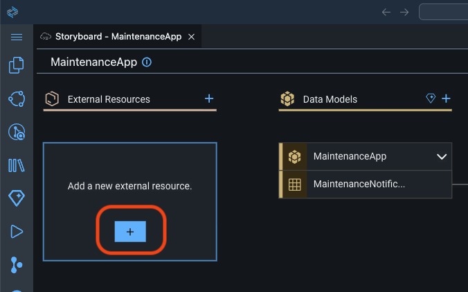
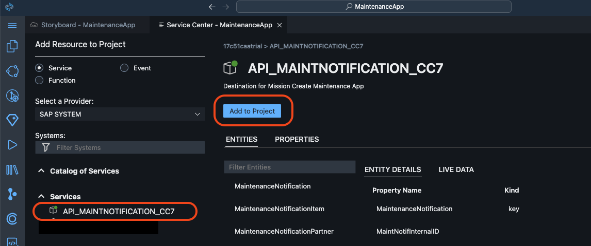
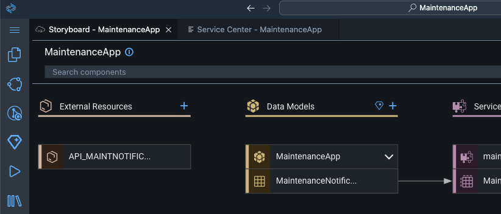
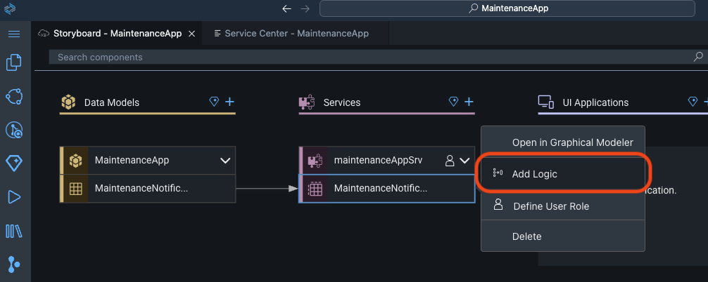
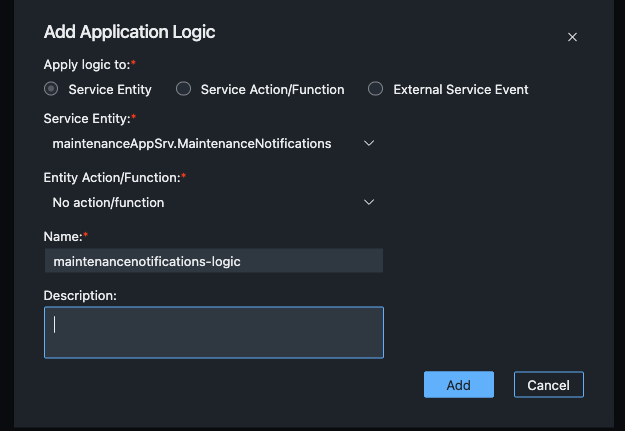
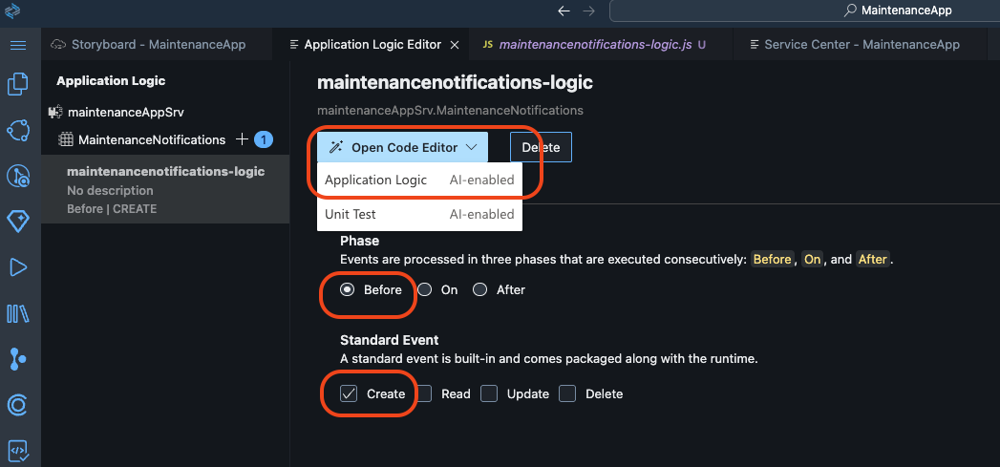
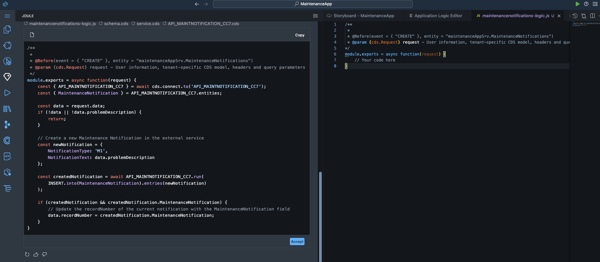

# Create a Maintenance Notifications App with SAP Build Code

Part 2: Extend the application.

### Add an External Resource to your Project

You can now connect your S/4HANA Cloud backend to your application.

1. Click on the "+" to add a new external resource.

    

2. Select "Service" and "SAP System" as Provider.

    Select the BTP destination you created for this mission and select "Add to Project".

    

3. The destination "API_MAINTNOTIFICATION_CC7" will be added as an External Resource. Thus, you can now use backend data instead of sample data.

    


### Add Logic to your Application Service

The next step is to add logic that creates a new maintenance notification whenever a notification is created in SAP BTP. For this, we will create a new CAP handler, which is invoked before a new notification is created in CAP.


1. On the Storyboard under "Services", select MaintenanceNotification -> Then right-click and select "Add Logic".

    

2. A dialog box will appear. Keep the prefilled values and choose "Add".

    

3. In the configuration screen, in the section "Phase", select "Before" Event.

    In the section "Standard Event", select "Create".

    

4. Click "Open Code Editor". This will open a dialog box. Select Application Logic.

    The "maintenancenotification-logic.js" tab will open.

    Go to Joule to create a new maintenance notification with backend data and assign a new record number. Enter this prompt:

    ```
    /cap-app-logic #srv/code/maintenancenotifications-logic.js For each new notification, create a new Maintenance Notification, connect to the external service, and then call it. The Maintenance Notification should have a notification type of "M1", and its notification text should be the problem description. Update the notification’s record number from the MaintenanceNotification field of the new Maintenance Notification.
    ```


    

6. Joule Code Assistant will create a proposal. Review the generated code. To apply the code, click "Accept". The code will be applied to maintenancenotification-logic.js

You created the application logic.
