<!---
parser: v2
auto_validation: true
time: 5
tags: [tutorial>beginner, topic>machine-learning, topic>artificial-intelligence, topic>cloud, software-product>sap-business-technology-platform, tutorial>free-tier]
primary_tag: topic>machine-learning
author_name: Oliver Stiefbold
-->

# Setup SAP Build Code with Free Service Plans for Enterprise Accounts

<!-- description --> Use the "Get Started with SAP Build Code (Free Plan)" SAP BTP booster to create a service instance of SAP Build Code and SAP Business Application Studio.

Make sure you have the entitlement for the [SAP Build Code](https://discovery-center.cloud.sap/serviceCatalog/sap-build-code?region=all&service_plan=standard&commercialModel=cloud) service. 

Setting up a trial account is pretty similar, but is covered in the previous tutorial.

## Prerequisites
- You have an enterprise account on SAP BTP.  
- You are entitled to use the SAP Build Code service with the free service plan.

## You will learn
  - Access your SAP BTP account
  - Create a new subaccount for SAP Build Code (optional)
  - Run the guided **Set up account for Build Code (Free Plan)** booster to assign entitlements, update your subaccount (or create a new one), create a service instance, subscribe to the service, and access the SAP Build lobby

---

### Go to your SAP BTP account

1. Open the [SAP BTP cockpit](https://emea.cockpit.btp.cloud.sap/cockpit).

2. Access your global account.

   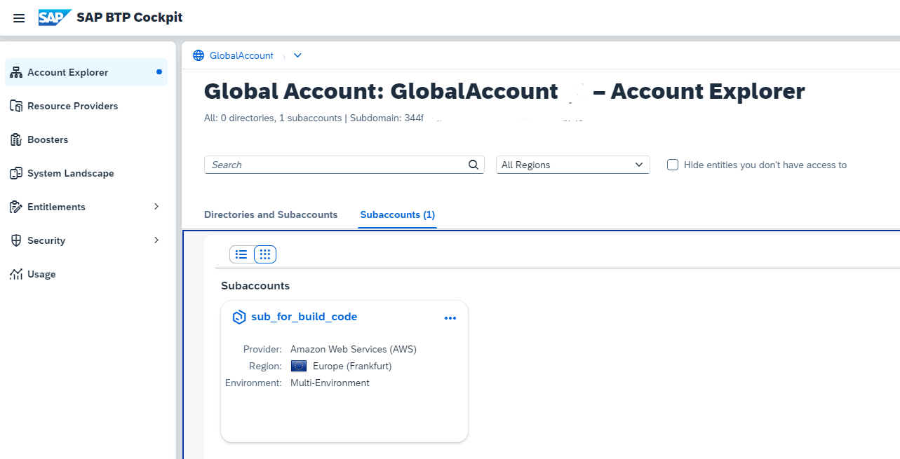

3. Make sure you are entitled to use the SAP Build Code service with the free service plan.

    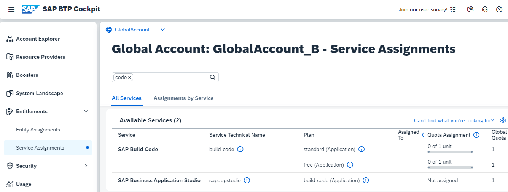

### Run Booster

SAP BTP provides interactive guided boosters to automate cockpit steps, so users can save time when trying out the services.

Select the **Set up account for Build Code (Free Plan)** booster to automatically assign entitlements, update your subaccount (or create a new one), create a service instance, subscribe to the service, and access SAP Build Code.

1. On the navigation side bar, click **Boosters**.

    Search for **Build Code** and click the tile to access the booster.

    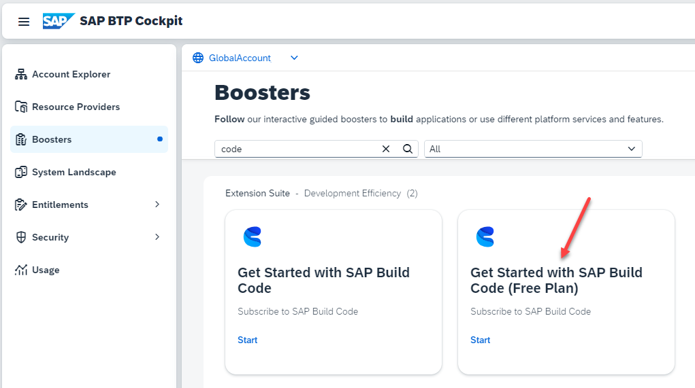

2. Go to the **Components** tab to see what will be installed, and click **Start**.

    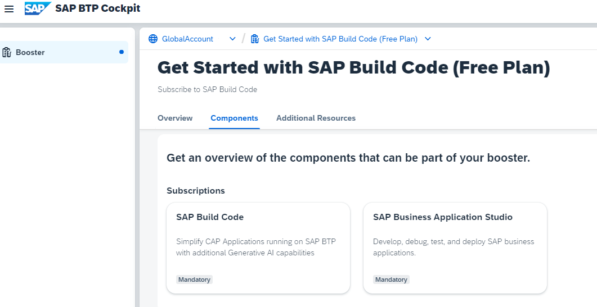

3. Booster Step 1: 

    The booster checks if the necessary entitlements for SAP Build Code are available and free in the global account and that you have the authorization to create subaccounts and services. 

    The result must be "All required prerequisites are met".

    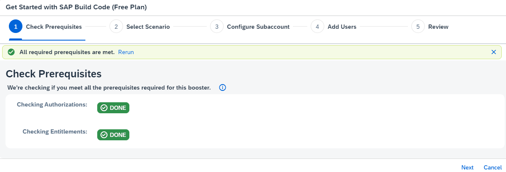

    If you are missing any of the prerequisites, the booster will inform you. For example, if you are missing entitlements.

    

4. Booster Step 2: 

    If you want to create a dedicated subaccount for the service instance, choose **Create Subaccount**. If you want to use an already created subaccount, choose **Select Subaccount** (the selection comes in the next step). 
   
    For this tutorial, you create a dedicated subaccount. Click **Next**.

    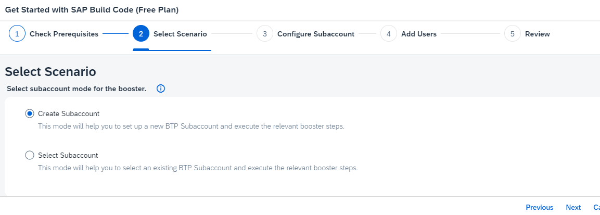

5. Booster Step 3:

    Choose the **"free"** service plan for SAP Build Code and SAP Business Application Studio.

    Provide the details for your subaccount:

    - name: e.g. "sub_for_build_code"
    - Provider: Of your choice
    - Region: typically close to your location.
    - Space: e.g. "dev".

    Keep the autogenerated values for Subdomain and Org or provide your own value.

    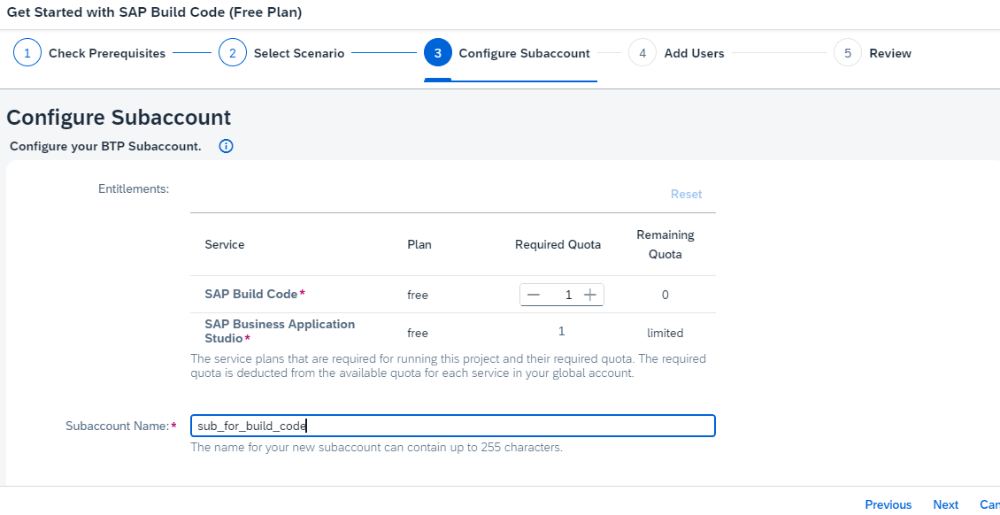

    Click **Next**.

6. Booster Step 4: Add Users

    Optional: Add additional users. Your user will be automatically added.

    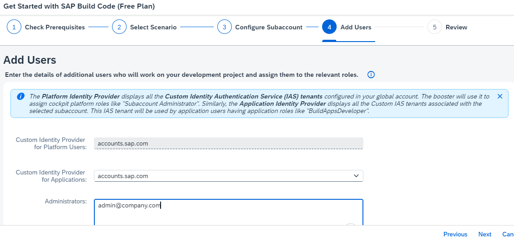

7. Booster Step 5: Review

    Review your settings for the booster. For example, double-check the region. If everything is ok, click **Finish**.

   

    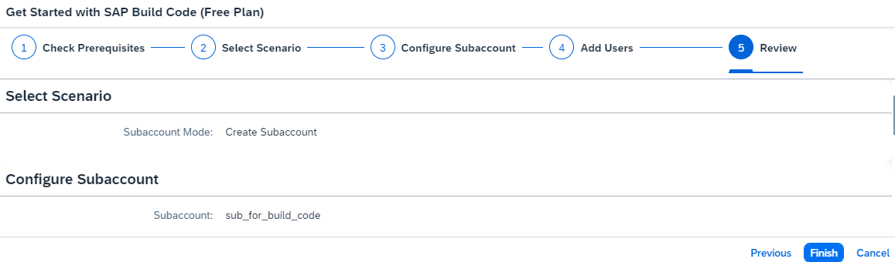

    The booster will start to run and a progress popup is displayed.

    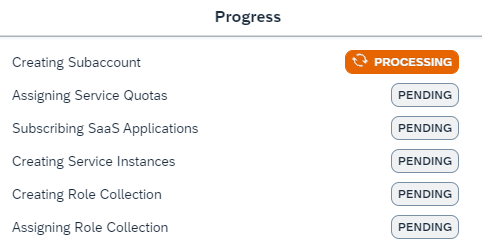

   When the booster has finished, the **Success** dialog box is displayed.

    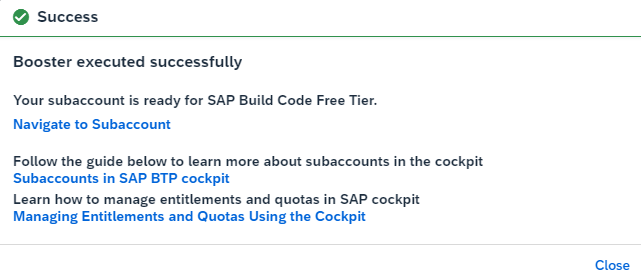

 
8. Click **Navigate to Subaccount** on the success popup. You will be forwarded to your SAP Build Code subscription.
   
     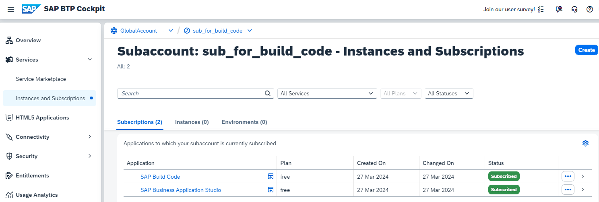

You have successfully used the **Set up account for Build Code (Free Plan)** booster to subscribe to and access SAP Build Code.

### Access the SAP Build Lobby

1. In the **Subscriptions** tab, click on **SAP Build Code**. You will be forwarded to the SAP Build lobby.

    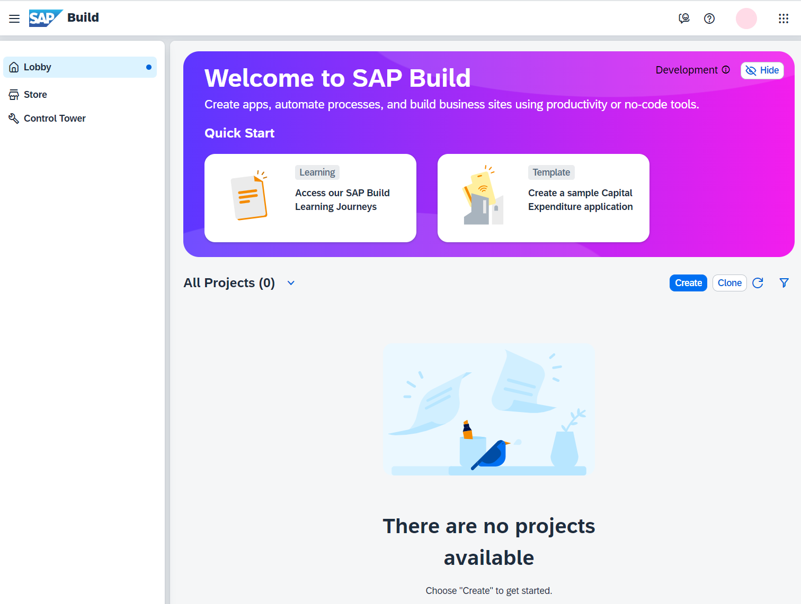

From here, you can create your first Full-Stack application as described in the next tutorial.

Congratulations, you've completed this tutorial.
