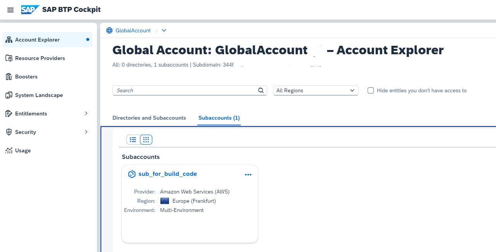

# Setup SAP Build Code for Enterprise Accounts

<!-- description --> Use the SAP BTP booster "Get Started with SAP Build Code" to create a service instance of Build Code and Business Application Studio.

Make sure you have the entitlement for the Service [SAP Build Code](https://discovery-center.cloud.sap/serviceCatalog/sap-build-code?region=all&service_plan=standard&commercialModel=cloud), [SAP Business Application Studio](https://discovery-center.cloud.sap/serviceCatalog/business-application-studio?region=all), [SAP Build Work Zone, standard edition](https://discovery-center.cloud.sap/serviceCatalog/sap-build-work-zone-standard-edition?region=all), and Cloud Foundry Runtime, if you want to deploy your applications to CF.

## Prerequisites
- You have an Enterprise Account on SAP BTP.  
- You are entitled to use the services SAP Build Code, SAP Business Application Studio, and SAP Build Work Zone, standard edition.

## You will learn
  - Access your SAP BTP account
  - Create a new subaccount for SAP Build Code (optional)
  - Run the guided "booster" **Get Started with SAP Build Code** to assign entitlements, update your subaccount (or create a new one), create a service instance, subscribe to and access the Build Code "Lobby"

---

### Go to your SAP BTP account

1. Open your [SAP BTP cockpit](https://emea.cockpit.btp.cloud.sap/cockpit).

2. Access your global account.

   

3. Make sure you are entitled to use the Build Code service with a free Service Plan.

    

### Run Booster

SAP Business Technology Platform provides interactive guided boosters to automate cockpit steps, so users can save time when trying out the services.

Select booster **Get Started with SAP Build Code** to automatically assign entitlements, update your subaccount (or create a new one), create a service instance, subscribe to and access the Build Code UI.

1. On the navigation sidebar, click **Boosters**.

    Search for **Build Code** and click the tile to access the booster.

    

2. Check the "Components" the booster will install and click **Start**.

    

3. Booster Step 1: 

    The booster checks if the necessary entitlements for Build Code are available and free in the Global Account and you have the authorization to create Subaccounts and Services. 

    The result must be "All required prerequisites are met":

    

    In case you miss the prerequisites, the booster will inform you. 

    If SAP Build Code entitlement is missing, the booster prerequisites check will fail.
    
    If optional entitlements are missing, the booster will give you a warning.

    

4. Booster Step 2: 

    If you want to create a dedicated subaccount for the service instance, choose **Create Subaccount**. 
    
    If you want to use an already created subaccount, choose **Select Subaccount** (the selection comes in the next step). 
   
    For this tutorial, you create a dedicated subaccount. Click **Next**.

    

5. Booster Step 3:

    The booster lists the services and their plans, which it will create.

    You can remove services that are not needed. A minimal setup should at least contain the following services:

    - SAP Build Code
    - SAP Business Application Studio
    - SAP Build Work Zone, standard edition
    - Cloud Foundry (optional if you do not want to deploy applications in Cloud Foundry)

    Provide the details for your subaccount:

    - name: e.g. "sub_for_build_code"
    - Provider: Of your choice
    - Region: typically close to your location.
    - Space: e.g., "dev".

    Keep the autogenerated values for Subdomain and Org, or provide your own value.

    

    Click **Next**.

6. Booster Step 4: Add Users

    Optional: Add additional users. Your user will be automatically added.

    

7. Booster Step 5: Review

    Review your booster settings. Double-check the region, for example. If everything is okay, click "Finish.

    

8.  The booster will start to run, and a progress pop-up will appear:

    

9. When the booster has finished, the **Success** dialog box will appear.

    

    Click **Navigate to Subaccount** on the success pop-up.
 
10. You will be forwarded to the Build Code application:
   
     

You have successfully used the booster **Get Started with SAP Build Code** to subscribe to and access the SAP Build Code Lobby.

### Access SAP Build Code Lobby

1. Click on the subscription "SAP Build Code".

2. You will be forwarded to the Lobby.

    

From here, you can create your first Full-Stack Application as described in the next tutorial.

Congratulations, you've completed this tutorial.
