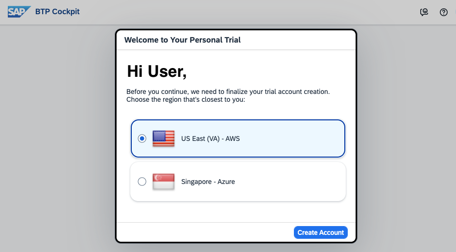
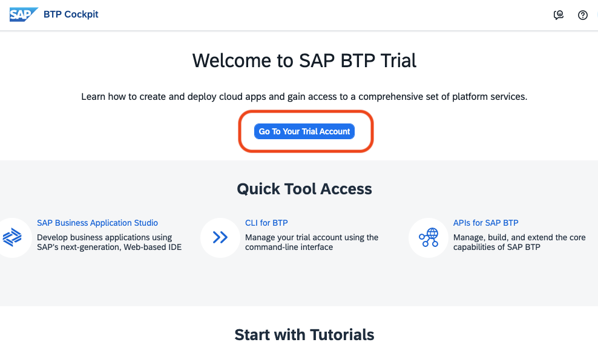
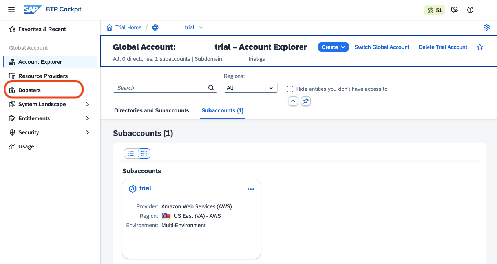
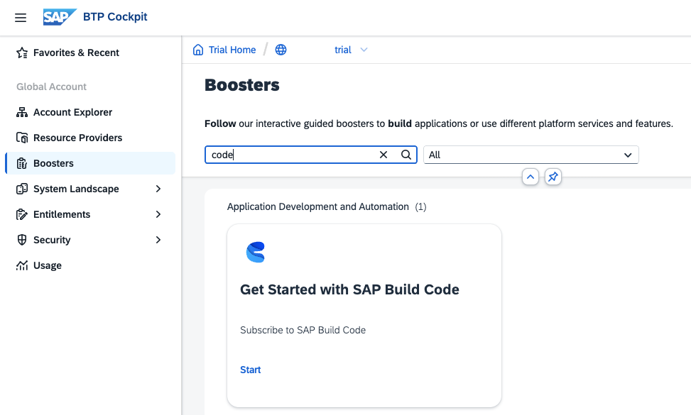
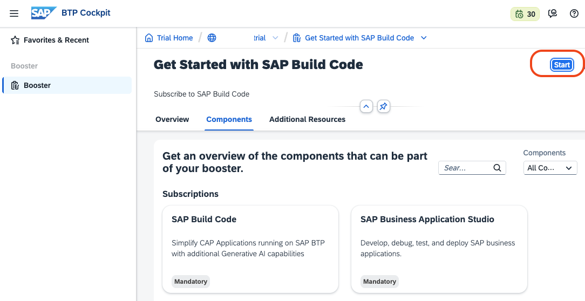
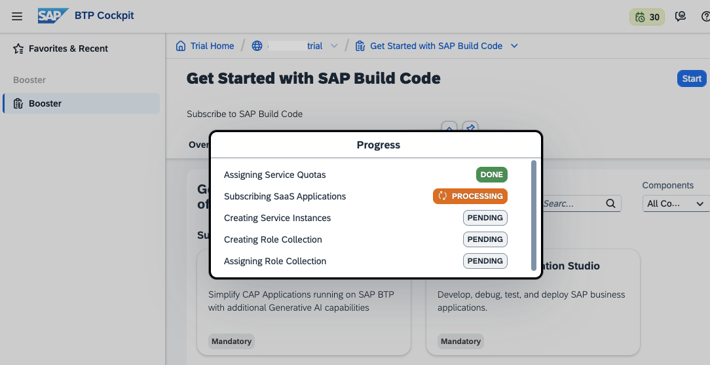
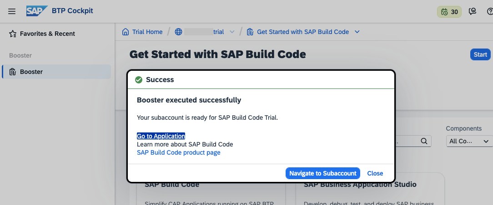
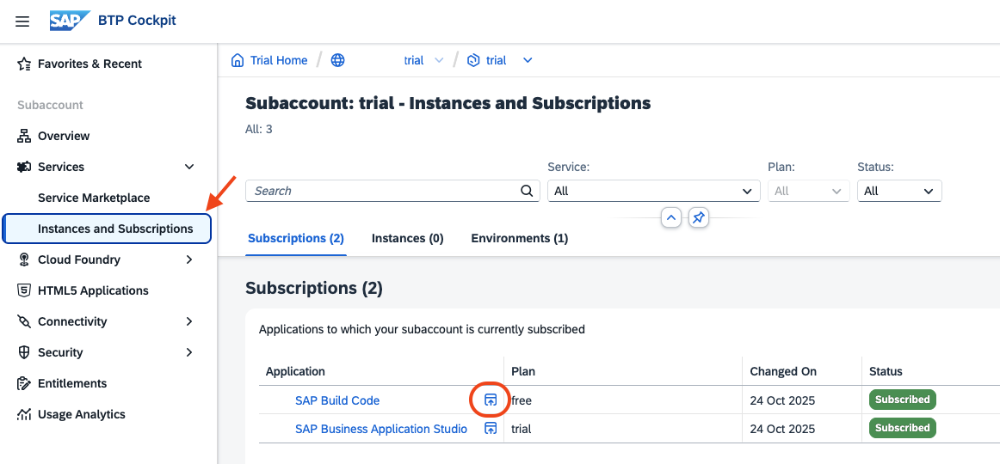
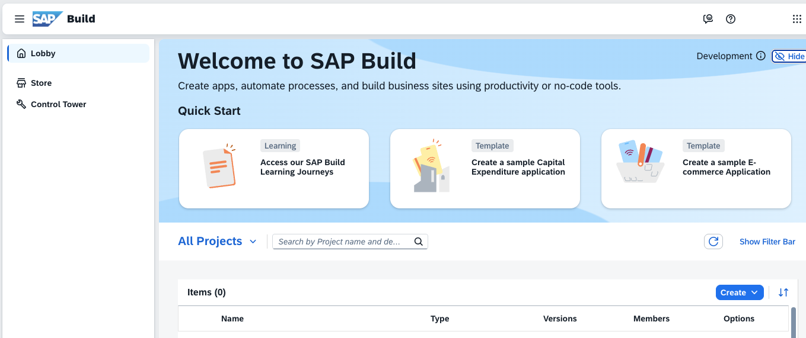

# Setup SAP Build Code for Trial Accounts

## Prerequisites
- You have an SAP BTP Trial Account. A trial account is entitled to use the services SAP Build Code and SAP Business Application Studio.

## About this guide

You will run the "Booster" **Get Started with SAP Build Code**, subscribe your trial subaccount to SAP Build Code, and access the Build Code Lobby.

### Open your SAP BTP Trial Account 

1. Open your [SAP BTP Trial Account](https://account.hanatrial.ondemand.com/trial/#/home/trial).

    If you do not have a global trial account yet, create one.

    

2. Access your global account.

    

3. Find "Boosters" in the left navigation pane.

   

### Run Booster

SAP Business Technology Platform provides interactive guided boosters to automate cockpit steps, so users can save time when trying out the services.

Select booster **Get Started with SAP Build Code** to automatically assign entitlements, update your subaccount (or create a new one), create a service instance, subscribe to and access the Build Code UI.

1. On the navigation sidebar, click **Boosters**.

    Search for **Build Code** and "Start" the Booster.

    

2. Check the "Components" the booster will install and click **Start**.

    

3. The Booster will execute immediately.

    

4. When the booster has finished, the **Success** dialog box will appear.

    Click **Navigate to Subaccount** on the success pop-up.

    

5. You will be forwarded to your trial subaccount.

   Open "Services" --> "Instances and Subscriptions" and click on your "SAP Build Code" Subscription.
   
    

6. Enter the SAP Build Code Lobby. You are ready to create your first project.

   

You have successfully used the booster **Get Started with SAP Build Code** to subscribe to and access the SAP Build Code Lobby.
