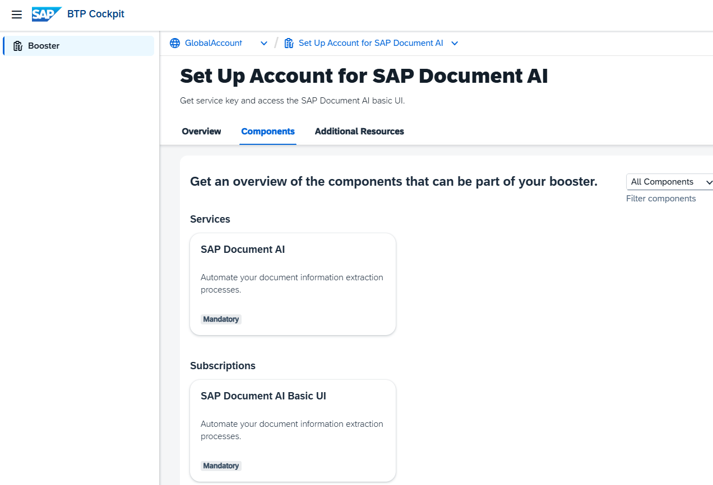
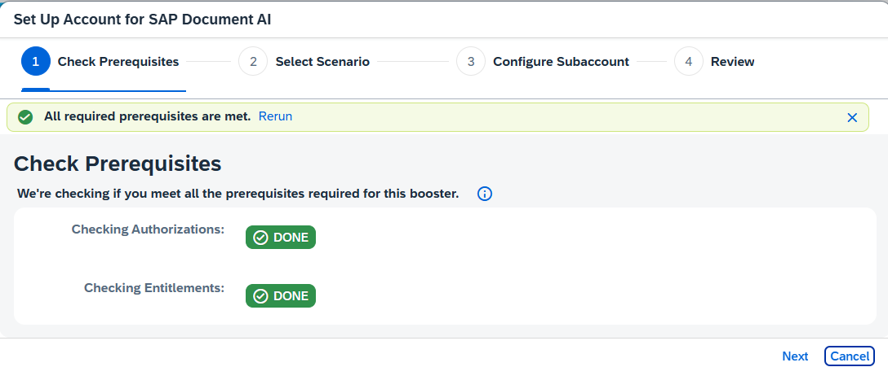
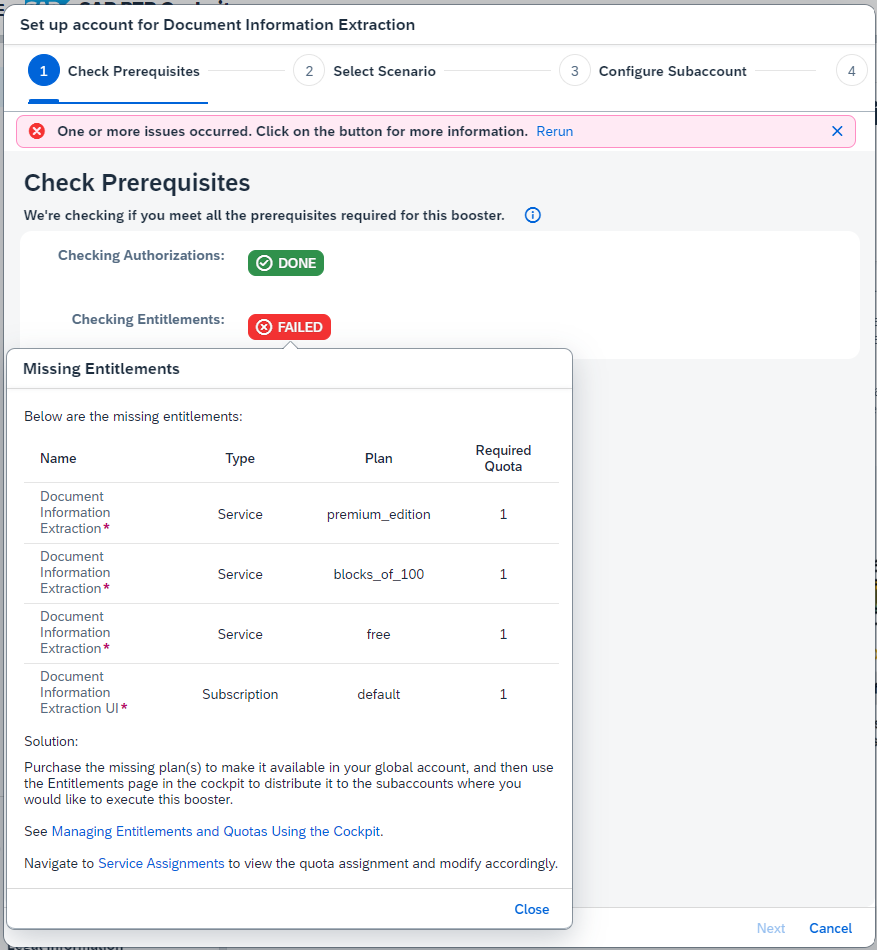
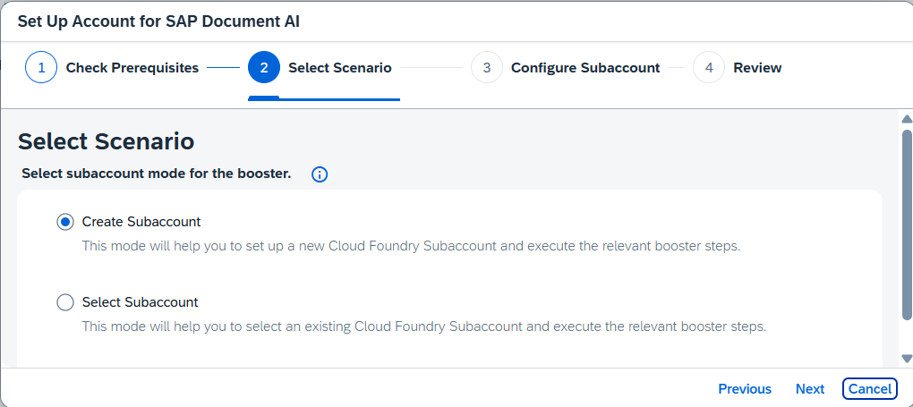
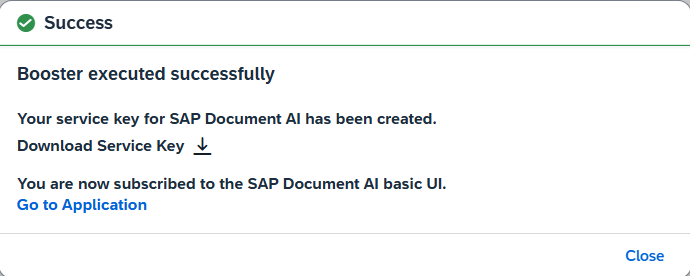

<!---
parser: v2
auto_validation: true
time: 5
tags: [tutorial>beginner, topic>machine-learning, topic>artificial-intelligence, topic>cloud, software-product>sap-business-technology-platform, software-product>sap-ai-services, software-product>document-information-extraction, tutorial>free-tier]
primary_tag: topic>machine-learning
author_name: Oliver Stiefbold
author_profile: https://github.com/Juliana-Morais
-->

# Set Up Document Information Extraction in Enterprise Accounts

<!-- description --> Use the SAP BTP booster "Set up account for Document Information Extraction" to create a service instance of Document Information Extraction and a subscription to the UI application for Document Information Extraction.

Depending on your entitlements you can choose three available [Service Plans](https://discovery-center.cloud.sap/serviceCatalog/document-information-extraction?region=all&tab=service_plan)

- Base Edition: Supports only default-extractors, managed by SAP. 
- Free: Same as Base Edition, with technical limits for uploaded documents and size. Not for productive use.
- Premium Edition: Includes document information extraction using generative AI. 

Setting up a Trial Account is pretty similar, but is covered in a dedicated tutorial.

## Prerequisites
- You have an Enterprise Account on SAP BTP.  
- You are entitled to use the Document Information Extraction service.

## You will learn
  - Access your SAP BTP account
  - Create a new subaccount (optional)
  - Run the guided "booster" **Set up account for Document Information Extraction** to assign entitlements, update your subaccount (or create a new one), create a service instance, subscribe to and access the Document Information Extraction UI

---

### Go to your SAP BTP account

1. Open your [SAP BTP cockpit](https://emea.cockpit.btp.cloud.sap/cockpit).

2. Access your global account.

    

### Run Booster

SAP Business Technology Platform provides interactive guided boosters to automate cockpit steps, so users can save time when trying out the services.

Select booster **Set up account for Document Information Extraction** to automatically assign entitlements, update your subaccount (or create a new one), create a service instance, subscribe to and access the Document Information Extraction UI.

1. On the navigation side bar, click **Boosters**.

    Search for **Document Information Extraction** and click the tile to access the booster.

    

3. Check the "Components" the booster will install and click **Start**.

    

4. Booster Step 1: 

    The booster checks if the necessary entitlements for Document Information Extraction are available and free in the Global Account and you have the authorization to create Subaccounts and Services. 

    The result must be "All required prerequisites are met":

    

    In case you miss the prerequisites, the booster will inform you. For example about missing entitlements:

    

5. Booster Step 2: 

    If you want to create a dedicated subaccount for the service instance, choose **Create Subaccount**. If you want to use an already created subaccount, choose **Select Subaccount** (the selection comes in the next step). 
   
    For this tutorial, you create a dedicated subaccount. Click **Next**.

    

6. Booster Step 3:

    Choose the Service Plan "Premium Edition" in order to use the generative AI features.

    You can also choose "Base Edition" or "Free", but you will not be able to us GenAI in taht case.

    Provide the details for your subaccount:

    - name: e.g. sub_for_docie
    - Provider: Of your choice
    - Region: typically close to your location.
    - Space: e.g. "dev".

    Keep the autogenerated values for subdomain and Org or provide your value.

    

    Click **Next**.

7. Booster Step 4: Review

    Review your settings for the booster. Double-check the region for example. If everything is ok, click **Finish**.

    The booster will start to run and a progress popup will appear:

    

   

8.  When the booster has finished, the **Success** dialog box will appear.

    

    Click **Go to Application** on the sucess popup.
 
 9. You will be forwarded to the Document Information Extraction application:
   
     

You have successfully used the booster **Set up account for Document Information Extraction** to subscribe to and access the Document Information Extraction UI.

Note: If you face any issue with the booster **Set up account for Document Information Extraction**, you can alternatively follow the steps in [Use Free Tier to Subscribe to Document Information Extraction UI](https://developers.sap.com/tutorials/cp-aibus-dox-free-ui-sub.html) to subscribe to the user interface application manually.

### Access subscription (optional)

> This is an optional step. Use it only if you want to access the Document Information Extraction application, you've subscribed to using the **Set up account for Document Information Extraction** booster, without having to run it once again.

Do the following to access the Document Information Extraction application, without having to run the **Set up account for Document Information Extraction** booster once again:

1. Close the booster **Success** dialog box.

    

2. Access your global account.

3. Click **Account Explorer** on the navigation side bar and access the subaccount you used to create your subscription to the Document Information Extraction application.

    

4. Click **Instances and Subscriptions** on the navigation side bar. You see the application subscription you created with the **Set up account for Document Information Extraction** booster.

    

5. Click the dots to open the menu and select **Go to Application** to open the app.

    

Congratulations, you've completed this tutorial.