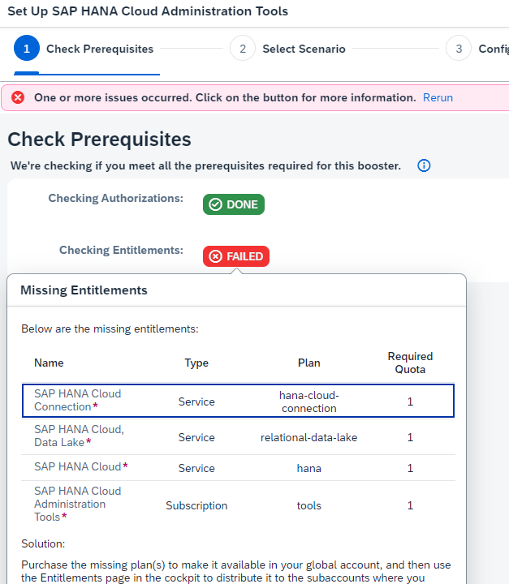
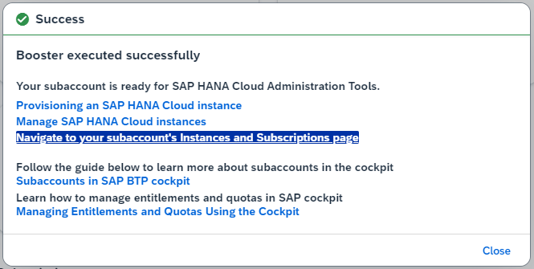
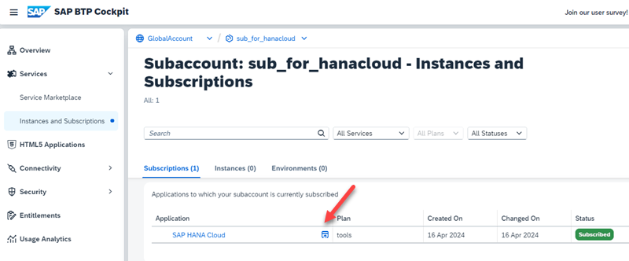

# Set Up SAP Hana Cloud with a Booster

1. Go to your Global Enterprise Account.

    Select "Boosters", search for "hana cloud" and select Booster "Set Up SAP HANA Cloud Administration Tools"

    

2. Check the Components and Entitlements you need and click "Start".

    

3. Booster Step 1: Check Prerequisites.

    If you are Global Account Administrator and your entitled to use the required services, the result is "green":

    

    Click "Next".

    In case you failed, check the missing entitlements, for example:

    

4. Booster Step 2: Select Scenario.

    You can use an existing account or create a new one. In this tutorial you create a new Subaccount.

    Click "Next"

5. Booster Step 3: Configure Subaccount

    You cannot de-select any Entitlements.

    Provide a name for your Subaccount, select a Provider and a Region (next to you).  

    Provide a unique name for your Subdomain or keep the prefilled value.

    Click "Next".

6. Booster Step 4: Add Users 

    Optional: Add additional users or change your Custom Identity Provider for Applications.

    Click "Next".

7. Booster Step 5: Review 
   
    Review your configuration, double check region and click "Finish". The set up starts:

    

8. Click "Navigate to your subaccount Instances and Subscriptions page".

    

9. Start your SAP HANA Cloud tools.

    

### Create SAP Hana cloud Instance

1. In your Hana Cloud tools select "Create Instance.

2. Create Instance Step 1: Select Hana Database

3. Create Instance Step 2: Provide a Name for your instance and a password for your "DBADMIN".

4. Create Instance Step 3: For a development instance, keep the pre-defined values.

5. Create Instance Step 4: Keep the pre-defined value "Assign Automatically" for Availability Zone.

6. Create Instance Step 5: SAP HANA Database Advanced Settings

    Skip "Additional Features" except you need it, keep Data Provisioning Server.

    If you want to access your Database from local development tools choose "allowed connections": "Allow all IP Adresses"

    

    Skip cloud connector, your need it for on-premise systems. 
    
    Skip Instance Mapping, in this tutorial you did not yet cerate a Cloud Foundry organization.

7. Create Instance Step 6: Skip Data Lake, if you are not sure , you will need one.

    Click "Review and Create".

8. Review and click "Create Instance".

    This will take some minutes.

    

### Open SAP HANA Database Explorer

1. In your Hana Cloud tools select "Actions" from your hana instance.

    

2. In the Actions popup, note the different options. 

    Select "Open in SAP HANA Database Explorer"

    

3. From here you can explore the artifacts of your Hana Instance.

    
