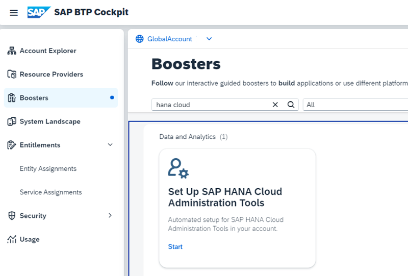
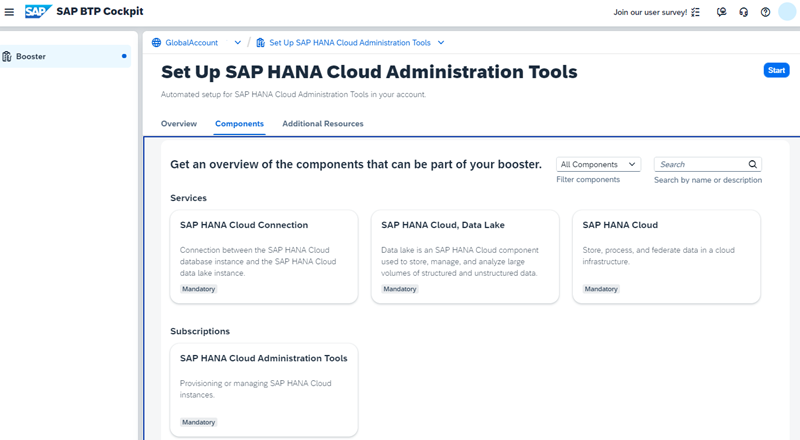
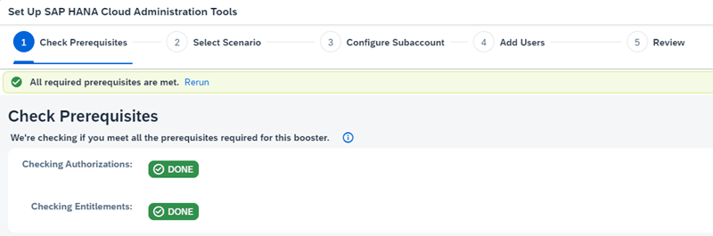

# Set Up SAP HANA Cloud Central with a Booster

In this set-up guide, you use the SAP HANA Cloud Administration Tools to set up a HANA Cloud instance, which is not bound to a specific BTP runtime or envirionment.

### Set Up SAP HANA Cloud Administration Tools

SAP HANA Cloud Central enables you to administer and monitor SAP HANA Cloud instances. 

1. Go to your Global Enterprise Account.

    Select "Boosters", search for "hana cloud" and select Booster "Set Up SAP HANA Cloud Administration Tools"

    

2. Check the Components and Entitlements you need and click "Start".

    

3. Booster Step 1: Check Prerequisites.

    If you are Global Account Administrator and your entitled to use the required services, the result is "green":

    

    Click **Next**.

    In case you failed, check the missing entitlements, for example:

    

4. Booster Step 2: Select Scenario.

    You can use an existing account or create a new one. In this tutorial you create a new Subaccount.

    Click "Next"

5. Booster Step 3: Configure Subaccount

    - You cannot de-select any Entitlements. 
    - Provide a name for your Subaccount 
    - Select a Provider and a Region (next to you)
    - Subdomain: Keep the generated value or provide a unique name for your subdomain

    Click "Next".

6. Booster Step 4: Add Users 

    Optional: Add additional users or change your Custom Identity Provider for Applications.

    Click "Next".

7. Booster Step 5: Review 
   
    Review your configuration, double check region and click "Finish". The set up starts:

    

8. Click "Navigate to your subaccount Instances and Subscriptions page".

    

9. Start your SAP HANA Cloud tools.

    

### Create a central SAP HANA Cloud Instance

1. In your HANA Cloud tools select "Create Instance.

2. Create Instance Step 1: Select "Hana Database"

3. Create Instance Step 2: Provide a Name for your instance and a password for your "DBADMIN".

4. Create Instance Step 3: For a development instance without document store or script server, keep the pre-defined values.

5. Create Instance Step 4: Keep the pre-defined value "Assign Automatically" for Availability Zone.

6. Create Instance Step 5: SAP HANA Database Advanced Settings

    Skip "Additional Features" (except you need it), keep "Data Provisioning Server".

    If you want to access your Database from local development tools choose "allowed connections": "Allow all IP Adresses"

    

    Skip cloud connector, your need it for on-premise systems.
    
7. **Add Instance Mapping**, for example to your Cloud Foundry organization.

    Provide the "Environment Instance ID" (the Cloud Foundry Org ID). You do not need the "Environment Group" (CF Space ID). 
    If you leave Space ID empty the mapping is valid for all Spaces of the Org ID.
    
    Sometimes the "Create Instance"-wizard wants a value for Space ID (which you can only get from the Cloud Foundry CLI). 
    In this case leave the mapping empty and add the mapping after the instance has been cerated (requires re-start of the instance).

    
    
    You get your OrgID from you Subaccount Overview page.
     
    
     
    Notice also your Subaccount API Endpoint, which you will need in SAP Business Application Studio.

8. Create Instance Step 6: Skip Data Lake, if you are not sure , you will need one.

    Click "Review and Create".

9. Review and click "Create Instance".

    This will take some minutes.

    

### Open SAP HANA Database Explorer

1. In your Hana Cloud tools select "Actions" from your hana instance.

    

2. In the Actions popup, note the different options. 

    Select "Open in SAP HANA Database Explorer"

    

3. From here you can explore the artifacts of your Hana Instance.

    
