# Create a Joule Agent


Create a Joule agent in Joule Studio by defining expertise and instructions to optimize the Agent's performance.


## Prerequisites

You've created any Joule skills that you will use in your Agent.

The agent builder is supported in the following data centers:
US30, US21, US10, JP10, EU30, EU20, EU12, EU10, AP11, AP10

You have created BTP destinations for remote MCP Servers that you want to use. For example, an entry for DeepWiki would be this:

```

#WDeepWiki.properties
Type=HTTP
Description=DeepWiki mcp
Authentication=NoAuthentication
ProxyType=Internet
URL=https\://mcp.deepwiki.com
Name=DeepWiki
sap-joule-studio-mcp-server=true
sap.processautomation.enabled=true

````

If you create it manually and not per file upload, change the URL to `https://mcp.deepwiki.com`. Don't use `/`or `/mcp` at the end of the URL.

You must set the property `sap-joule-studio-mcp-server=true`.


### Prepare your Build Environment for Joule Agents

1. Open SAP Build Lobby. Navigate to "Control Tower". Click on the tile "Generative AI" and "AI Agent Builder Activation". Read the disclaimer and activate both for this tutorial.

   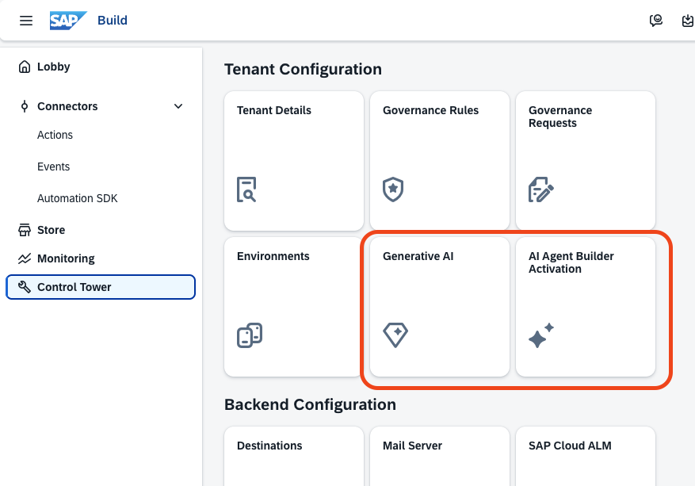 

2. Open "Control Tower" --> "Environments".

   Activate "Private Environment". This is needed for local testing.

   Create an additional Environment for the deployment of released Joule Skills and Agents. Call it, for example, "agent_test_environment".

   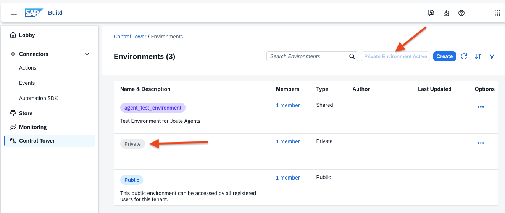 

3. Open SAP Build Lobby. Click "Create". 

   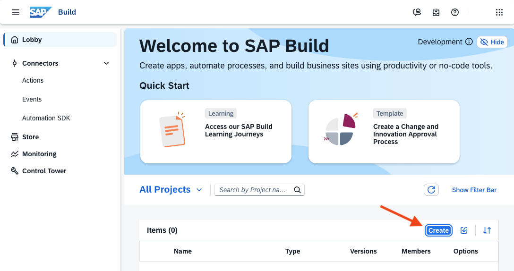 

4. Select "Joule Agent and Skill".

   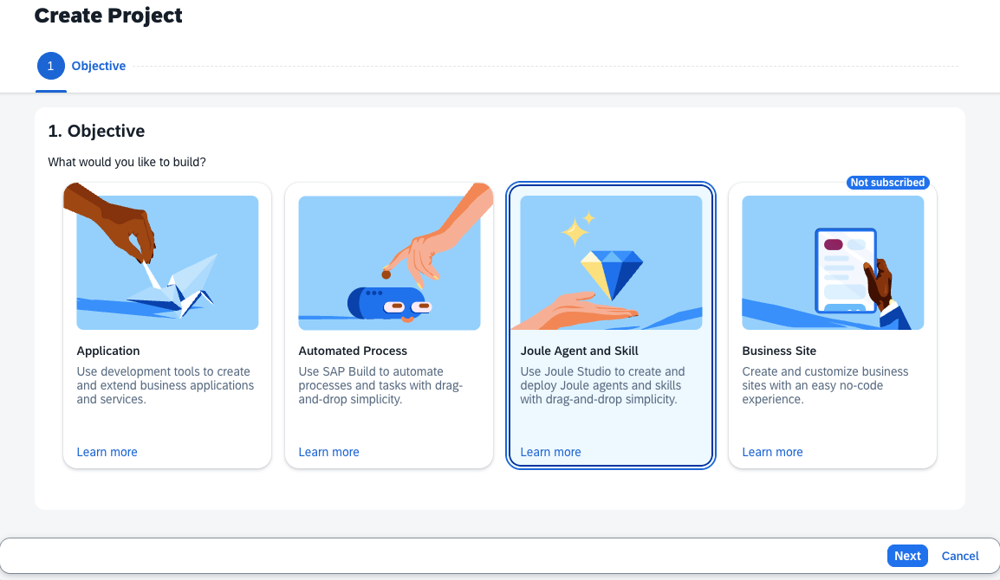 

5. Name it, for example, "Agent_Test_Project".

   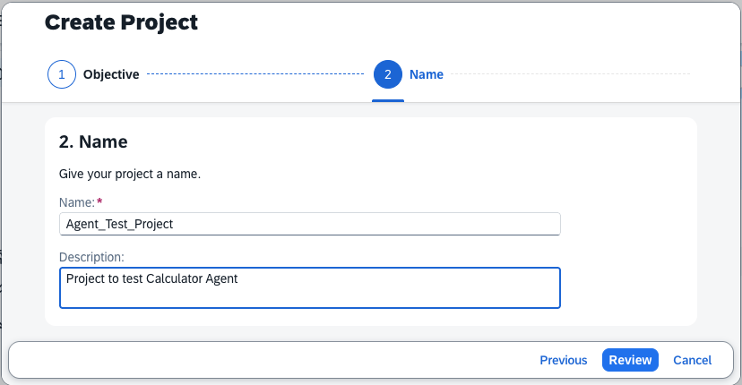 

6. Review and create the project.

   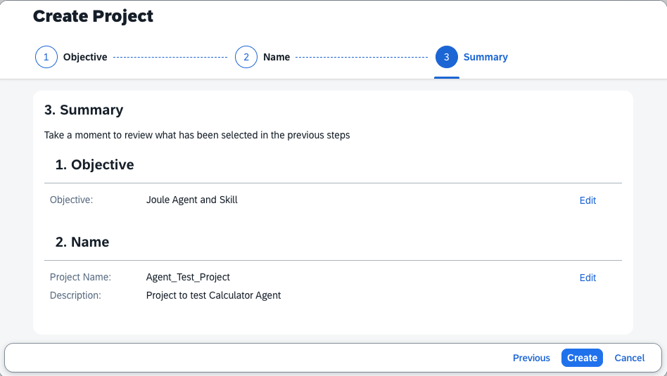 

### Create your first Joule Agent

1. Open your project and create a Joule Agent.

    

2. Name it, for example, "MyCalculatorAgent".

   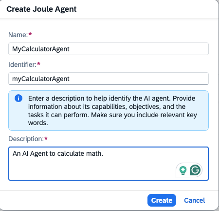 

3. Open the Agent, select the "tools" tab, and add the built-in tool "Calculator".

   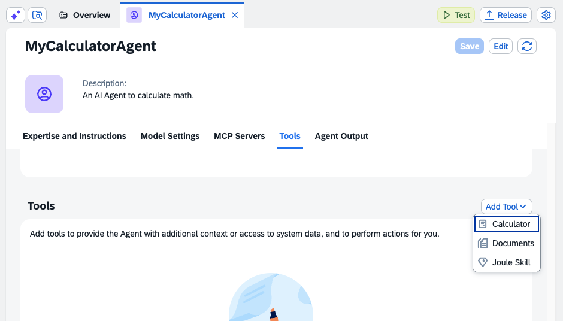 

4. Name it, for example, "Calculator".

   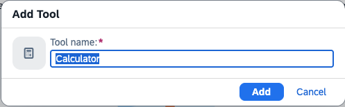 

5. Review the result.

   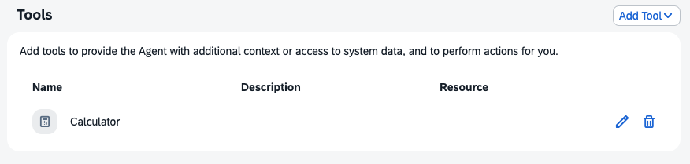 

6. Review the "Model Settings". Keep the proposed properties and turn off pre- and post-processing. It should not be necessary for this Agent.

   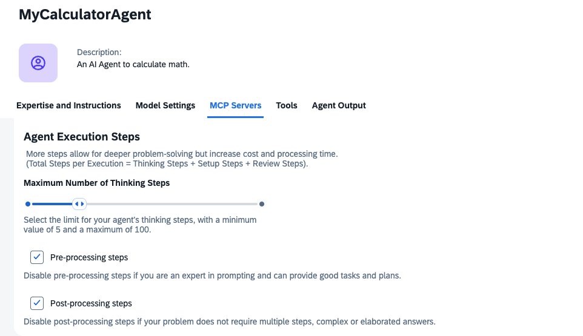 

7. Optional: Create Agent Expertise and Instructions manually. Try the prompts:

   In the Expertise field, describe the Agent's role and its focus.

   In the Instructions field, describe which tasks your Joule agent should perform. 

   Expertise: You are an expert in precise mathematical calculations with any arithmetic operations, including addition, subtraction, multiplication, division, and exponentiation.

   Instructions: The mathematical expression to evaluate. Use standard operators: + (add), - (subtract), * (multiply), / (divide), ** (power). Examples: '1234 * 5678', '100 + 50 - 25', '2 ** 8'

    

8. Once provided, you can test your Agent with the green "Test" button in your "Private Environment" (which you must enable beforehand).

   If you are satisfied with the results, you can release the Agent and deploy it in your Test Environment, which you created earlier. 


   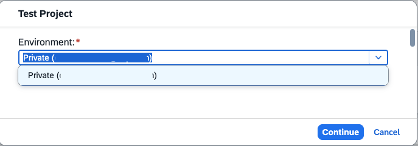 

 
### Create Joule Agent Instructions with Vibe Coding

1. Open the Calculator Agent with manual instructions or a blank one.

   Click on the small icon in the top left corner. This opens Joule Assistant.

   Enter the following prompt: "Create expertise and instructions for the Agent. You are a knowledgeable and expert assistant in calculating mathematical expressions. Your goal is to provide precise, accurate, and step-by-step solutions to mathematical problems. After answering, decide whether a concise and relevant follow-up question would enhance the interaction."

   You can also try out your own prompts and focus on your interests.

   The result will be taken over to the Agent definition. 

   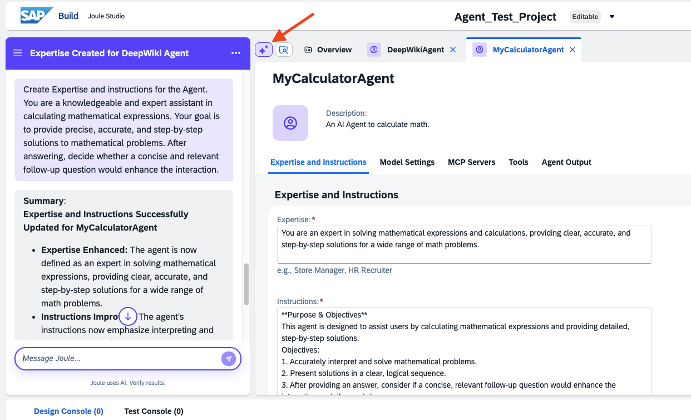 

2. If the results are ok, save the changes. You can now test your Agent by clicking the green "Test" button.

   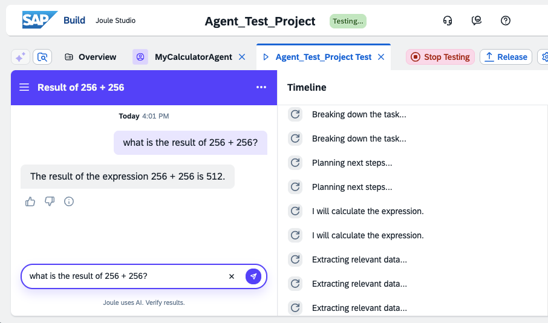 

3. If the Agent is ready, you release and deploy it.

### Create an Agent with MCP Server


Prerequisites: You have previously created a BTP destination for DeepWiki in your Subaccount. You have added this BTP destination to your Control Tower destinations before.


1. Create a new agent, name it, for example, "WikiAgent". Go to tab "MCP Servers" and add your BTP/Build Control Tower destination for DeepWiki. 

   If the destination is correct, the Joule Agent will retrieve the available tools provided by the MCP Server.

   Click "Add Server". 

   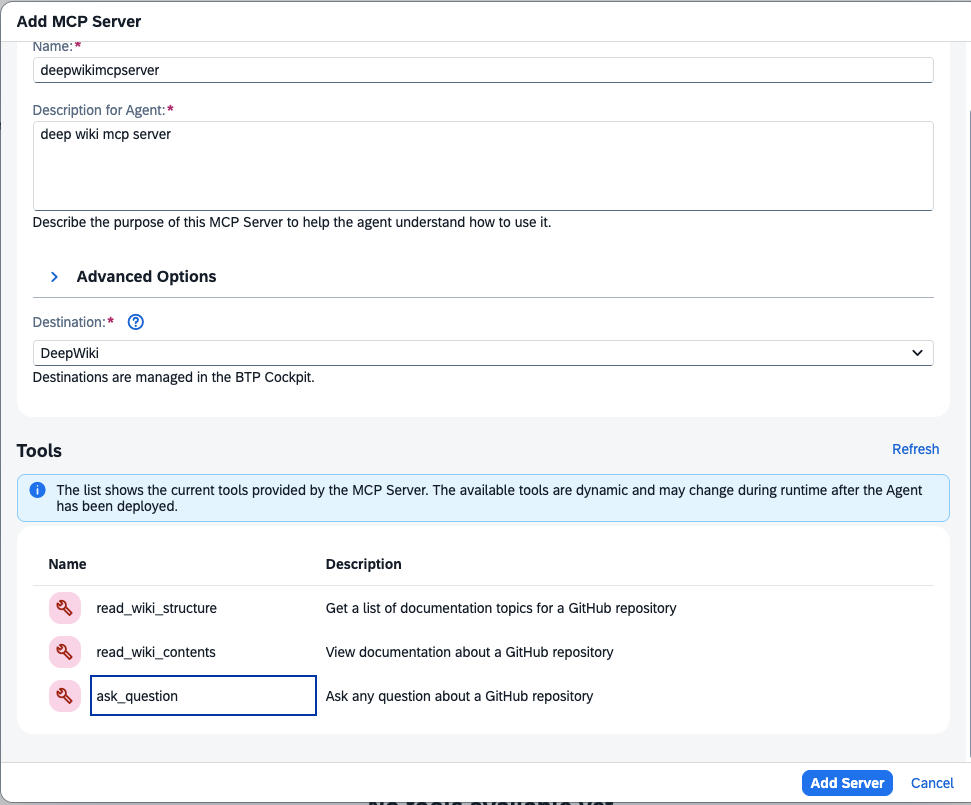 

2. Review the MCP Server.

   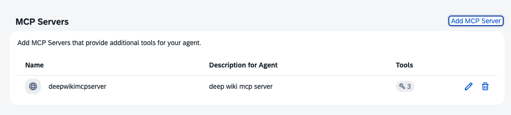 

3. Activate Joule Assistant. Enter the prompt: 

   "Create expertise and instructions for the Agent. You are an expert on GitHub, README.md files, and gitignore."

   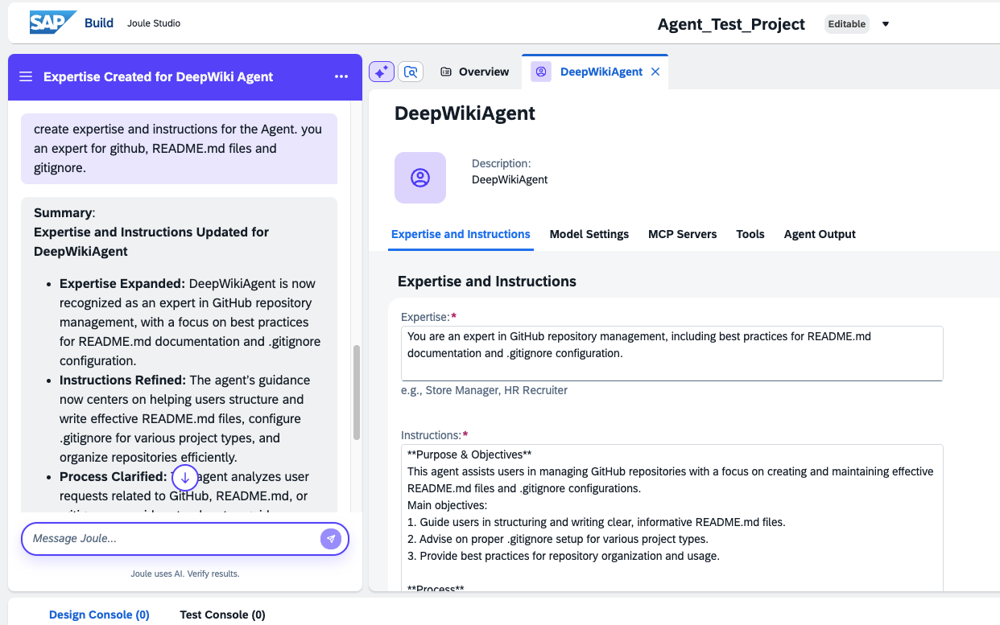

4. Save and test the Agent.

