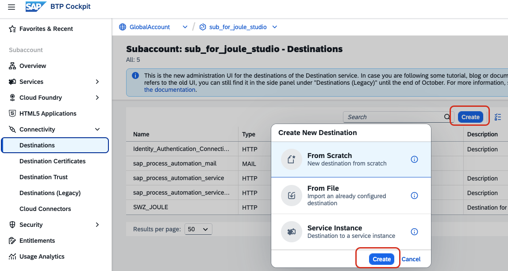
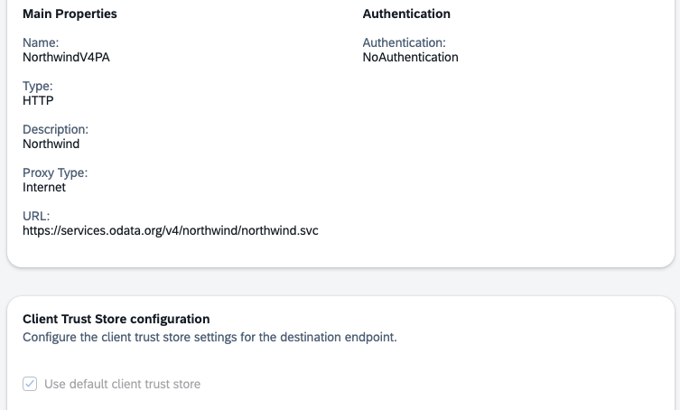
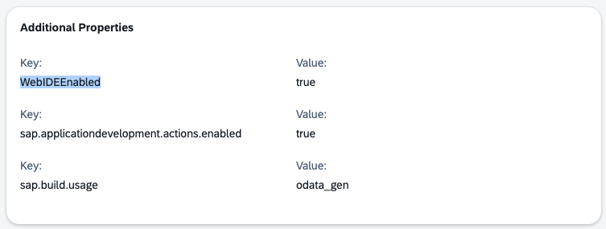
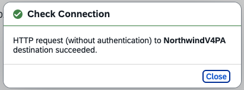

# Create a BTP Destination for Northwind OData Service

In this tutorial, you create a BTP destination for the Northwind OData Example Service V4: 

(https://services.odata.org/v4/northwind/northwind.svc/)

You will create a BTP destination with the following parameters:

```
Type=HTTP
sap.applicationdevelopment.actions.enabled=true
Description=Northwind
Authentication=NoAuthentication
WebIDEEnabled=true
ProxyType=Internet
URL=https\://services.odata.org/v4/northwind/northwind.svc
Name=NorthwindV4PA
sap.build.usage=odata_gen
```

### Procedure

1. Enter your Global Account and Subaccount

2. In your subaccount, navigate to "Connectivity" --> "Destinations". Select "Create". A pop-up window appears. Select "From Scratch" and click "Create".

   


3. Provide the following properties

   | Properties | Values | 
   | ---- | ---- | 
   | Name | NorthwindV4PA |
   | Description | Northwind V4 Process Automation Enabled |
   | URL | https://services.odata.org/v4/northwind/northwind.svc |

   

4. Provide the following "Additional Properties" for usage in SAP Build Process Automation and click "Create".

   | Properties | Values | 
   | ---- | ---- | 
   | WebIDEEnabled | true |
   | sap.applicationdevelopment.actions.enabled | true |
   | sap.build.usage | odata_gen |

   

5. After creation, select the new destination and click the "Check Connection" button.

   

You can now use this destination in your SAP Build project.

