# Create Joule Skills for Northwind Orders

In this tutorial, you create a BTP destination for the Northwind OData Example Service V4: 

(https://services.odata.org/v4/northwind/northwind.svc/)

### Create a Joule Skill for Orders

1. Create a Joule Skill for getting Northwind Orders. Go to "Lobby", open your Project and select "Create" --> "Joule Skill".

   Provide a Name: "Get Food Orders for Customer ID"

   And the important description for Joule: "Get Food Orders for a provided Customer ID and show all information."

   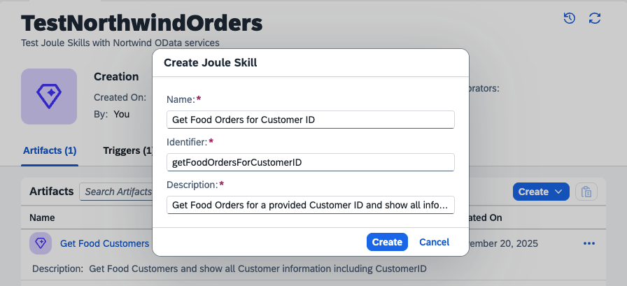 

2. The Editor for the new skill opens. Select the first step, "Trigger".

   Keep "Allow Joule to generate a response.

   Select the tab "Parameter" and select "Configure Skill Input". Provide the Input Parameter "Customer ID", "Required".

   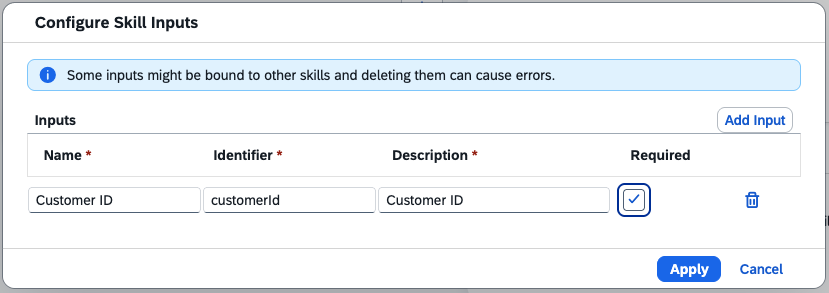 

3. Select the tab "Parameter" and select "Configure Skill Output". Provide the Output Parameter "Customer Order List", "Required", "List".

   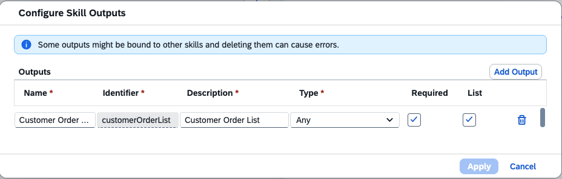 

4. Click the "**+**" icon in the steps overview. Add "Call Action"

   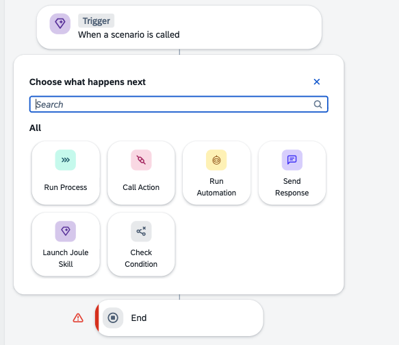 

5. You should see the actions already assigned to the project. If no, select "Browse All Actions".

   Select "Get entities from related Orders" action.

   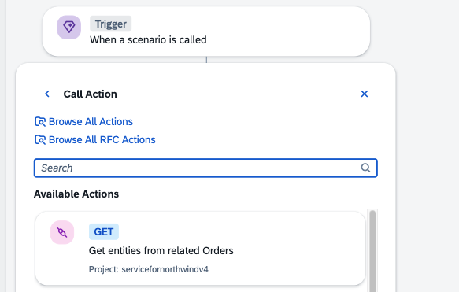
   
6. Click on the action, assign your Northwind destination variable, and map the required service Input Parameter "CustomerID" to the Skill Input Parameter "Customer ID".

   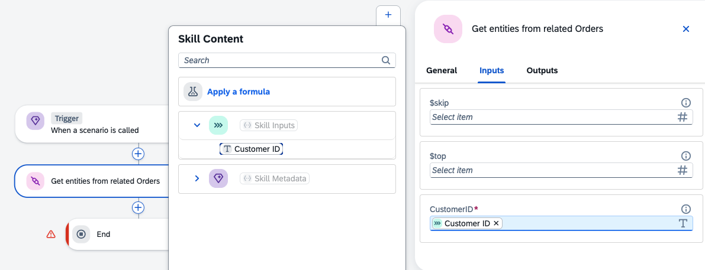 

7. Check the result set of the action (optional).

   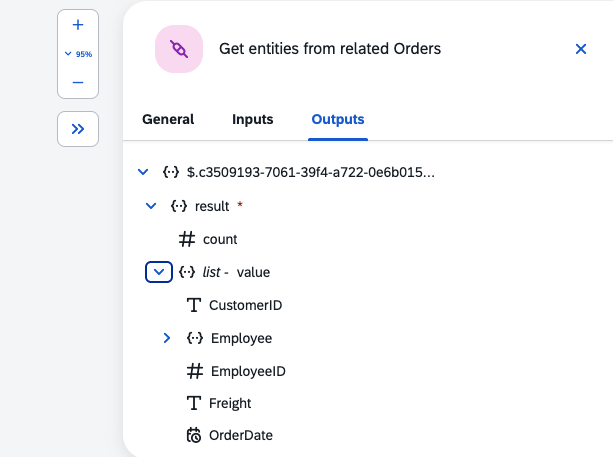 

8. Go to the "End" step of your skill. Map the service output "list-value" to your Skill Outputs.

   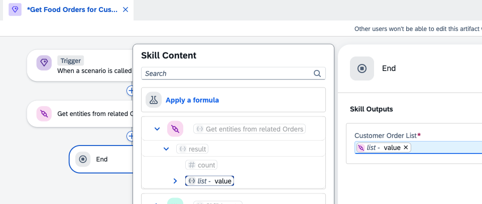 

9. Do not forget to "Save".

This Joule Skill is ready for release.

### Create a Joule Skill for Food Order Details

Order ID

Order Details

1. Create a Joule Skill for getting Northwind Order Details for an Order ID. Go to "Lobby", open your Project and select "Create" --> "Joule Skill".

   Provide a Name: "Get Food Order Details for Order ID"

   Add the important description for Joule: "Get Order Details for a provided Order ID and show all information."

   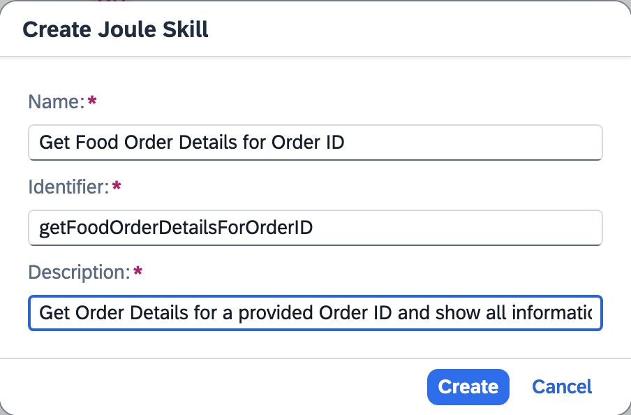 

2. The Editor for the new skill opens. Select the first step, "Trigger".

   Keep "Allow Joule to generate a response".

   Select the tab "Parameter" and select "Configure Skill Input". Provide the Input Parameter "Order ID", "Required".

   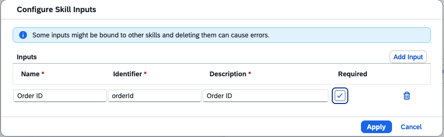 

3. Select the tab "Parameter" and select "Configure Skill Output". Provide the Output Parameter "Order Details", "Required", "List".

   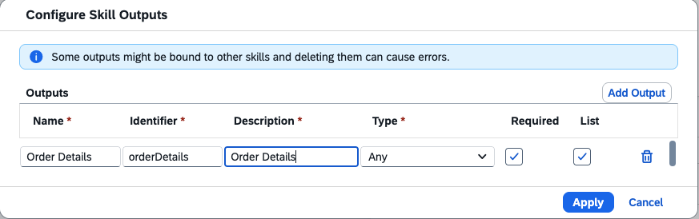 

4. Click the "**+**"-icon in the steps overview. Add "Call Action"

    

5. You should see the actions already assigned to the project. If not, select "Browse All Actions".

   Select "Get entities from related **Order_Details**" action.

   Click on the added action and assign your Northwind destination variable. 

   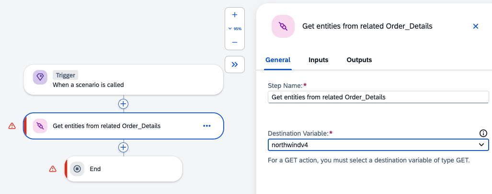 

6. Map the required service Input Parameter "OrderID" to the Skill Input Parameter "Order ID".

   However, you will notice that you cannot assign the service parameter directly. It is of type "string", and must be "number" for the service.

   Select "Apply a Formula". 

   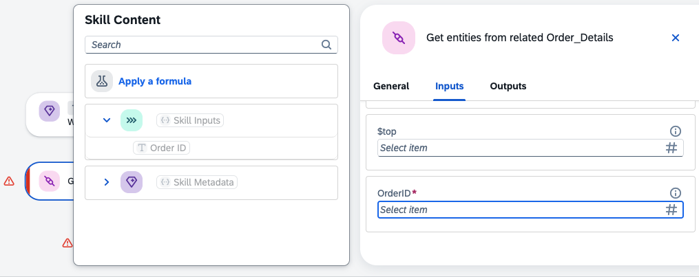 

7. Select "String functions" and select the "StringToNumber()" function.

   Click on Skill Input "Order ID" to add it as an input parameter for the string function "StringToNumber(Order ID)".

   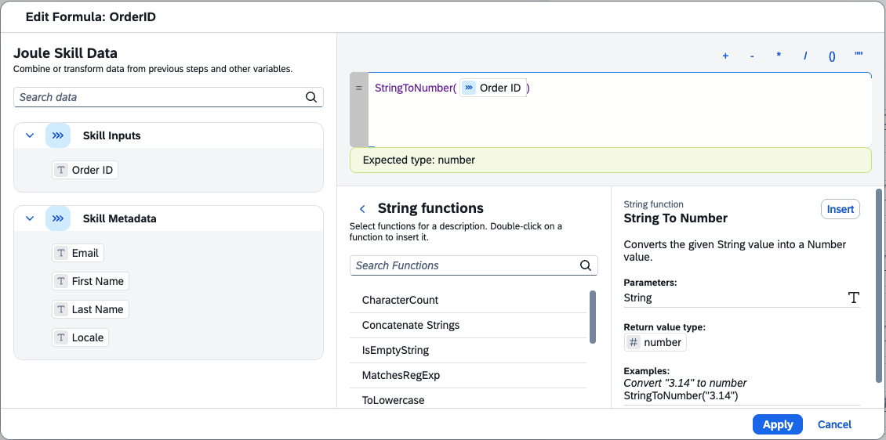 

8. The result will be an "Expression" in your parameter mapping. Save your changes.

   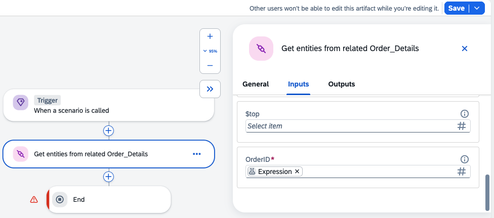 

9. Check the result set of the action (optional).

10. Go to the "End" step of your skill. Map the service output "list-value" to your Skill Outputs.

    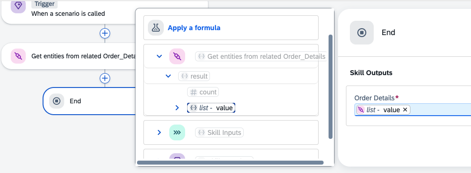 
  

9. Do not forget to "Save".

This Joule Skill is ready for release.

### Release and deploy your Joule Skills

1. Go to your Project Overview and "Release" your Joule Skills. 

2. Select the new Release version and "Deploy". Map your Northwind Test Environment to your Project destination variable.

   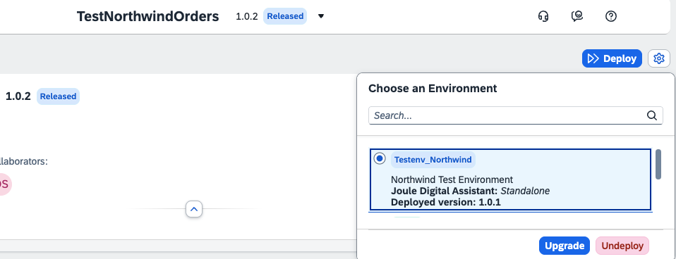 

### Test your new Joule Skills

1. Go to "Control Tower" --> "Environments" and click your Test Environment.

     

2. Select the tab "Joule" and "Launch" your Joule Standalone Environment.

     

3. Search for a customer, for example: "Show me customer ALFKI".

     

4. Search for Orders for a valid Customer ID, like ALFKI: "Show me orders from ALFKI".

   You get the Order IDs. E.g., Order ID "10643".

   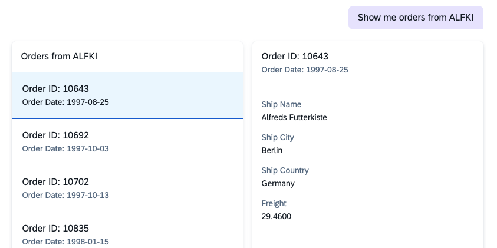 

5. You can also filter the result, like: "Show me orders from ALFKI in 1997". Or ask Joule to list more results: "Show me orders from ALFKI in 1997, show all details".

   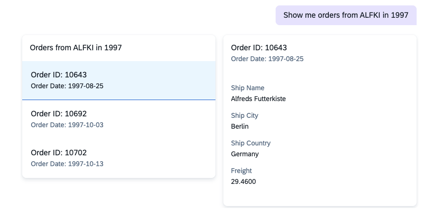 

6. Search for the Order Details for a valid Order ID. E.g., Order ID "10643": "Show me order details for 10643"

   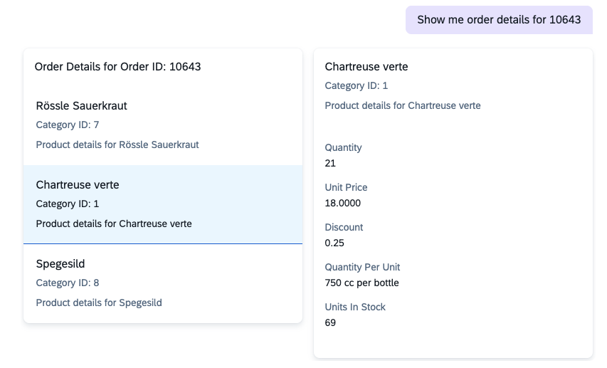

You are done with your Northwind Joule Skills!
