# Optional: Set up SAP Build Work Zone Service

SAP Build Work Zone enables you to easily create business sites that provide centralized access to applications from your projects.

## Prerequisites

You need an entitlement for SAP SAP Build Work Zone, standard edition service in your Global Account

You need a Cloud Identity Services tenant (Identity and Authentication service, IAS). If you don't have one, create one first. If you need help creating one, see the Discovery Center mission [Get Started with SAP BTP—Cloud Identity Service Provider](https://discovery-center.cloud.sap/missiondetail/4325/4605/).

   

### Check and Set your Subaccount Entitlements

In case you run the commercial model "subscription you might need to entitle your Subaccount.

Note: You can only entitle your Subaccount if you are entitled to the SAP Build Work Zone in your Global Account.

1. Go to your Subaccount, where you want to deploy your Build Work Zone service.

    Go to "Entitlements" and search for "Build Work Zone".

    If your Subaccount is not entitled yet, select "Edit" --> "Add Service Plans"

    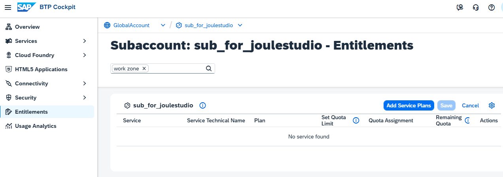

2. Search for "Studio", select SAP Build Work Zone, and add your required service plans.

    Select "Add ... Service Plans".

    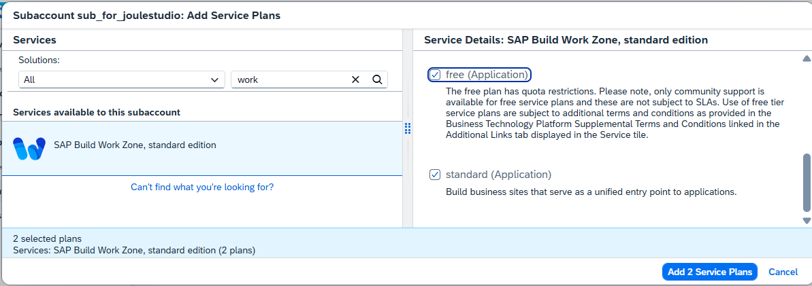

3. You are entitled to use SAP Build Work Zone in your Subaccount.

    Do not forget to **Save**.

    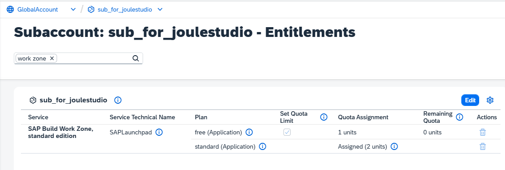

### Check your Trust Configuration

SAP Build Work Zone needs a Trust Configuration for your Identity Provider. In this example, you use BTP Cloud Identity Services.

Your subaccount should already have a trust configuration from the previous booster for SAP Build Process Automation.

1. Open your Global Account and your Subaccount for Joule Studio.

2. Open "Security" --> "Trust Configuration"

    The "Default Identity Provider" is the Provider from the BTP platform, used for the Subaccount Administrator.

    The "Custom IAS tenant" (or any other name for your custom IAS) is the identity provider for your SAP Build Work Zone service.

    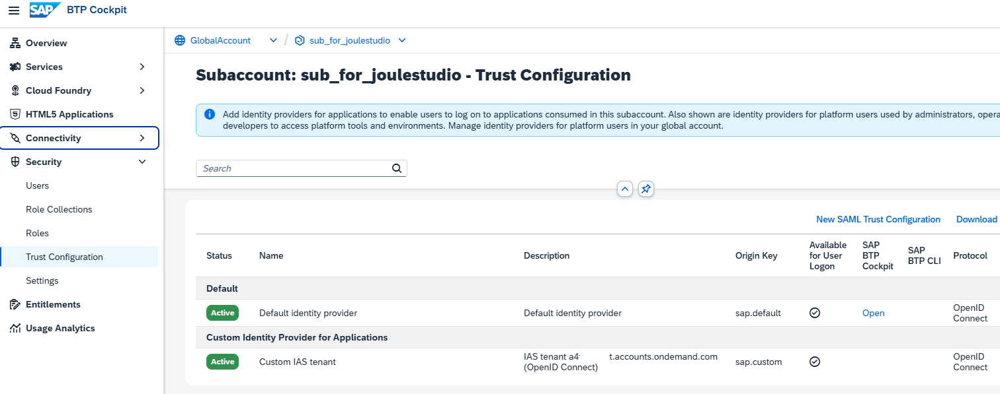

### Subscribe to the SAP Build Work Zone Service

1. Log into your trial subaccount, navigate to "Services" --> "Instances and Subscriptions," and choose "Create."

    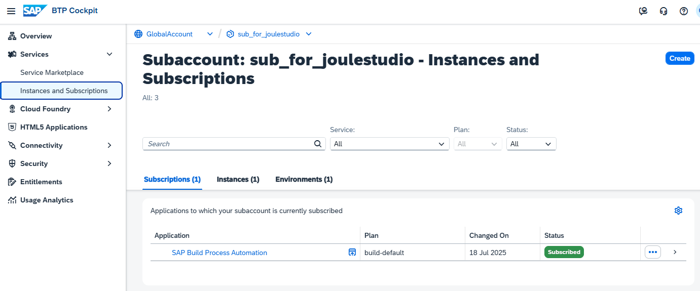

2. Select "SAP Build Work Zone, standard edition" as the Service and select "Subscription" as the service plan.

    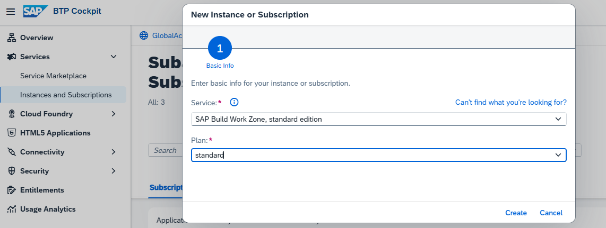

3. The Subscription for SAP Build Work Zone will be created.

    This takes a minute for this service.

    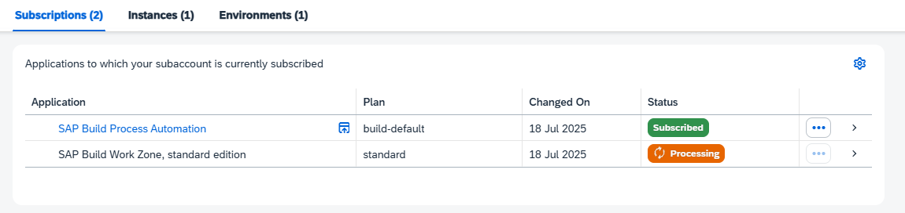

4. Click on the Build Work Zone Subscription or on "Go to Application". 

    A new window will open with "Access Denied". 
    
    You need to add the missing Role Collection "Launchpad_Admin" to your user. 

    The required role collections have already been created with the subscription to the Launchpad Service.

5. In the left-handed navigation pane of the BTP Cockpit, navigate to **Security --> Users**and click on users.

    In this mission, you will see your own user twice:
    One with "Default Identity Provider," the Provider from the BTP platform used for the Subaccount Administrator.
    And one with "Custom IAS tenant" (or any other name for your custom IAS), the identity provider for your SAP Build Work Zone service.

    Click on your user with Custom IAS (you can also additionally add the Role collection to your platform user)

7. Click on "Assign Role Collection".

    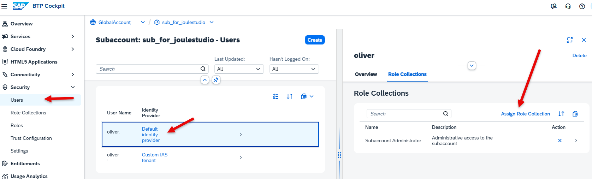

8. Assign at least the Role Collection **Launchpad_Admin** and click "Save".

    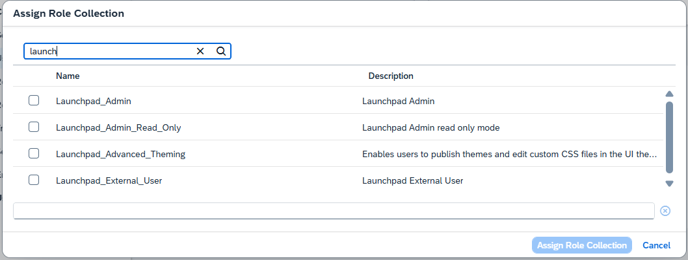

9. Go back to "Services" --> Instances and Subscriptions" and click "SAP Build Work Zone, standard edition" again. 

    The browser may still cache old authorization information. In this case, log out, or close and reopen your browser.

    You have to authenticate with your Custom IAS user.

    The Work Zone Site Manager should now open. 

    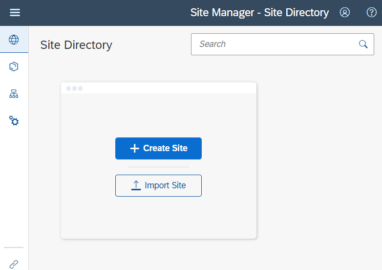

### Optional: Activate Joule in SAP Build Work Zone 

If you have the Joule Service installed, you can activate Joule in Work Zone.
It can be used for Joule Digital Assistant in shared environments.

1. Create a "Test Site" in Work Zone Site Manger.

2. Enter the "Site Settings" of your Test Site. 

    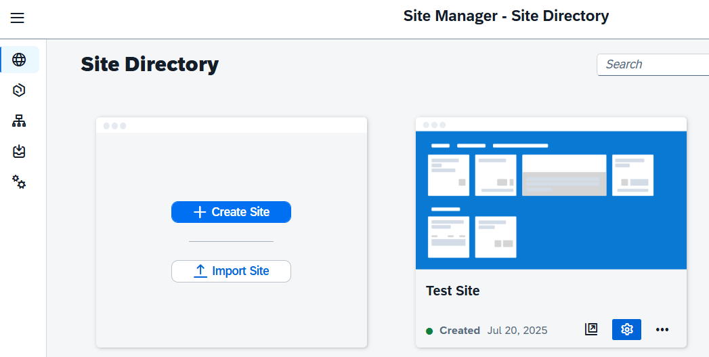

3. Choose "Edit in your Site Settings and switch the Joule slider.

    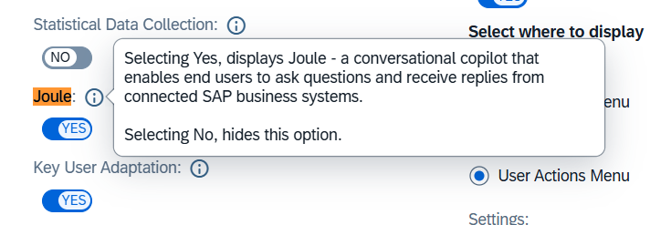

### Optional: Integrate your standalone SAP Build Environment in SAP Build Work Zone

After you have created your first Joule Studio app, you can later optionally integrate your standalone SAP Build environment with your Joule project as a "Dynamic URL" app into your SAP Build Work Zone (e.g., for testing). When you create a new app in the Content Manager, choose:

- System: SWZ_Joule
- APP UI Technology: Dynamic URL
- Relative Path to APP (example): /webclient/standalone/da_myjouleskillsenv

  (example for a "standalone environment" and the name "myjouleskillsenv")

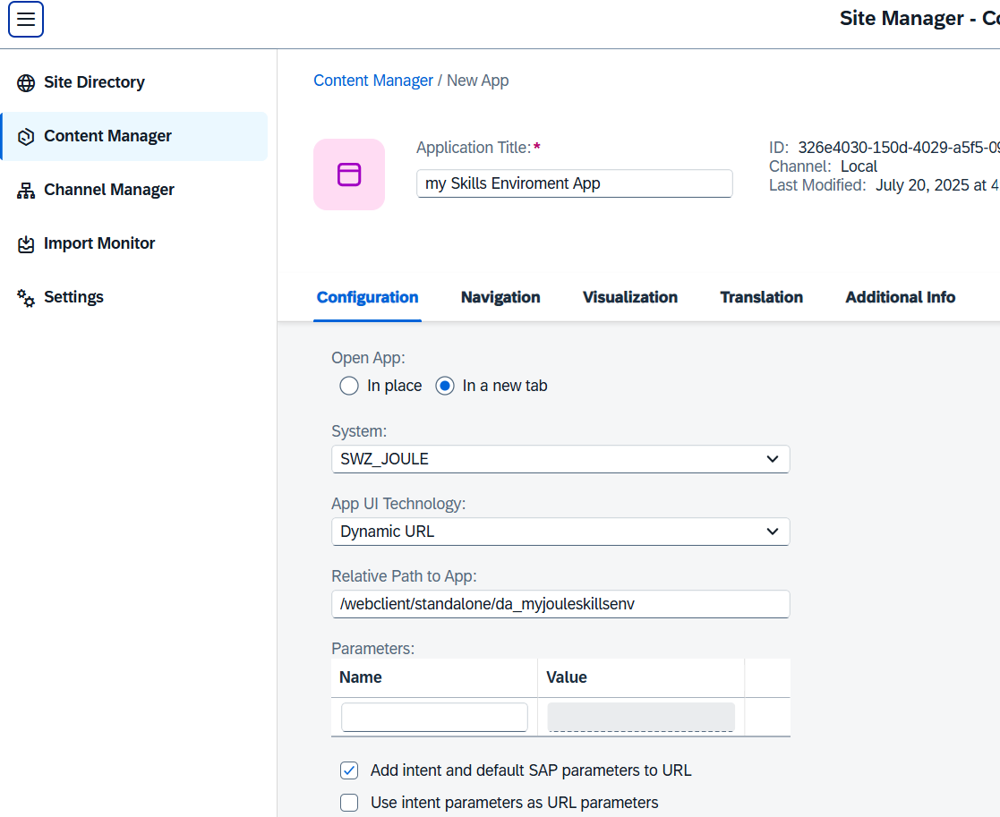
  
Provide a "Semantic Object" and an "Action" of choice.

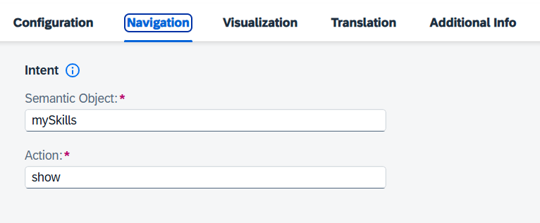

For more information about setting up SAP Build Workzone, see the tutorial [Deliver Your First SAP Fiori Launchpad Site](https://developers.sap.com/mission.cp-starter-digitalexp-portal.html)

