# Get Started with a simple Joule Skill example

After you have now set up your Joule Studio environment, you may make your very first steps in Joule Studio with a simple example.

### Create an Environment for your Joule Skills

Enter your SAP Build Lobby, click on your SAP Build Process Automation Subscription in your Subaccount.

1. Enter the "Control Tower" in SAP Build and select "Environments".

    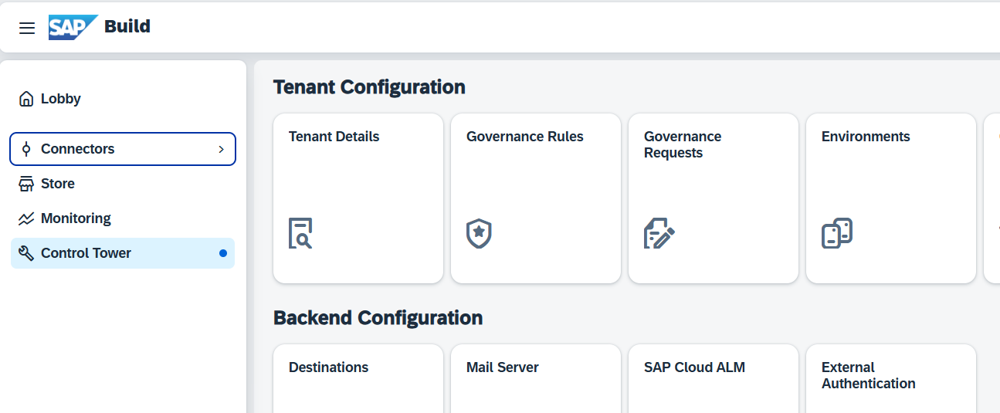 

2. Select "Create".

    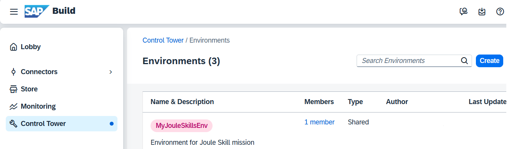 

3. Enter the name "test_env_standalone", select a color, and provide some description. 

     

4. Create a second environment, named "test_env_shared".

    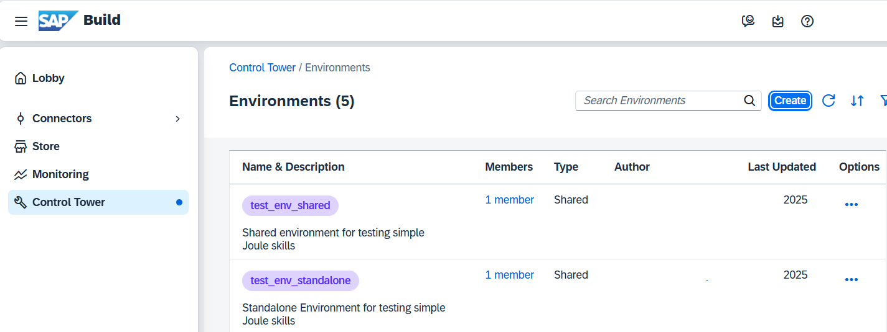 

5. Click on your environments and select the "Joule" view on your environment. It is empty for now.

    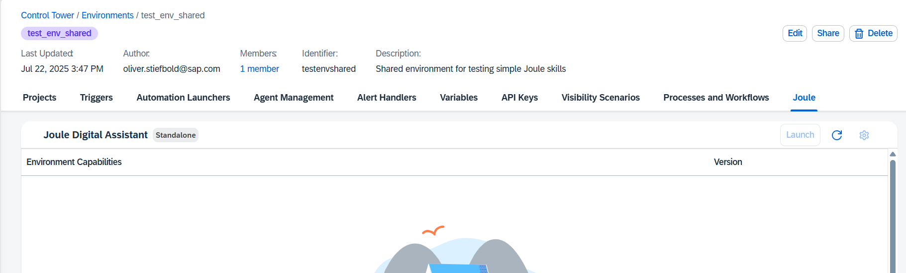 

### Create your first Joule Skill

1. Enter the "Lobby". Select "Create" --> "Joule Skill"

     

2. Provide a name for the project. E.g., "testJoule_project".

    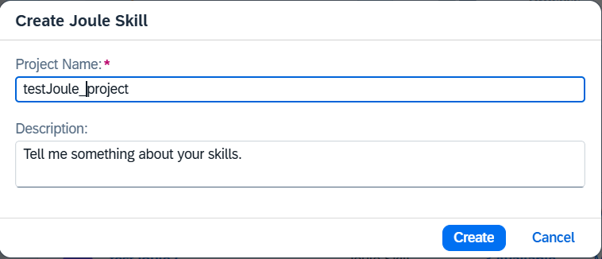 

3. In your project, select "Create" --> "Joule Skill"

     

4. Provide a name, "SimpleSkill", and provide the description "Tell me something about your skills". The description is important. Based on it, Joule will select the skill in a shared environment.

    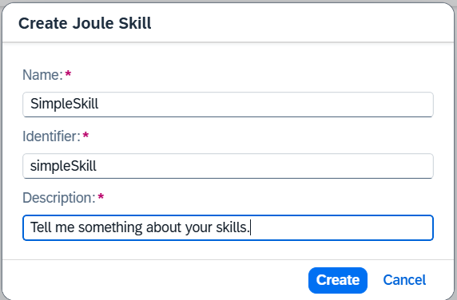 

5. Click on your skill and enter Joule Studio.

   Select the first step, "When a scenario is called," and check the configuration.

    

6. Click on the "Plus" icon between the steps. A selection screen opens. Select "Send message".

    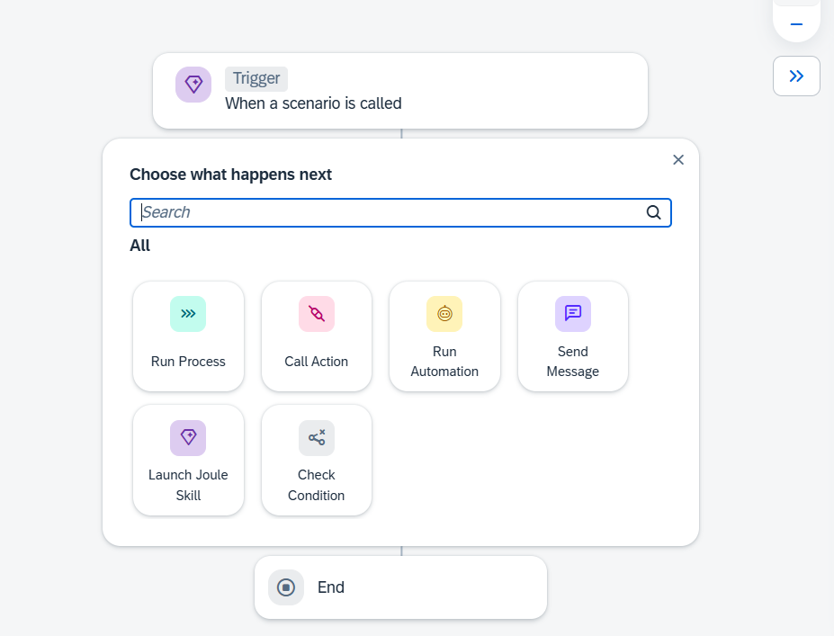 

7. Click on your "Send Message" step and open the Message Editor.

    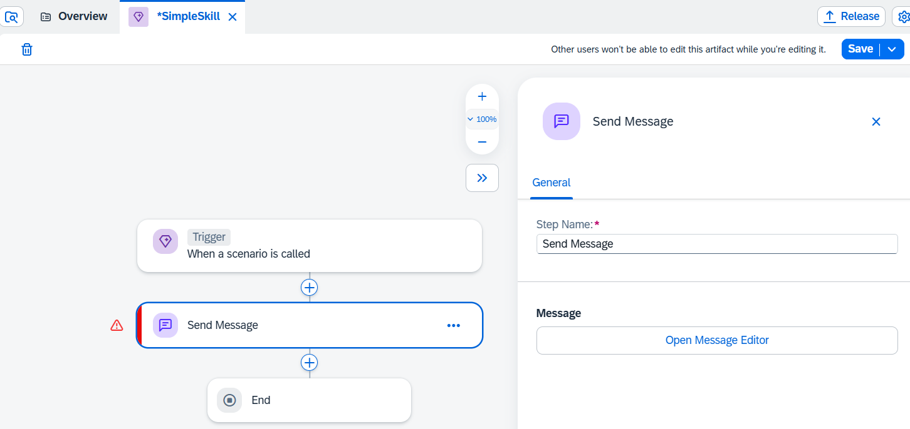 

8. Keep "Illustrated Message", provide the "answer" (e.g., "Joule skills are magic!"), and change the picture, for example, to "Balloons" and save it.

    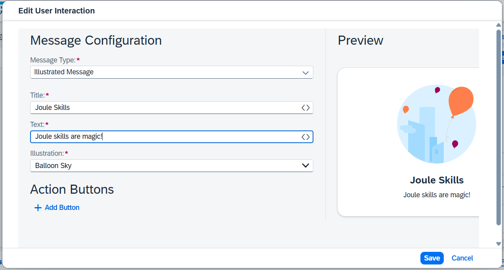 

### Release Deploy your Joule Skill

1. Save and Release your Joule Skill.

     

2. Switch the version of your Project to the "Released" version.

    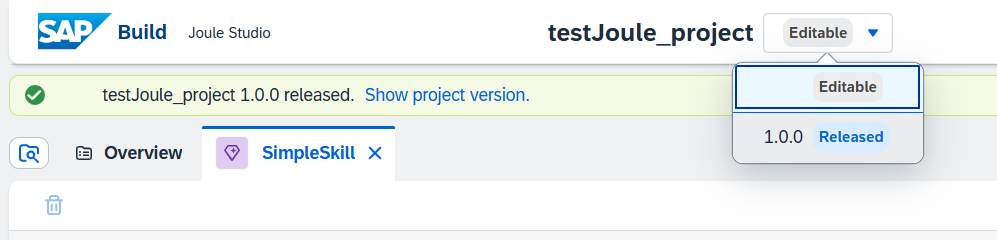 

3. A deploy button will appear; click "Deploy". 

    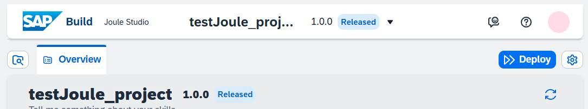 

4. Select "test_env_standalone" as the deployment environment. Confirm "Deploy".

    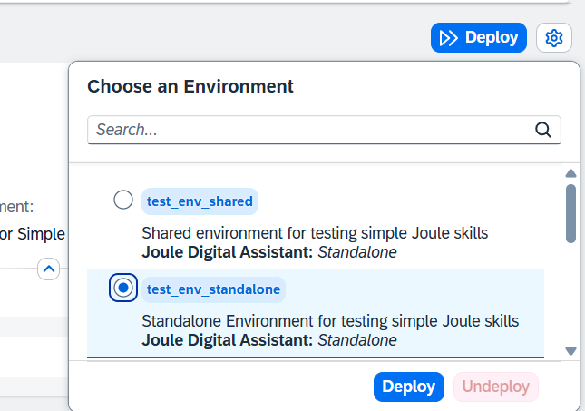 

5. Switch back to your environments and select the Joule tab. A "Launch" button will appear. You can now test the skill in a standalone environment, which means only the Joule skills of your project are available in Joule.

    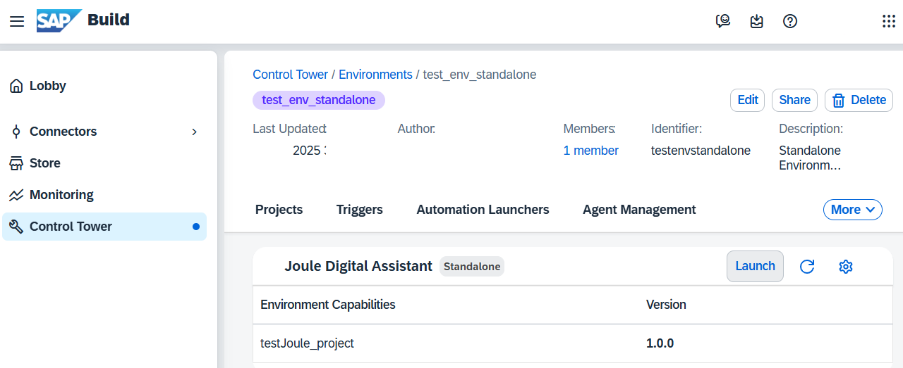 

6. Type "Tell me about your skills" in Joule

     

7. Receive the message you have created.

    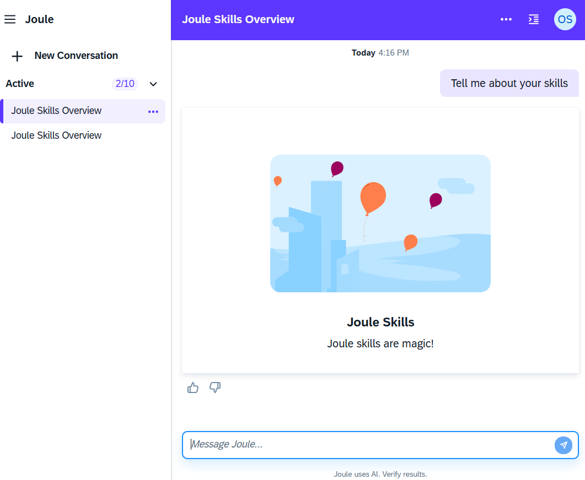 

### Optional: Test your skill in a shared environment

1. Deploy your skill also in your second environment, which you have named "test_env_shared". Once deployed, open this environment. You can now enable the "Share Environment Capabilities" under "Settings".

     

2. Switch to your Joule-enabled SAP Build Work Zone application. Open a site and select the Joule icon.

     

3. Repeat your test with "Tell me about your skills" in Joule

    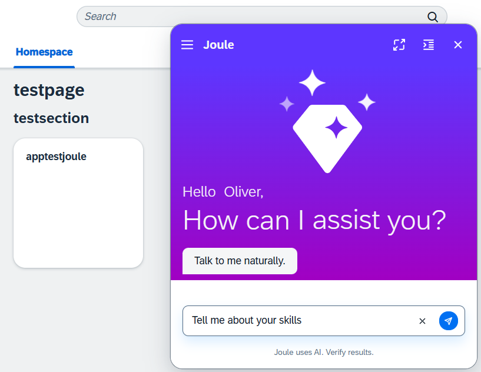

4. The results should be the same.

    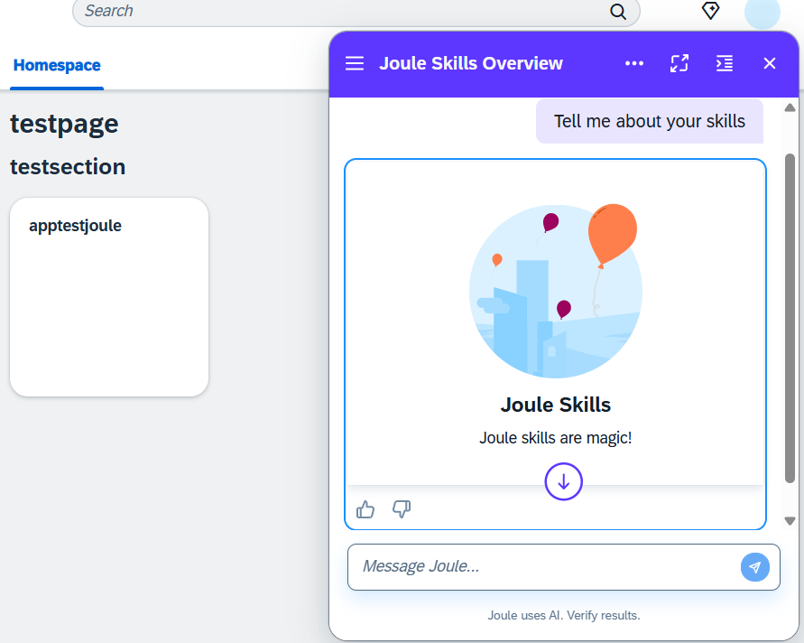 
