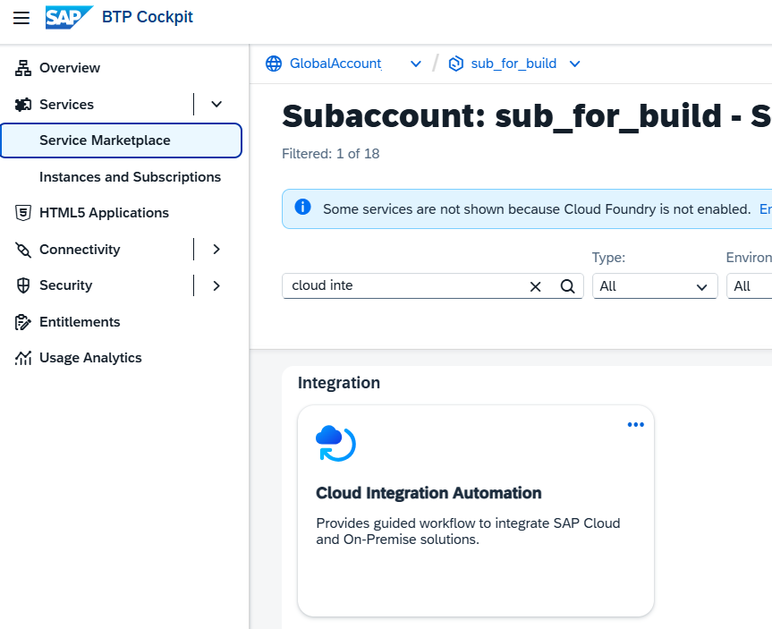

# Set-Up SAP Build with Cloud Integration Automation

You can set up SAP Build in two different ways.

You can set-up SAP Build services using a specific set-up Booster for SAP Build Process Automation, Joule, and optional SAP Build Work Zone.

Or you can use the "Cloud Integration Automation" (CIAS) service, a free service in SAP BTP, which offers a guided approach for setting up scenarios. One of the supported scenarios of CIAS is the set-up of SAP Build (for additional scenarios see [SAP Help Portal](https://help.sap.com/docs/cloud-integration-automation/user-guide/overview?locale=en-US)). From a sceanrio you can generate a guided workflow, which contains tasks (steps) that can be executed automated or manual, following the instructions.

For more information, see [SAP Help Portal](https://help.sap.com/docs/build-service/build-service-guide/initial-setup-of-sap-build?locale=en-US)

### Subscription to Cloud Integration Automation Service

You can subscribe to Cloud Integration Automation service from the service marketplace of SAP BTP cockpit. 

1. Set-up a Subaccount (or use an existing one) to subscribe to CIAS. To set-up a subaccount open the "Account Explorer" of your Global Account and click "Create" --> "Subaccount.

    Provide a name and a region. Cloud Integration Automation service is only available in the following [regions](https://help.sap.com/docs/cloud-integration-automation/user-guide/prerequisites).

    Choose "Create".

     

2. Enter your Subaccount and open "Service Marketplace". Search for "cloud integration" and open it.

      

3. Click "Create".

     
    
4. Cloud Integration Automation service provides two plans:

    - Standard - This is an application plan that provides capabilities to work with Cloud Integration Automation service UI application.

    - OAuth2 - This is a service plan that provides access to the APIs of Cloud Integration Automation service. You don't need this plan for this scenario.

    Choose Standard.

     

5. Go to "Security" --> Users. Select your User to assign Role Collections for CIAS.

     

6. Add the 3 CIAS Role Collections

     

### Open Cloud Integration Automation Service

7. Navigate to "Services" --> "Instances and Subscription" in your Subaccount and open CIAS. Check the Help Documentation.    

     

8. In order to start a scenario, navigate to "Plan for Integration" and search for "Build". Select "Provision SAP Build on SAP BTP" 

     

9. Check the Scenario, esp. which entities are needed for this Scenario. Click "Select Systems".
 
     

10. Provide your tenants for the Scenario. Best you search BTP with the name of your Global Account and your Cloud Identity Services also with its name.

     Afterwards you can click "Generate Workflow". Either as Background Execution or in this case, you choose "Step by Step Execution".

      

11. Click "Next" and then "Generate".

     

12. A workflow with 39 tasks will be generated and is available in you "Inbox".

    Read the Disclaimer and agree or claim.

     

13. Check your systems again and agree.

     

14. Assign Users to Roles. You can also assign all roles to your user and confirm.

     

15. Select the required scope for Joule Studio.
 
     

16. Provide the necessary Parameters for a new subaccount. Choose a Data Center where Joule is available.

    Or click "Task Completed", then you can provide the parameter of an existing Subaccount. You find all parameter in your Subaccount "Overview" in BTP Cockpit.

     

17. In case you create a new Subaccount, the progress will be shown in the task.

     

18. In case you use an existing Subaccount or you created a subaccount manually, following the "Manual Instructions", confirm the manual "Task Completion".
 
     

19. In case you get an error for the task execution, you can also execute the task manually. Follow the "Manual Instructions", they are contained in every task and confirm completion afterwards.

 
    

20. Open the overview tab of your workflow. You see the upcoming 38 required steps.

    

21. Repeat until Task 39.
