# Minimal Account Set up with SAP Build Process Automation (Free) Booster

You can set up SAP Build in different ways.

This tutorial uses a standalone setup of SAP Build services, utilizing a specific Booster for SAP Build Process Automation (Free), which provides a minimal setup for Joule Studio.

You can also utilize the "Cloud Integration Automation" service, a free service in SAP BTP, which facilitates onboarding BTP scenarios through a guided approach. For more information, see [SAP Help Portal](https://help.sap.com/docs/build-service/build-service-guide/initial-setup-of-sap-build?locale=en-US).

### Prerequisites

You need an entitlement for SAP Build Process Automation and the service plan **build_default**. You will also temporarily need the service plans **standard** (or **foundation**, depending on the license model).

You need a **Cloud Identity Services tenant** (Identity and Authentication service, IAS). If you don't have one, create one first. If you need help creating one, see the Discovery Center mission [Get Started with SAP BTP—Cloud Identity Service Provider](https://discovery-center.cloud.sap/missiondetail/4325/4605/).

You need an entitlement and a free quota for SAP BTP, Cloud Foundry Runtime.

**Optional:** You can set up SAP Build Work Zone and deploy your Joule Skills and Agents to a shared Joule Environment.

### Check your Entitlements

The Booster for SAP Build Process Automation does not support the service plan "build-default". It requires a "free (Application)" service plan for setup in addition.

1. Open your Global Account, navigate to Entitlements --> Service Assignments, and search for "Process Automation". Ensure you have the necessary entitlements: Free for applications, standard (or foundation) for applications and services, and build-default for applications.

    

### Start Booster for SAP Build Process Automation

1. Navigate in your Global account to "Boosters". Search for "Process Automation".

    Select the booster "Set up account for SAP Build Process Automation (Free)".

    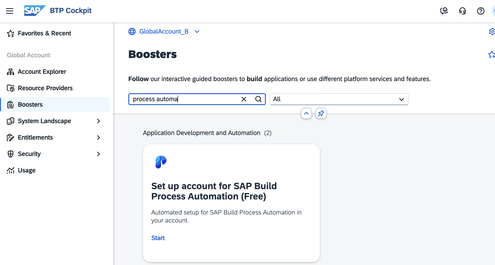

    Click Start. You will only install the mandatory components.

2. Step 1: Check Prerequisites.

    This step must be "green", which means you have the necessary entitlements in your global account. 

    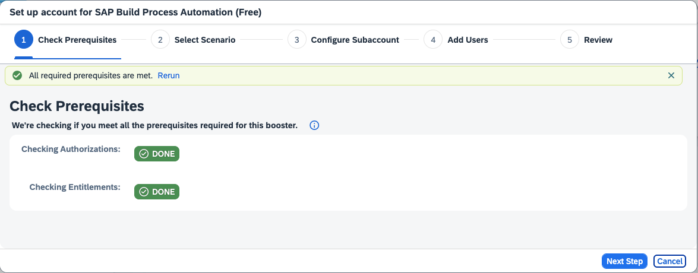

3. Step 2: Either create a new Subaccount or use an existing one. In this example, you create a Subaccount.

    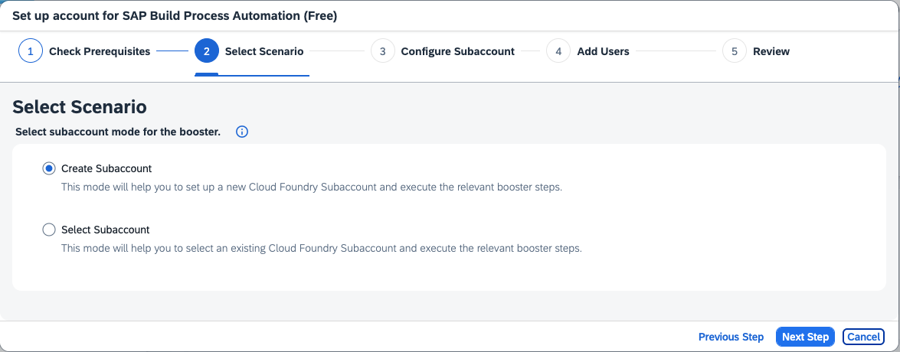

4. Step 3: Name your Subaccount, choose Provider and Region (where Joule is also available)

    Choose "standard" as the service plan. The booster does not support "build_default". You will need to change the service plan later to the "standard" plan and then to "build-default".

    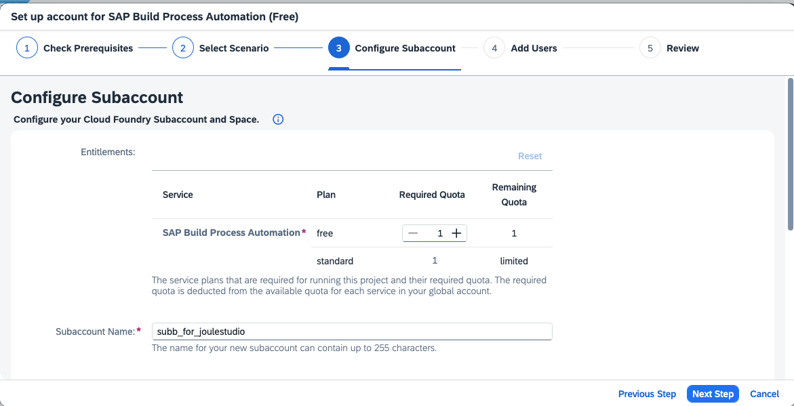

5. Step 4: Add users

    Please provide your Customer Identity Provider for Applications here. Otherwise, Joule Studio will not work.

    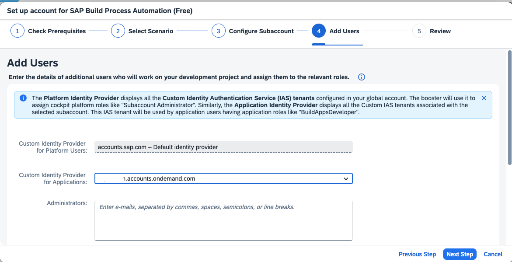

6. Step 5: Review and Start

   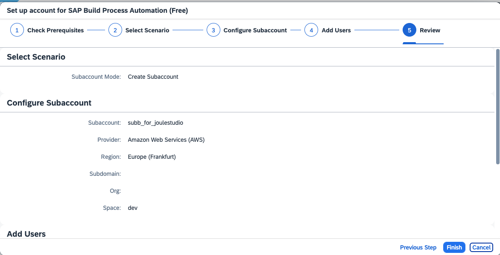 
    
    The installation of SAP Build Process Automation starts.
    

7. When the booster has finished, navigate to your (new) Subaccount --> Instances and Subscriptions.

   

8. You have a SAP Build Process Automation Subscription and a Service. If you do not see the "Update" context menu entry, your Subaccount is missing additional service plans. You will add them.

    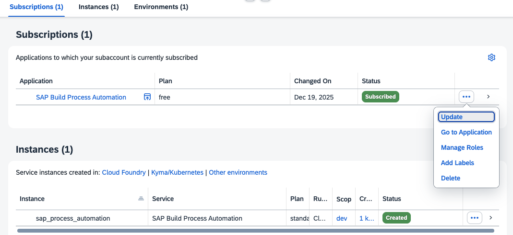

9. In order to install Joule, you have to update your service plan for SAP Build Process Automation to **build-default**. First, add the missing entitlements of your Subaccount.

    Go to "Entitlements" of your Subaccount and click "Edit". Search for "process automation". Add "standard (Application)" or "foundation" for some license models and "build-default" for others.

    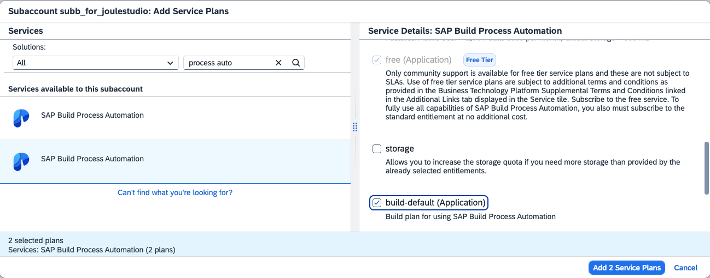

10. Do not forget to save. Check that you are entitled.

    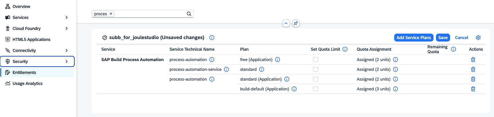

11. Update your service plan now for your Subscription from "free" to "standard".

    

    Change your service plan from free to "standard" and "Update Subscription".
    
    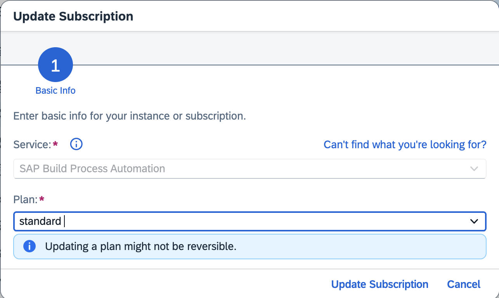

12. Afterwards, repeat the step and change the service plan to "build-default". Your Subscription is now ready for adding a Joule subscription.

    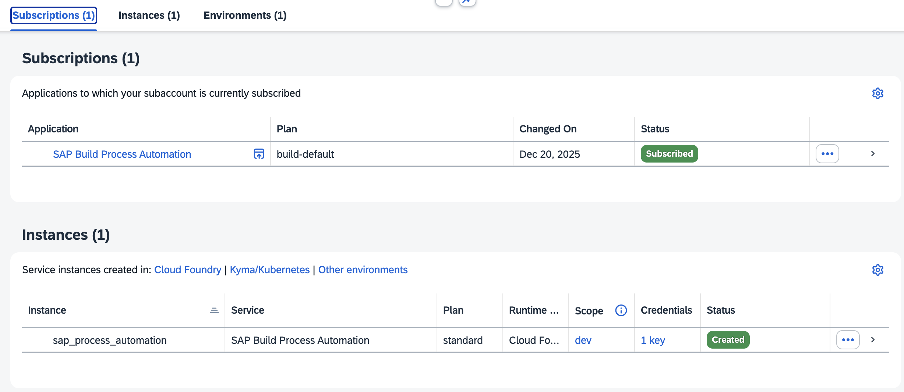

### Additional Checks

1. Check your new Destinations. 2 new destinations have been created.

    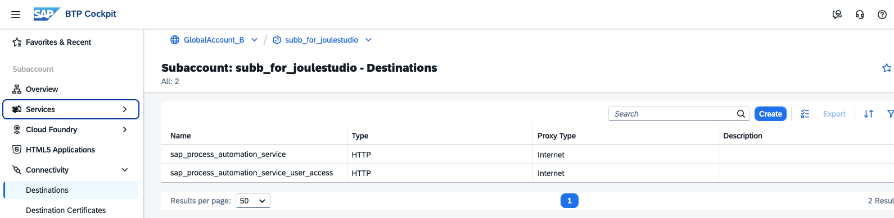

2. Check your Trust Configuration. Note, in this picture, you have two identity providers available for user logon. This means you can choose which one to use when you log in to SAP Build Lobby.

     

3. Check your Custom IAS User and assigned Role Collections. Note the assigned Process Automation Role Collections.

     

4. Click on your Subscription "SAP Build Process Automation" to open it.

     If you want to authenticate yourself with your Custom IAS User instead of your Platform User, you must log off first or restart your browser.

     The SAP Build Lobby should start.

     

5. Check that "SAP Build Process Automation" and your "SAP Cloud Identity Services" are registered in "Systems" and thus visible for Joule setup.

   Go to your Global Account --> "System landscape" --> "Systems". Check that both are available. 

SAP Build Process Automation is now set up for use with SAP Build.

### Optional: Set Up SAP Build Work Zone

You can now set up SAP Build Work Zone. This is optional for this mission. Follow the next tutorial card.

