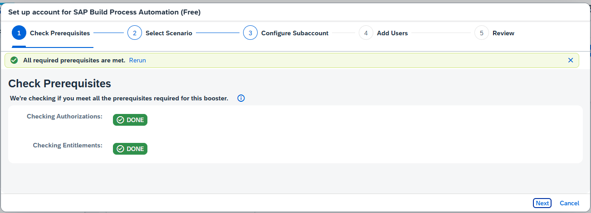
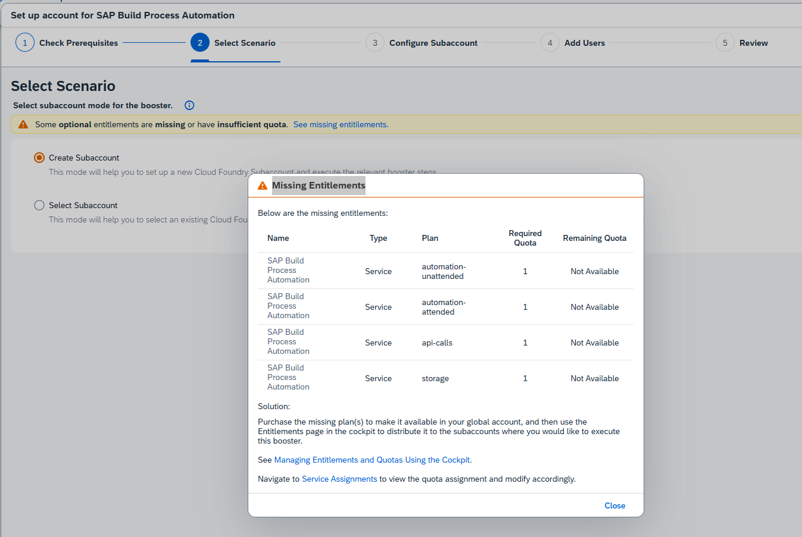
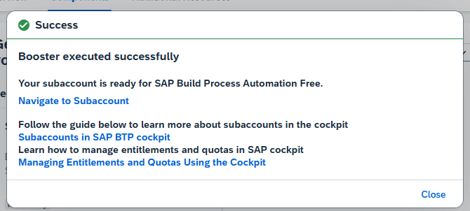
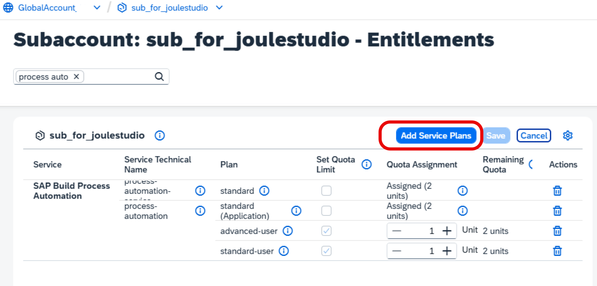
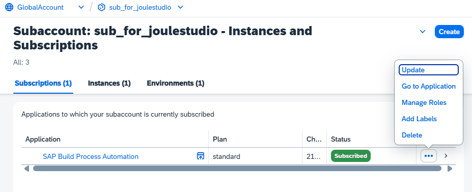
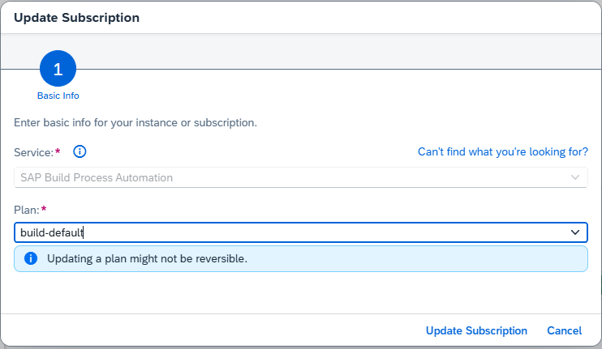
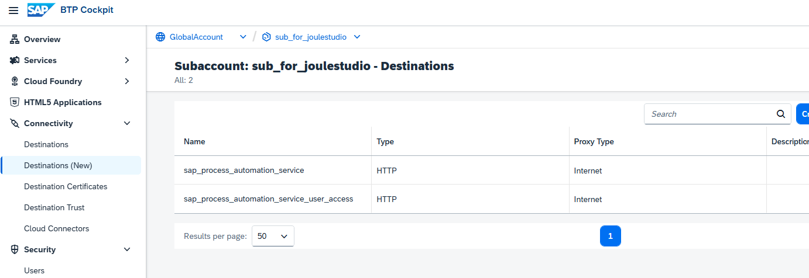
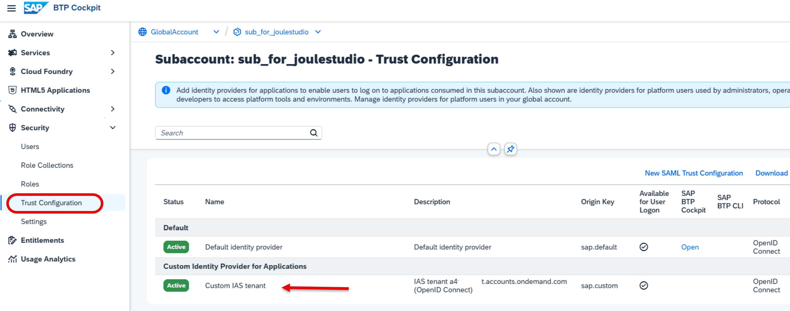
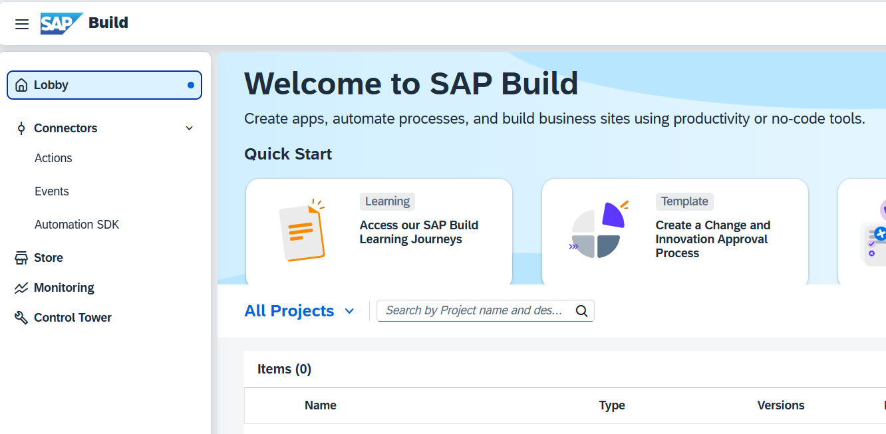

# Set up SAP Build Process Automation with a Booster

You can set up SAP Build in different ways.

You can utilize the "Cloud Integration Automation" service, a free service in SAP BTP, which facilitates onboarding BTP scenarios through a guided approach. For more information, see [SAP Help Portal](https://help.sap.com/docs/build-service/build-service-guide/initial-setup-of-sap-build?locale=en-US).

This tutorial uses a standalone setup of SAP Build services, utilizing a specific Booster for SAP Build Process Automation.

### Prerequisites

You need an entitlement for SAP Build Process Automation and the service plan **build_default**. You will also temporarily need the service "standard."

You need a Cloud Identity Services tenant (Identity and Authentication service, IAS). If you don't have one, create one first. If you need help creating one, see the Discovery Center mission [Get Started with SAP BTP—Cloud Identity Service Provider](https://discovery-center.cloud.sap/missiondetail/4325/4605/).

You need an entitlement and a free quota for SAP BTP, Cloud Foundry Runtime.

### Check your Entitlements

The Booster for SAP Build Process Automation does not support the service plan "build-default". It requires a "standard" service plan for set-up in addition.

1. Open your Global Account, navigate to Entitlements --> Service Assignments, and search for "Process Automation". Make sure you have the necessary entitlements.

    

### Start Booster for SAP Build Process Automation

1. Navigate in your Global account to "Boosters". Search for "Process Automation".

    Select the booster "Set up account for SAP Build Process Automation".

    

    Click Start. You will only install the mandatory components.

2. Step 1: Check Prerequisites.

    This step must be at least "green" or "warning". A warning means you don't have the entitlements for the optional service plans.

    

3. Step 2: Either create a new Subaccount or use an existing one. In this example, you create a Subaccount with all entitlements.

    

    ...or with missing optional entitlements

    

4. Step 3: Name your subaccount, choose Provider and Region (where Joule is also available)

    Choose "standard" as the service plan. The booster does not support "build_default". You will need to change the service plan later (if you use a booster with a "free" plan, you must first switch to the "standard" plan).

    

5. Step 4: Add users

    Please provide your Customer Identity Provider for Applications here. Otherwise, Joule Studio will not work.

    

6. Step 5: Review and Start

    The installation of SAP Build Process Automation 

    

7. When the booster has finished, navigate to your (new) Subaccount --> Instances and Subscriptions.

    

8. Check your newly created Process Automation Service.

    If you cannot update the service plan (as shown), the entitlement for "**build_default**" is missing.

    
    
    Add the missing entitlement. Do not forget to save afterwards.

    

    

    Change your service plan to "build_default"

    

    
    
    

9. Check your new Destinations 

    

10. Check your Trust Configuration. Note, in this picture, you have two identity providers available for user logon. This means you can choose which one to use when you log in to SAP Build Lobby.

     

11. Check your Custom IAS User and assigned Role Collections. Note the assigned Process Automation Role Collections.

     

12. Click on your Subscription "SAP Build Process Automation" in order to open it.

     If you want to authenticate yourself with your Custom IAS User instead of your Platform User, you need to log off first, or restart your browser.

     The SAP Build Lobby should start.

     

SAP Build Process Automation is set up.
