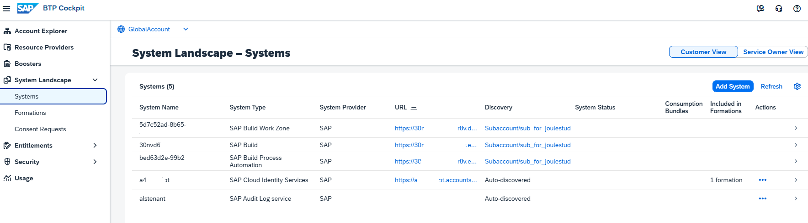
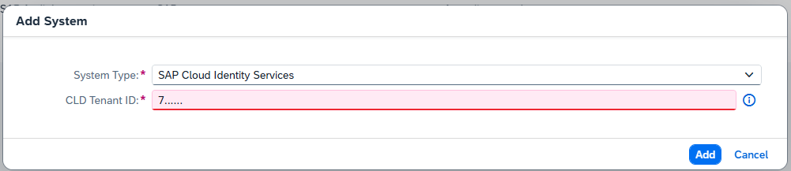
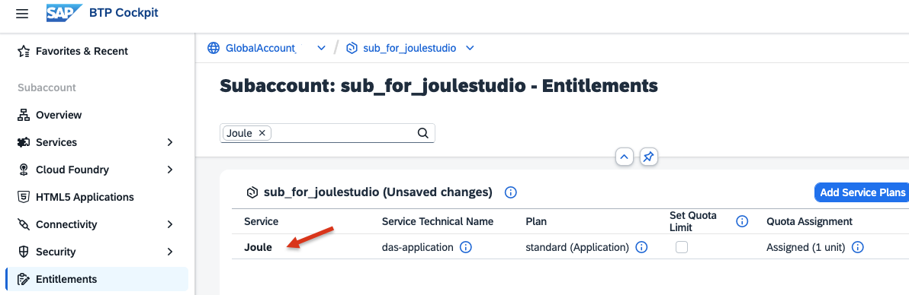
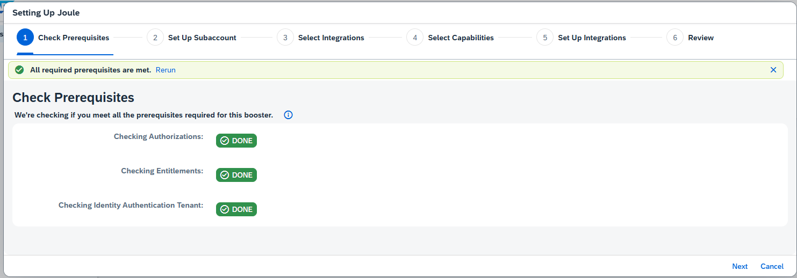
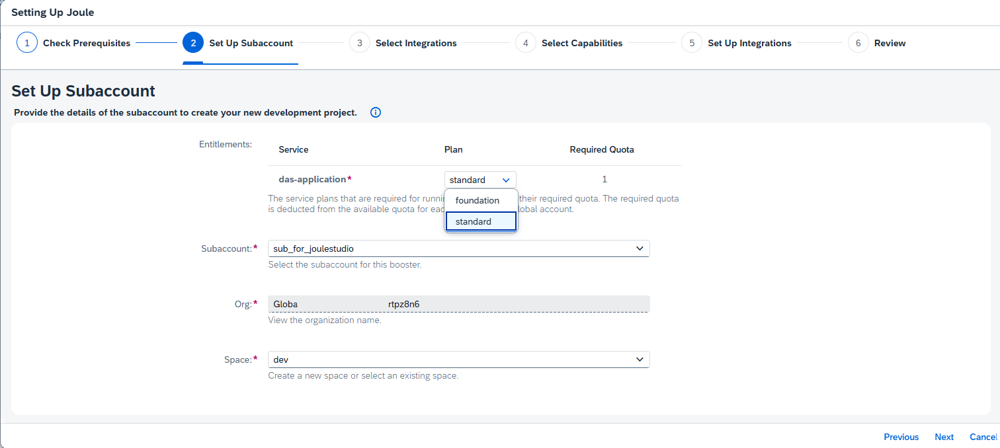
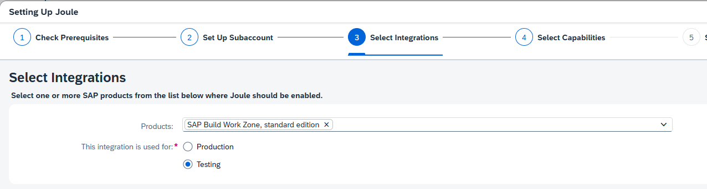
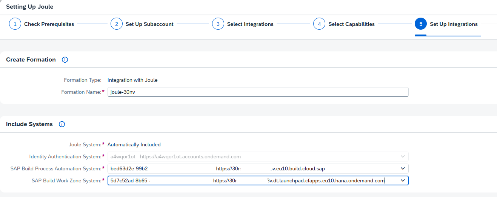
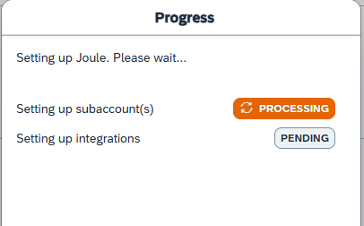
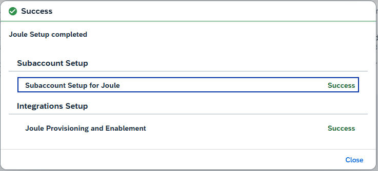
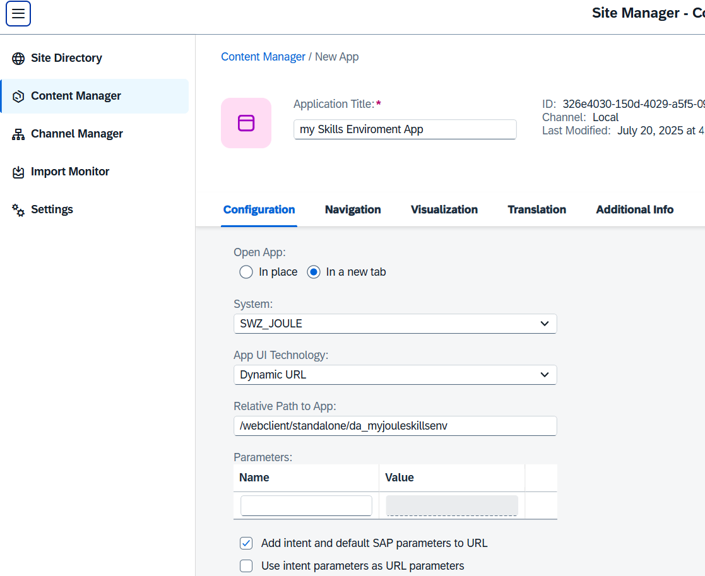

# Set up Joule for Joule Studio with a Booster

Joule Studio is a capability in SAP Build that enables organizations to create and deploy custom Joule agents and skills, automating workflows and enhancing efficiency across both SAP and non-SAP systems.

### Prerequisites

You have subscribed to SAP Build Process Automation using the **build_default** service plan. Other licenses and plans are not supported.

You are entitled to Joule with the service plan "foundation" (or, in some cases, "standard").

You have established trust between Joule and the SAP Cloud Identity Services identity authentication tenant.

You are entitled to use Joule.

Optional: You are subscribed to SAP Build Work Zone.

### Prequisites: Check your Global Account System Landscape

To run the Joule Booster successfully, your SAP Cloud Identity Services must be known to your System Landscape.

1. Open Global Account and navigate to "System Landscape" --> "Systems".

    In this case, the Booster for SAP Build Process Automation has already created a System entry.

    

2. Optional: If missing, add your Cloud Identity Services tenant manually.

    Switch to "Service Owner View" and click "Add System" and select "SAP Cloud Identity Services". 

    You need to know your CLD Tenant ID from your installation. It typically has around 9 digits.

    

3. Check your Trust Configuration. You need to establish trust between your Subaccount and Cloud Identity Services tenant.  

     

### Setup Joule with Booster 

1. Check your entitlement for Joule. You must be entitled to use "Joule" with the service plan "foundation" (or "standard").

    

2. Open your Global Account, navigate to Boosters. Search for "Joule". Start the Booster "Setting up Joule".

    

3. Step 1: The Prerequisites check must be green. If not solve the error messages of the prerequisites check.

    

4. Step 2: Set up Subaccount

    Select the Service Plan "foundation" (or standard, depending on your license model)

    

5. Step 3: Integrations

    Select Products from your System Landscape that you want to integrate into SAP Joule. In your case, SAP Build Work Zone (optional for this mission).

    Choose "Testing" for this mission.

    

6. Step 4: Capabilities

    Select both. 

    

7. Step 5: Set up Integrations

    

8. Review and Start Booster.

    This will take some minutes.

    

    Your booster should end successfully.

    

9. Go to your Subaccount --> "Instances and Subscription".

    Open your new Subscription "Joule" by clicking on it.
  
    

    You probably need to authenticate with your Custom IAS user.

    You should see the message: "The service is up and running".

### Important: Assign required Roles and Role Collections

The Joule Booster does not create a Role Collection for your user. You have to do this manually.

1. Open your Subaccount, navigate to "Security" --> "Roles". Check the available Joule roles.

    

2. Navigate to "Security" --> "Role Collections". Choose "Create" Role Collection.

    

3.  Name it, for example, "Joule_Role_Collection".

     

3. Click on Joule Role Collection and click "Edit".

    Add the two following Roles: "extensibility_developer" and "end_user", and select "Add"

    

4. Save your new Role Collection.

    

5. Go to your user and assign the new Role Collection "Joule_Role_Collection" to your user. You are ready to create and deploy Joule skills.

### Optional: Integrate your standalone SAP Build Environment in SAP Build Work Zone

After you have created your first Joule Studio app, you can later optionally integrate your standalone SAP Build environment with your Joule project as a "Dynamic URL" app into your SAP Build Work Zone (e.g., for testing). When you create a new app in the Content Manager, choose:

- System: SWZ_Joule
- APP UI Technology: Dynamic URL
- Relative Path to APP (example): /webclient/standalone/da_myjouleskillsenv

  (example for a "standalone environment" and the name "myjouleskillsenv")

  
Provide a "Semantic Object" and an "Action" of choice.

For more information about setting up SAP Build Workzone, see the tutorial [Deliver Your First SAP Fiori Launchpad Site](https://developers.sap.com/mission.cp-starter-digitalexp-portal.html)

Congratulations!

