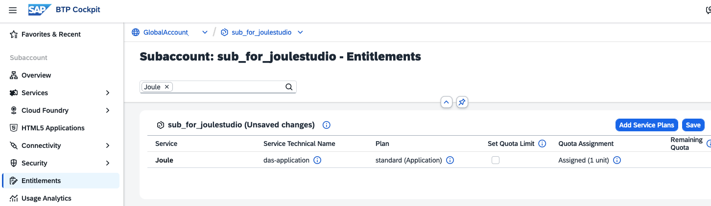
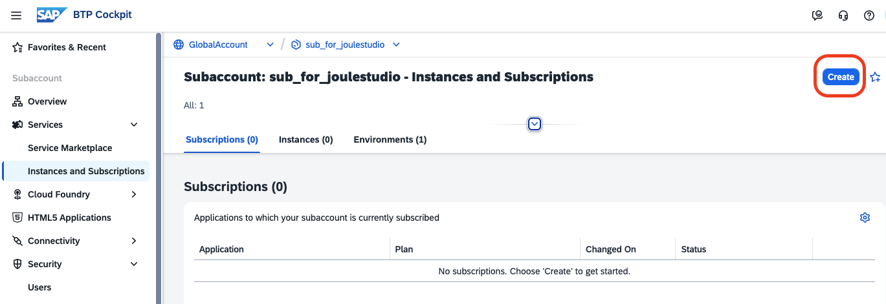
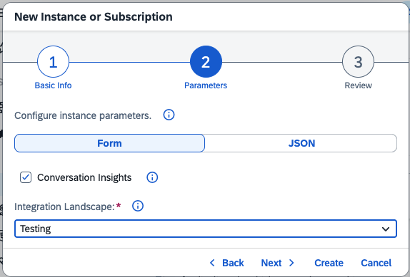
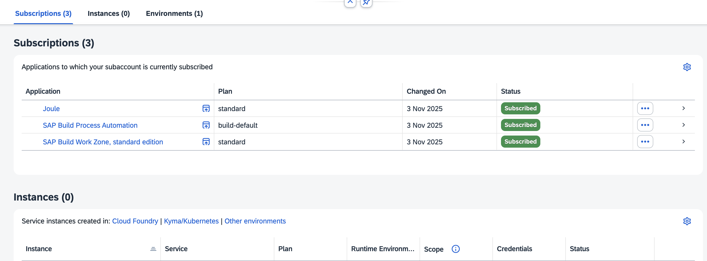
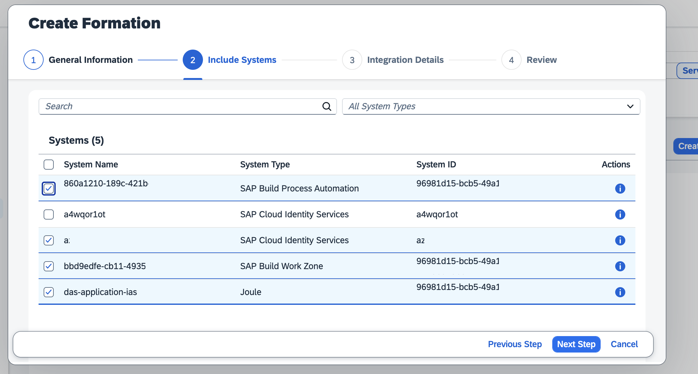
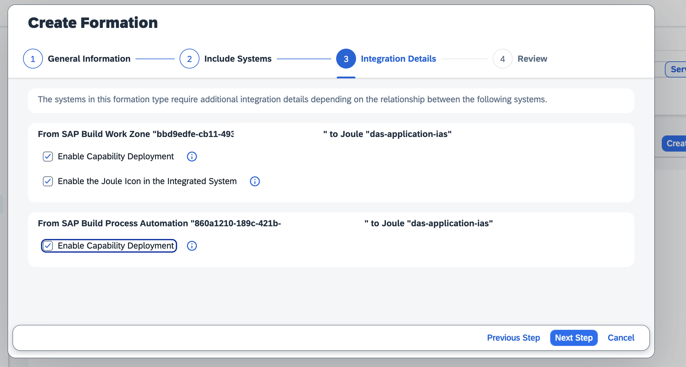

# Sunscribe Joule for Joule Studio

Joule Studio is a capability in SAP Build that enables organizations to create and deploy custom Joule agents and skills, automating workflows and enhancing efficiency across both SAP and non-SAP systems.

For non-productive use, you can manually subscribe to Joule in the SAP BTP Cockpit to use it in Joule Studio.

### Prerequisites

You have subscribed to SAP Build Process Automation using the build_default service plan.

Optional: You are subscribed to SAP Build Work Zone.

You are entitled to Joule with the service plan "foundation" (or, in some cases, "standard").

You have established trust between your Subaccount and your Custom Identity Provider for Business User Logon.

### Check your Entitlement

1. Go to your Global Account --> Entitlements --> Service Assignments.

    Search for "Joule" and check that you are entitled to Joule with service plan "foundation" (or, in some cases, "standard")

2. Go to Subaccount --> Entitlements and search for Joule. 

    Verify if your global entitlement for Joule, specifically the service plan "Foundation" (or "Standard"), has been assigned to your Subaccount.

    

3. If not, select "Add Service Plan", search for Joule, and add it to your Subaccount. Do not forget to save.

    

### Check your Global Account System Landscape and Trust Configuration

To successfully subscribe to Joule, your SAP Cloud Identity Services and additional SAP Build Services must be known within your System Landscape.

You need at least one registered Cloud Identity Services tenant to set up Joule.

1. Open Global Account and navigate to "System Landscape" --> "Systems".

    In this example, you see your available Cloud Identity Systems and two SAP Build "Systems", which you want to enable for Joule.

    

2. Go to "Security" --> "Trust Configuration" and check your Configuration.

    Trust between your Subaccount and your Cloud Identity Service needs to be enabled.

    Note that your Platform Identity Provider is still enabled for Business user logon in this example. Disable if required.

    

    

### Subscribe to Joule Service

1. Navigate to your Subaccount --> Instances and Subscription and click "Create"

    

2. Select Service "Joule" and plan "foundation" or "standard" for some license models.

    

3. Select "Testing" or "Production". Select if you want to store your conversations.

    

4. Review and select "Create". Note that this may take some time.

    

5. After the subscription has finished, you will see the subscribed Joule service. You cannot use it yet.

    

### Assign required Roles and Role Collections

The Joule subscription does not create a Role Collection for your user. You have to do this manually.

1. Open your Subaccount, navigate to "Security" --> "Roles". Check the available Joule roles.

    

2. Navigate to "Security" --> "Role Collections". Choose "Create" Role Collection.

    

3.  Name it, for example, "Joule_Role_Collection".

     

3. Click on Joule Role Collection and click "Edit".

    Add the two following Roles: "extensibility_developer" and "end_user", and select "Add"

    

4. Save your new Role Collection.

    

5. Go to your user and assign the new Role Collection "Joule_Role_Collection" to your user. You are ready to create and deploy Joule skills.

### Create a System Landscape Formation for Integration with Joule

1. Go to "System Landscape" --> "Systems". 

    Check that your Joule "System" has been created.

    

2. Go to "Formations". Select "Create Formation". 

    Select Formation Type "Integration with Joule" and give it a name. Select "Next"

    

3. Select the systems to include in your Joule formation to enable these systems for Joule. Select "Next Step".

    

4. Provide Integration Details. Enable the Joule Capabilities for the selected Build Services.

    

5. Review and Create the Integration with Joule Formation.

    Once created, you can start using Joule Studio in your SAP Build Lobby.

    

Congratulations! You can now use Joule in your SAP Build Services.

