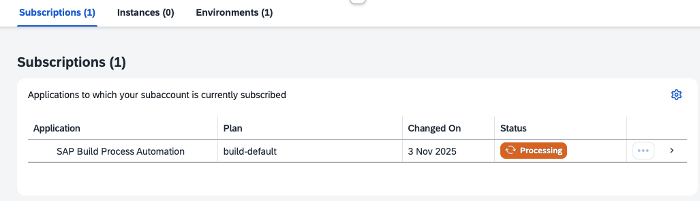

# Set up SAP Build Process Automation manually

You can set up SAP Build in different ways.

You can use the "Cloud Integration Automation" service, use the booster "Set up account for SAP Build Process Automation", or subscribe to "SAP Build Process Automation" manually.

This tutorial utilizes an SAP BTP Enterprise Account and a manual subscription to the SAP Build Process Automation service.

### Prerequisites

You need an entitlement for SAP Build Process Automation and the service plan **build_default**. Other service plans do not support Joule Studio.

You need a Cloud Identity Services tenant (Identity and Authentication service, IAS). If you don't have one, create one first. If you need help creating one, see the Discovery Center mission [Get Started with SAP BTP—Cloud Identity Service Provider](https://discovery-center.cloud.sap/missiondetail/4325/4605/). 

You need an entitlement and a free quota for SAP BTP, Cloud Foundry Runtime.

### Create a Subaccount

1. Open your Global Enterprise Account in SAP BTP Cockpit, navigate to "Account Explorer" and click "Create" (subaccount). In the pop-up, provide a Name for the subaccount, a Region, and a Subdomain. Choose "Create"

     

2. Enter your new Subaccount and click "Enable Cloud Foundry".

     

3. Provide your own values or keep the generated values and click "Create".

     

4. Create a "dev" Space in Cloud Foundry.

     

### Check your System Landscape

1. Go to "System Landscape" --> Systems. Check that you have maintained at least one Cloud Identity Service (CIS) tenant.

     

2. If you have not maintained your CIS tenant yet, do so. Switch to "Service Owner View" and choose "Add". Select "Cloud Identity Service as System Type.

    Provide your CIS tenant ID. It consists typically of 9 digits. Choose "Add".

     

3. Check your "Trust Configuration" and click "Establish Trust" between your Subaccount and your CIS tenant.

     

4. In the pop-up wizard, select the CIS tenant.

     

5. Choose a domain for your trust configuration

     

6. Configure your parameters or keep the predefined parameters.

     

7. Check your new Trust Config. 

    Optional: You can disable the "Default Identity Provider" for "User Logon", which means you need your Custom Identity Provider-User to log on to your SAP Build Lobby (which you will enable in this tutorial).

    

### Check your Entitlement for SAP Bild Process Automation

1. Open your Global Account, navigate to Entitlements --> Service Assignments, and search for "Process Automation". Make sure you have the necessary entitlements. You need "build-default" in order to enable Joule.

     

### Subscribe to SAP Build Process Automation

1. Navigate to "Services" --> "Instances and Subscriptions". Choose "Create".

    Select SAP Build Process Automation and plan "build-default".

     

2. The subscription will start

     

3. Once subscribed, you will be able to access the SAP Build Lobby by clicking the Service. In order to access it, you need to assign the necessary Role Collections first.

     

4. Go to "Security" --> "User", select your User and click "Assign Role Collection".

     

5. Select at least "ProcessAutomationAdmin" and assign the role collections to your user.

     

6. Go back to your SAP Build Process Automation Service and click on it.

    In case you have more than one Identity Provider configured to User Logon, select one and identify yourself.

     

7. As a result, you will enter the SAP Build Lobby.

    

Congrats!

