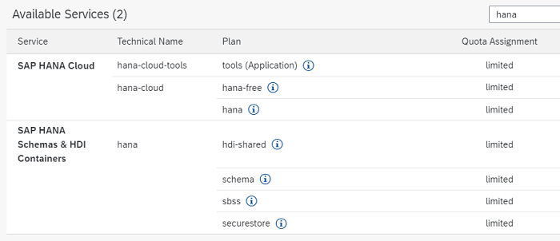
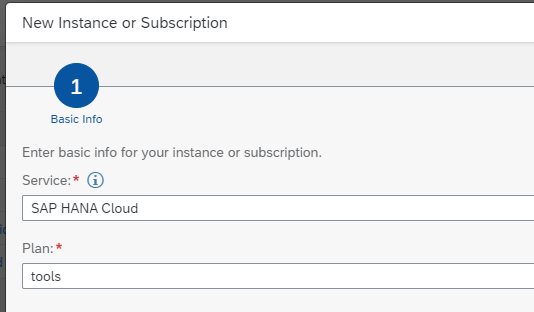
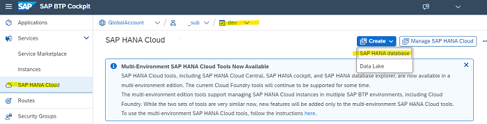
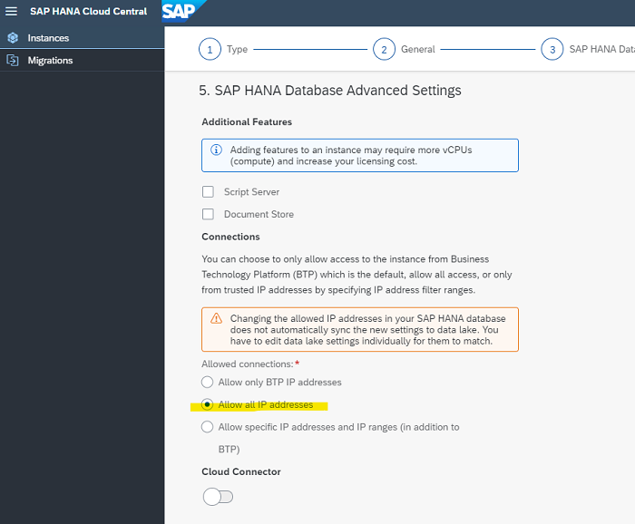
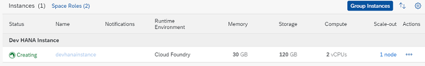
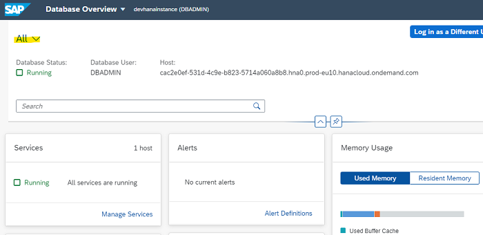
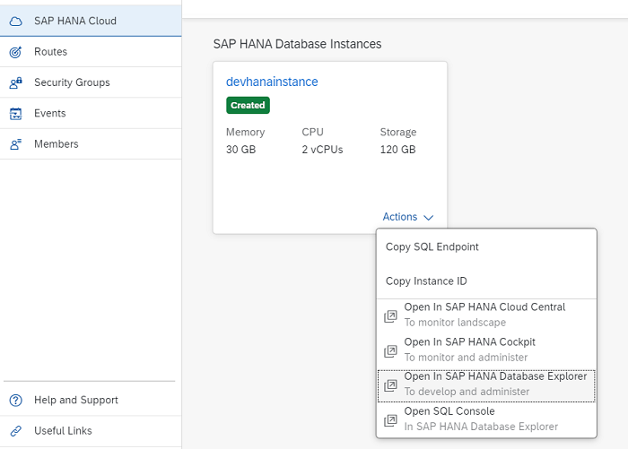
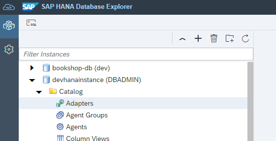

# Setup SAP HANA Cloud 

This step is only necessary if you want to deploy your database application in BTP or if you want to use a SAP HANA backend database for (hybrid) development.

For example, SAP Cloud Application Programming CAP comes with a built-in in-memory database, which you can use during development.

## Setup SAP HANA Cloud in BTP Cockpit

### Prerequisites

SAP BTP Enterprise or Trial Account with at least one Cloud Foundry enabled Subaccount and at least on Cloud Foundry Space.

### Check you Entitlements

1. Open your Global Account in BTP Cockpit.

2. Go to `Entitlements` --> `Service Assignments` and search for `hana`.

3. Check, that you are entitled to use SAP HANA Cloud: 

   - Service plans "relational-data-lake" and "hana-cloud-connection" will not be used in this tutorial.
   - hana-cloud-tools is used for Multi-Environment SAP HANA Cloud Tools.
   - Trial Accounts use the service plan hana-cloud-trial
   - hdi-shared, schema and securestore is required to deploy db schemas and db artifacts.

   

4. Go to `Entity Assigments`, click on `Select Entities` and select your Subaccount in which you want to deploy your application.

5. Check that your Subaccount is entitled for HANA Cloud. 

6. If not click on `Configure Entitlements` and then on `Add Service Plans`. 
   
7. Search for `hana` and add the required service plans for SAP HANA Cloud and SAP HANA Schemas & HDI Containers

8. Click on `Add Service Plans`.

### Add SAP HANA Cloud Tools to your Subaccount.

1. Open your Subaccount.

2. In the left pane of the subaccount, click `Instances and Subscription`.
   
3. Click on the blue `Create`button.

4. A popup opens. Select **Service: SAP HANA Cloud** and **Plan: tools**.

   

5. Click `Create`.

6. Go to `Instances and Subscription`. Wait until the Application is subscribed.

7. Go to `Security` --> `Users`. Click on your User.

8. Assign the Role Collection `SAP HANA Cloud Administrator` to your user.

9. Go to `Instances and Subscription`. Click on your Subscription "SAP HANA Cloud". A new window opens, your SAP HANA Administration Environment.

   

### Create HANA Database Instance

If you create your HANA Cloud instance from your Cloud Foundry Space, you get your CF Organization and Space pre-configured.

1. Open your Cloud Foundry Space, for example **dev**. 

2. Click SAP HANA Cloud in the left pane.

   

2. Click on the blue `Create Instance` button and select `SAP HANA Database`

3. Step 1: Choose Type `SAP HANA Cloud, SAP HANA Database`. Choose `Next Step`.

4. Step 2: Enter the Instance Name, for example **`devhanainstance`**.  
   Provide an Administrator Password for DBADMIN. Choose `Next Step`.

5. Step 3: Keep the default settings. Choose `Next Step`.

6. Step 4: Keep the default settings. Choose `Next Step`.

7. Step 6: If you want to use local development tools like VS Code, select "Allow all IP adresses". You can change this also later. Keep the other default settings. Choose `Review and Create`.

   

8. Step 5: Keep the default settings. No data lake. Choose `Next Step`.

9. Choose `Create Instance`. The creation will usually take over 10 minutes. 

   

   This page does not automatically update the status. You can choose the Refresh icon in the header bar to update the status manually.

10. After completion, the status will switch to green and "Running".

> **Note:** In a trial environment, your SAP HANA Cloud service instance will be automatically stopped overnight, according to the server region time zone. That means you need to restart your instance every day before you start working with it.

### Explore your SAP HANA instance

1. Open your Subaccount and select "Instance and Subscriptions" in the left navigation pane.

   A new instance for **SAP HANA Cloud** has been created. 

3. Click on the SAP HANA Cloud instance. This will open the **Instances** Overview.  

   
   
   Click on your new instance (for example devhanainstance). Check you have enough free ressources (which should be the case in a fresh instance with defaults).

4. Switch to your Cloud Foundry Space, where you installed HANA Cloud. For example "dev".
  
5. Click on "SAP HANA Cloud". Your SAP HANA Database Instances will be listed.

   

6. You will only see the devhanainstance, which should not contain much artifacts.
   In this exmple you see also an exmaple for a deployed HDI schema: "bookshop-db".

   

Congratulations! You just setup your first HANA instance.
