# Create a CAP application with Fiori UI in minutes


This tutorial guides you through the process of creating a CAP application, add a basic OData service definition, add a hana database for deployment, add a Fiori app and deploy it to SAP BTP Cloud Foundry Subaccount.

>Make sure the Prerequisites are fulfilled and a SAP HANA instance is in place.

### Create a Dev Space in SAP Business Application Studio

1. Open your Business Application Studio (BAS).

2. Click on **Create Dev Space** on the SAP Business Application Studio home page.

3. Select **Full-Stack Application** and provide a name of your choice (for example, "CAP") in the upper left corner. <br>
   Provide a name. This is the dev space stack you will use for modelling your new app. <br>

   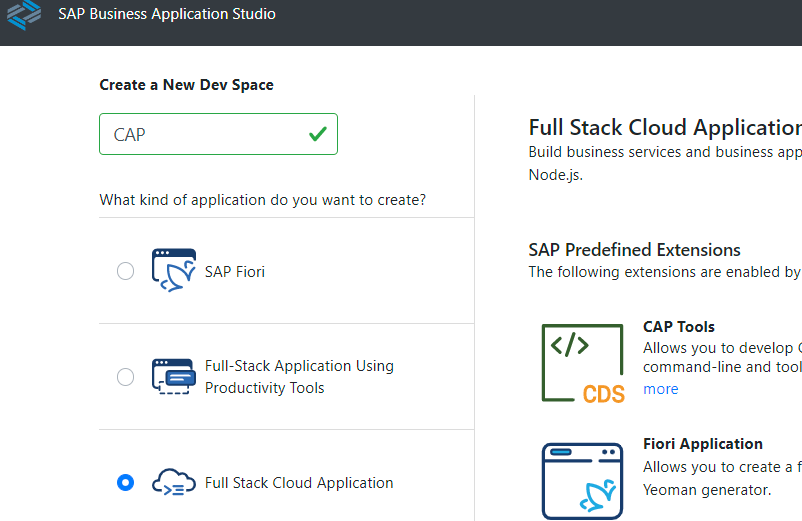

4. Click again **Create Dev Space** in the lower right corner. <br>
   You will be forwarded to an overview of your dev space(s). <br>
   It may take some time until the newly created dev space is started. <br>
   Once started the status changes from "STARTING" to "RUNNING” and the dev space name (in this case "CAP") will turn into a blue hyperlink.

5. Click on your Full Stack Cloud Application dev space link (e.g. named "CAP") to enter your space.

   After a few seconds ... you will see the **Home** page of your dev space. <br>


### Create a new project

1. Click on **Open Folder** in your Dev Space. Select `/home/user/projects/`.

   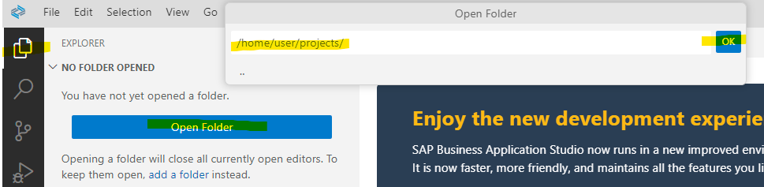

2. You can create a new CAP project either "from template" or via "command line". This tutorial uses command line.

   Create a new project from command line:

   - In the menu bar, select "Terminal" --> "New Terminal".
   - Make sure you are in your projects root folder: `/home/user/projects/`.
   - In the terminal type 
      
      ```
      cds init bookshop
      ```

      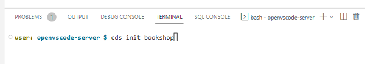

   The **bookshop** project will be created.

3. Change the root directory of your terminal bash. 

   ```
   cd bookshop
   ```

4. Create a basic data model with sample data and a service.

   ```
   cds add samples
   ```

   Optional: Explore the generated files in bookshop/db and bookshop/srv

5. For the production database, use SAP managed HANA database. It is important to add "--for production", otherwise CAP will not use its built-in in-memory database SQLite anymore in your development environment.

   ```
   cds add hana --for production
   ```

6. Use Cloud MTA Build Tool for deployment to SAP BTP Cloud Foundry

   ```
   cds add mta
   ```

7. Install npm. Use the short version of `npm install`.

   ```
   npm i
   ```

8. Run your app with development profile.

   ```
   cds watch
   ```

9. Either start your browser via the link in the terminal log or use the link in the popup.

   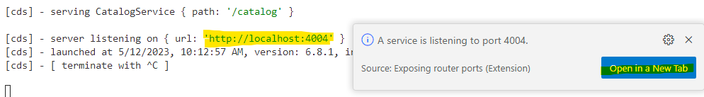

10. Explore the links and the data provided by your CAP service (4 links).

    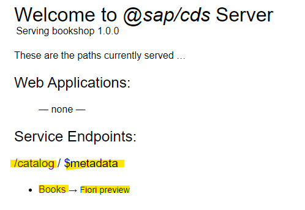

    Optional: Stop it in terminal with **CTRL + C**.

Your CAP OData service is up and running.


### Add SAP Managed Application Router for Fiori UI

The application router is used to serve static content, authenticate users, rewrite URLs, and forward or proxy requests to other micro services while propagating user information. This tutorial uses SAP Managed Application Router, which requires a subscription to SAP Build Work Zone service.

The application router is needed for CAP projects if you want to add Fiori apps.

1. Right-click on the file **`mta.yaml`** of your bookshop project. <br>
   Select "Create MTA Module from Template". 

2. A new template page opens, select the module template **"Approuter Configuration"** and click **Start**.

3. Keep "Managed Approuter" (important) and provide a name for the Approuter. Select "Yes", you plan to add a Fiori UI.

   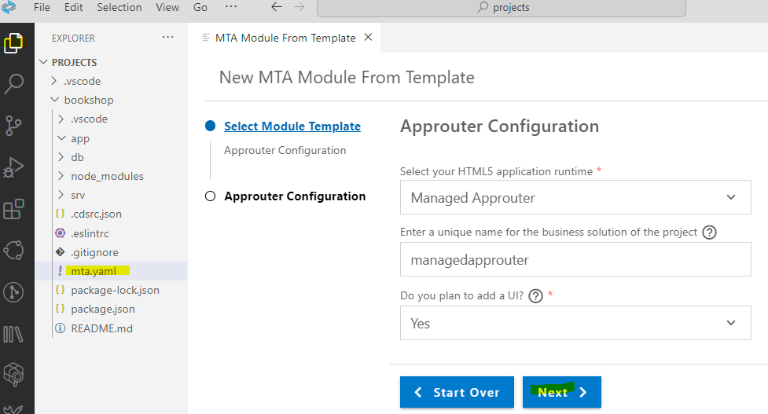
   
4. Click next, this will generate the approuter configuration in `mta.yaml` and you will get a `xs-security.json` file.  


### Add XSUAA configuration

1. Add **now** missing xsuaa dependencies. **Otherwise, deployment will fail**.
    
   **Note**: do not add xsuaa before you added the managed application router. 
   Otherwise, the cds xsuaa configurations will be incompatible with Fiori Tools.
   Do not add xsuaa **after** you created your first Fiori app.
   
   Type in terminal of your project root:

   ```
   cds add xsuaa --for production
   ```
   
   and run npm i to add the new packages:

   ```
   npm i
   ```

2. Add xsuaa does the following changes:
 
   - In file package.json it adds additional dependencies:

     ```json
     "dependencies": {
       "@sap/xssec": "^3",
       "passport": "^0"
     },
     ```
     
     and in production profile:
     
     ```json
     "auth": {
       "kind": "xsuaa"
     }
     ```
  
    - In file mta.yaml it adds name: uaa_bookshop:

      ```yaml
      requires:
        - name: bookshop-db
        - name: uaa_bookshop
      ``` 
  
      and in parameters a new config part.
    
      ```yaml
      parameters:
        path: ./xs-security.json
        service: xsuaa
        service-name: bookshop-xsuaa-service
        service-plan: application 
        config:
          xsappname: bookshop-${org}-${space}
          tenant-mode: dedicated
      ``` 

3. Optional run `cds watch`.


### Generate a Fiori app

1. Right-click on the file **`mta.yaml`** of your bookshop project. <br>
   Select "Create MTA Module from Template". 

2. A new template page opens, select **SAP Fiori application** and click **Start**.
   
   Optional: you can also start from command palette: Fiori: Open Application Generator.

3. Select template **List Report Page** and click "Next". 

4. In step "Data Source and Service Selection", select:
   - **Data Source:** Use a Local CAP Project
   - **Choose your CAP project:** bookshop
   - **OData service:** CatalogService (Node.js) 

   Click "Next".

5. Keep your **Main Entity** "*Books*". It is anyways the only one in the project.
   
   Keep **Yes** for "Automatically add table columns".

   Click "Next".

6. In step "Project Attributes", provide:

   - **Module name:** booksui
   - Application title: A Fiori UI for Books service (for example)
   - **Application namespace:** my
   - Keep the default setting for the rest, especially **Yes** for "Add deployment configuration to MTA project". 

   Click "Next".

7. In the next step, "Deployment Configuration", provide:

   - **Please choose the target:** Cloud Foundry
   - **Destination name:** Local CAP Project API (Instance Based Destination)

   Click "Finish". Wait until the files are generated...

8. Run `cds watch` in terminal and open your "local" preview. <br>
   You have a new entry in "Web Applications", your Fiori app `/booksui/webapp/index.html`. <br>
   Click on it. 

   In the Fiori app, click on **`Go`** to get the data. (this is how initial Fiori apps work)

   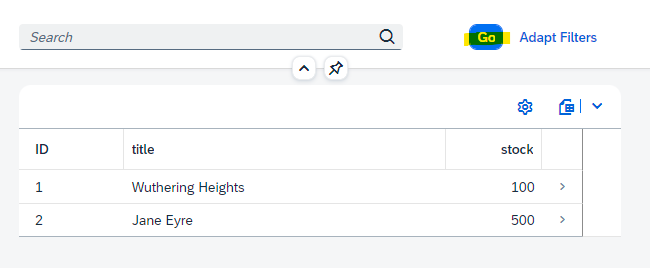

   Optional: stop cds watch.


### Deploy to Cloud Foundry

1. Right-click on file `mta.yaml` and select "*Build MTA Project*". 

   Alternatively use terminal:

   ```
   mbt build
   ```

2. Login to Cloud Foundry. Open Command Palette (`CTRL + Shift + P`) and search for "CF: Login to Cloud Foundry" and select it.


3. Important: Make sure you use the correct **API Endpoint** from your CF Subaccount. You find it in the Overview page of your Subaccount.

   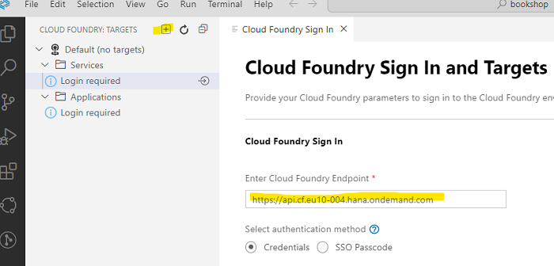

4. Enter username (email) and password or SSO Passcode.

5. Choose your Subaccount, where you have SAP HANA installed, and your preferred Space. e.g. "dev". <br>
  
   Tip: Sometimes CF login skips this view. Just run "CF: Login" again.

6. Choose **Apply**. 

7. Right-click on file `mta_archives/bookshop_1.0.0.mtar` and select "*Deploy MTA Archive*". 

   Alternatively use terminal:

   ```
   cf deploy mta_archives/bookshop_1.0.0.mtar
   ```

8. Go to your Cloud Foundry Subaccount. Check that deployment was successful. <br>
   Open the Cloud Foundry **Space**, where you deployed your application to. <br>

   Under Applications, you see 2 new entries. Don't start the bookshop-db-deployer. Its sole purpose is to deploy the bookshop schema with an HDI-Container.

   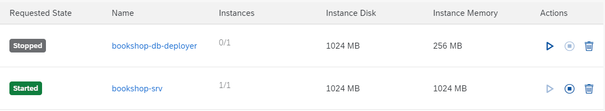

   You can open the service `bookshop-srv`. But it requires now authentication, which you can't provide in a plain browser.

   Navigate to "Instances". You see 4 new entries.

   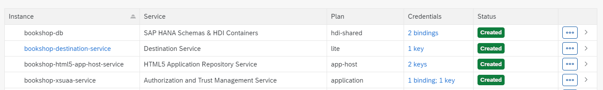


9. Run your Fiori app. Go to "HTML5 Applications" in the left navigation pane (which will only be there if you subscribed to SAP Build Work Zone). 

   Click on your app "booksui2":
 
   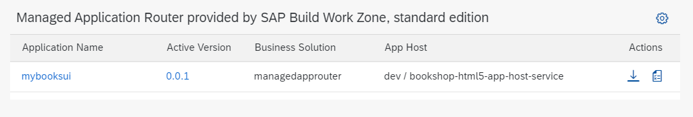

10. The app should look the same as in your dev environment.

    


Congratulations! You have just finished your first CAP app with an SAP Fiori UI!

### Appendix

A second option to create a new project is to run "new project from template" in BAS.
   
1. On the **Get Started** page click Click "Start from Template". 

   Hint: You can always reopen the page in the menue bar, select "Help" --> "Get Started.

2. Select **CAP Project** and click **Start**

3. Provide the project name **bookshop**. Keep the Node.js Runtime and leave all other options not checked..
   
4. **Finish**. Same result as `cds init`.
