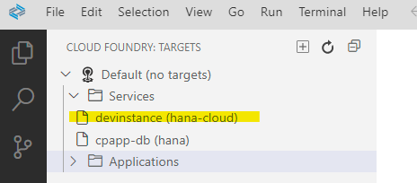
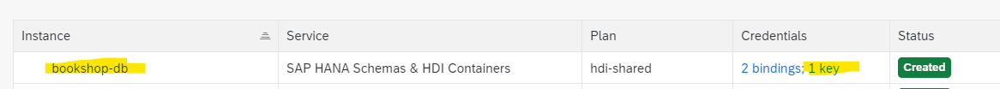
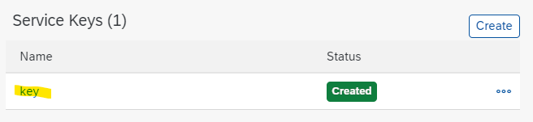

# Test your bookshop app with SAP HANA and hybrid profile


You can easily test your CAP application using a local database and mock ups. 
But at some point, you’re going to want to test with real cloud services. 

Of course, you can always deploy your application to the cloud, but with hybrid testing capabilities, you can stay in your local development environment and avoid the long turnaround times of cloud deployment. 
And you can selectively decide which services you want to use from the cloud.

Use the **cds bind** command to connect your application to services on the cloud. 
Start your application with the hybrid profile to use these service bindings.
You can switch between local mock configuration and cloud service configuration by simply setting or omitting the profile parameter.


### Configure Business Application Studio

1. Open your Dev Space.

2. Open **Cloud Foundry** in the activity bar or choose **View: Show Cloud Foundry** from Command Palette.

3. Click on **+** **Create Cloud Foundry Target**. 

4. Make sure you use the correct **API Endpoint** from your CF Subaccount. You find it in the Overview page of your Subaccount.

   

5. Enter username (email) and password or SSO Passcode.

6. Select **create a new target**

7. Choose your Subaccount, where you have SAP HANA installed, and your preferred Space. e.g. "dev".

8. **Apply**.  <br>
   Optional: Enter a name for the target.

9. You should see at least your HANA instance plus additional databases you have already deployed. <BR>
    Remember the name of your hana-cloud instance and remember where to find it in BAS.

    


### Add HANA for hybrid development to your project

1. Open the terminal of your bookshop project. 
   If you haven#t done so yet, add hana configuration to your project:

    ```shell
    cds add hana --for hybrid
    ```


2. This enhances `package.json` with:
    
   - If the HANA db dependency does not yet exist:

     ```json
     "dependencies": {
        "hdb": "^0.19.0"
     }
     ```
    
   - and the new hybrid profile:

     ```json
     "cds": {
        "requires": {
           "[hybrid]": {
                 "db": {
                 "kind": "hana-cloud"
                 }
           },
           "db": {
                 "kind": "sql"
           }
        }
      }

      ```
   
   - It also adds `db/src/.hdiconfig` and `db/undeploy.json` if this is the fist time you add a HANA dependency.


3. Run `npm install` in terminal to add the *hdb* driver dependency, if you have not done so yet.


### Connect to an existing HANA db

If you run through the previous tutorial, you already have a running HANA instance. You can reuse it and bind it to your dev space.

1. Check the name of your db instance in Cloud Foundry and the name of the key. 
   
   - Open your Subaccount and the CF Space, containing your hana db. 
   - Open Services --> Instances
   - Search for `bookshop-db` from previous tutorial. Thats the name of the instance.

     

   - Click into bookshop-db and note the name of the Service-Key: **`key`**

     


2. Bind your HANA db with your project in BAS terminal

   ```shell
   cds bind -2 bookshop-db:key
   ```
   The binding information is stored in the `.cdsrc-private.json` file of your project in the requires section.

   For more information, see `cds bind --help` in terminal and in [CAPire](https://cap.cloud.sap/docs/advanced/hybrid-testing).


3. Optional: You can check your binding using the `cds env` command. Run in terminal: 
   
   ```shell
   cds env get requires.db.credentials --profile hybrid --resolve-bindings
   ```


4. Run your app with hybrid profile. Run in terminal:
   
   ```shell
   cds watch --profile hybrid
   ```

5. Optional: If you want to test the difference between local and remote database, make a small change in the sample data file  `bookshop/db/data/my.bookshop-Books.csv`. For example change the stock quantity and explore the difference between `cds watch` and `cds watch --profile hybrid`.


### Deploy a new HANA database schema

If you have not yet deployed a HANA database to Cloud Foundry, you can create a new one.

1. Make sure that you’re logged in to your Cloud Foundry Subaccount and Space.

2. Make sure you have running HANA instance in your Cloud Foundry Subaccount. <br>
   You find the name either in the Cloud Foundry View of your project or in your BTP Cloud Foundry Subaccount under "Instances and Subscriptions" or in your Cloud Foundry Space under "SAP HANA Cloud".

   In this example we used the HANA instance name **devhanainstance**.

3. Deploy your project schema and data. In terminal, run:

   ```Shell
   cds deploy --to hana --profile hybrid
   ```
   
   Optional: Explore the log.

      

4. Run your app with hybrid profile. Run in terminal:
   
   ```shell
   cds watch --profile hybrid
   ```

   Explore the log:

   ```Shell
   [cds] - connect to db > hana {  ...  }
   [cds] - serving CatalogService { path: '/browse', impl: 'srv/cat-service.js' }
   [cds] - server listening on { url: 'http://localhost:4004' }
   [cds] - [ terminate with ^C ]
   ```

5. Note: Your in-memory configuration still works. Run `cds watch` with uses SQLite per default. <br>

Congratulations! You have setup successfully your hybrid development scenario.

