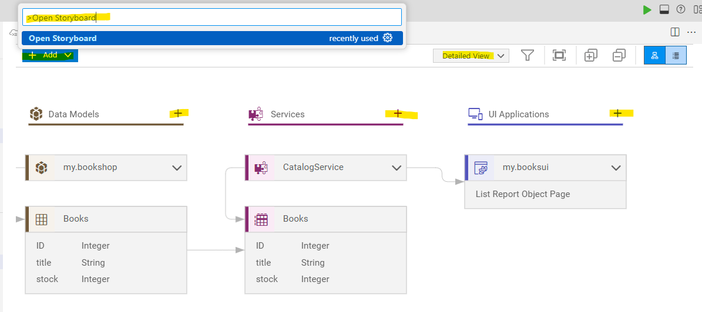
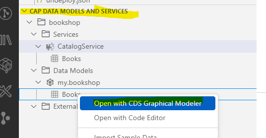
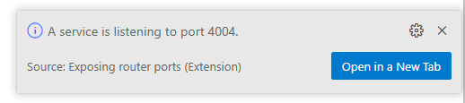
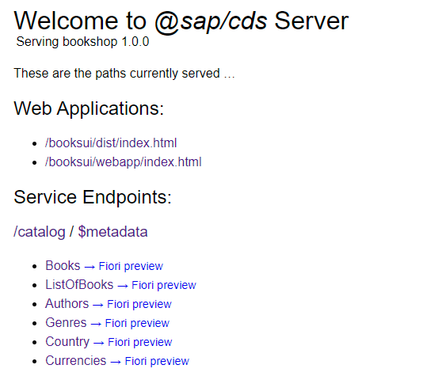
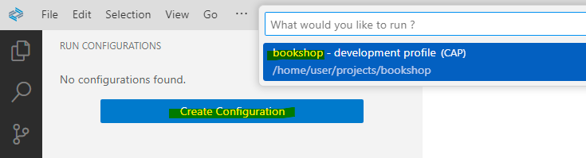
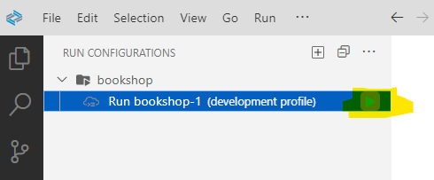
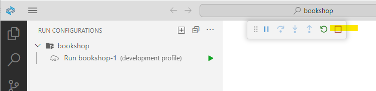
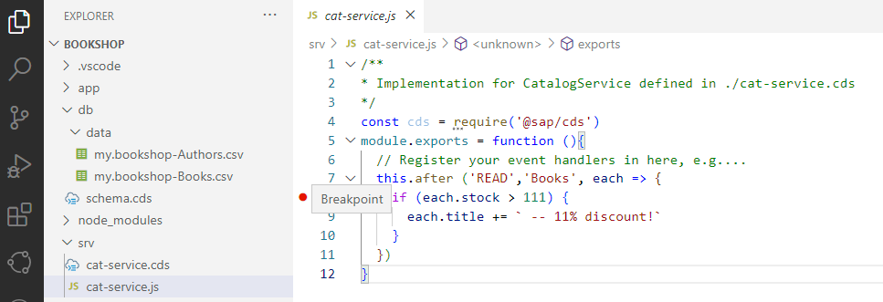
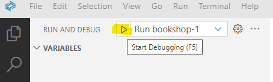
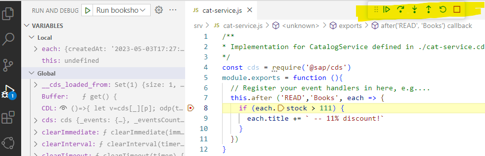

# Extend your bookshop app

So far your bookshop application is quite basic. The following steps guide you through the process of extending your bookshop application.


### Open your bookshop project

1. Open your Full Stack Cloud Application Dev Space to enter your space.
  
2. Open the bookshop folder from menu bar: "File" --> "Open Folder" --> `/home/user/projects/bookshop/`

3. You see the folders for 3 main entities of a CAP Project:

   - **db** for domain models, containing `/db/data-model.cds` and sample data `/db/data/my.bookshop-Books.csv`
   - **srv** for services, containing `/srv/cat-service.cds`
   - **app** for the UIs, containing `/apps/booksui`


4. Optional: Open the View "**CAP Data Models and Services**" in your BAS Explorer. It provides a dedicated CAP view on your project.
   

5. Open Storyboard. Open in BAS menu bar: "View" --> "Command Palette" and type **Open Storyboard**.

   Select your project path and select "Detailed View" in Storyboard. Explore the Storyboard.

   

   You can also create new project artifacts from here.

6. Click on  **my.bookshop** table and select **Open in Graphical Modeler**. 

   

   You can extend and change your data model here. But will use the text editor in this tutorial.


### Extend your data model

This tutorial uses the classic text editor and checks the result in Storyboard.

1. In the `db` folder, click on `data-model.cds`.

2. Extend your data model.

   Copy the following code and replace your existing data model.

   ```sql
   /** using predefined @sap/cds/common */
   using { Currency, managed, sap } from '@sap/cds/common';
   /** namespace */
   namespace my.bookshop;
   /** Books table*/
   entity Books : managed {
     key ID : Integer;
     title  : localized String(111);
     descr  : localized String(1111);
     author : Association to Authors;
     genre  : Association to Genres;
     stock  : Integer;
     price  : Decimal(9,2);
     currency : Currency;
   }
   /** Authors table*/
   entity Authors : managed {
     key ID : Integer;
     name   : String(111);
     dateOfBirth  : Date;
     dateOfDeath  : Date;
     placeOfBirth : String;
     placeOfDeath : String;
     books  : Association to many Books on books.author = $self;
   }
   /** Hierarchically organized Code List for Genres */
   entity Genres : sap.common.CodeList {
     key ID   : Integer;
     parent   : Association to Genres;
     children : Composition of many Genres on children.parent = $self;
   }
   ```

  For more information about , explore SAP CAPire documentation:

   - [CAPire - Domain Modeling](https://cap.cloud.sap/docs/guides/domain-modeling)
   - [CAPire - Common Types and Aspects](https://cap.cloud.sap/docs/cds/common#why-use-sap-cds-common)
   - [CAPire - Associations, relationships](https://cap.cloud.sap/docs/guides/domain-modeling#associations)
   - [CAPire - Common Code Lists](https://cap.cloud.sap/docs/cds/common#code-lists)


### Extend your bookshop service

1. In the `srv` folder, open the file  `cat-service.cds`.

2. Populate the file with the following service definitions:

   ```javascript
   /** Using bookshop database model */
   using { my.bookshop as my } from '../db/data-model';
   /** Using predefined sap.common from CDS */
   using { sap.common.Countries };
   /** Filling sap.common with data */
   using from '@sap/cds-common-content';

   /** Define service. URL is <server>/catalog/<entity>  */
   service CatalogService {

       /** Extend Books Service with additional fields for UI*/
       extend my.Books with { genrename : String; }
       extend my.Books with { authorname : String; }

       /** Service for Books */
       @readonly entity Books as SELECT from my.Books { 
       *,
       author.name as authorname,
       genre.name as genrename,
       } 
       excluding { createdBy, modifiedBy };

       /** Derived Service  with reduced fields for UI */
       @readonly entity ListOfBooks as projection on Books
       excluding { descr };

       /** Service Authors */
       @readonly entity Authors as projection on my.Authors;

       /** Service Genres */
       @readonly entity Genres as projection on my.Genres;

       /** Service Country from sap.common */
       @readonly entity Country as projection on Countries;
    }
   ```

   **Hint:** You added Countries from sap.common here in the service, and Currencies in the data-model.


3. Add the missing content package @sap/cds-common-content from NPM. It provides pre-built data for the common entities Countries, Currencies, and Languages.

   ```shell
   npm add @sap/cds-common-content --save
   ```
      
   It adds an additional dependency to file package.json (and packacke-lock.json):
   
   ```json
   "dependencies": {
       (...)
       "@sap/cds-common-content": "^1.1.0",
       (...)
    },
   ```

4. Optional: Explore the changes in Storyboard.


### Add additional sample data

Add missing sample data. 

1. Download all sample data from the [cap/samples](https://github.com/SAP-samples/cloud-cap-samples/tree/main/bookshop/db/data) repository.

   ```shell
   sap.capire.bookshop-Authors.csv , rename to my.bookshop-Authors.csv
   sap.capire.bookshop-Books.csv , rename to my.bookshop-Books.csv
   sap.capire.bookshop-Genres.csv , rename to my.bookshop-Genres.csv
   ```
   
   Optional: Add sap.capire.bookshop-Books.texts.csv as my.bookshop-Books.texts.csv. 

   Note: Rename the namespace. It must have the same name and namespace as the data model entities.

2. Copy them into the project folder `/bookshop/db/data/`. Replace the old ones.

3. Optional: Explore the new content of the service with `cds watch` in terminal.


### Optional: Add custom event handler


1. In the `srv` folder, create a new file called `cat-service.js`. <br>
   (If asked if you want to allow the use of the ESLint library for validation, click **Allow**).

  
2. Populate the `cat-service.js` file with the following:

   ```JavaScript
   /**
   * Event handler for CatalogService defined in ./cat-service.cds
   */
   const cds = require('@sap/cds')
   module.exports = function (){
       // Register your event handlers in here, for example, ...
       this.after ('READ','Books', each => {
           if (each.stock > 111) {
               each.title += ` --for Sale!`
           }
       })
    }
   ```

3. Optional: Explore the changes in Storyboard.


### Test the application with build-in database

You can now run your application in the dev environment and it will implicitly use a build-in, in-memory database.

You will first add all required dependencies, and then create a "run configuration".

1. Add and install all required dependencies. <br>
   Make sure you in the `bookshop` root directory. Select **Terminal** in the menu bar and select **New Terminal**. <br>
   Run the following command:

   ```Shell
   npm install
   ```

2. Run the following command in terminal:

   ```Shell
   cds watch
   ```

3. Check the terminal log. There is a log entry like `[cds] - server listening on { url: 'http://localhost:4004' }`. 
   
4. Click this link or the link provided in the popup

   

5. Explore the result:

   


### Optional: Use run configurations

1. From the left side menu, open the **Run Configurations** view. <br>
   Alternatively you can open it in Command Palette. Type: "View: Open Run Configurations".
   

2. Click **Create Configurations** at the top of the view to add a new configuration.

   

3. Select `bookshop (development profile)` as the runnable application from the command palette prompt.

4. Hit `Enter` to use the default name for the configuration. 
   A new configuration **Run bookshop-1** is added to the run configuration tree.

5. Click the right green arrow on the right of the configuration name to run the application.

   

6. A popup appears, click **Open in New Tab**. 
   The application opens in the browser. 
   Unlike using *cds watch* there is no link provided in the log.

7. Stop your application.

   

### Optional: Debug your application

You can also debug your application with the **Run and Debug** view. 

1. Place a breakpoint in the function in the `cat-service.js` file. Click into the break line.

   

2. Open the "Run and Debug" view from the BAS activity bar or open Command Palette and type **View: Show Run and Debug**.

3. Start Debugging (F5).

     

4. Open the web page of the app and click on "Books". The application should not execute.

5. Switch back to your BAS. The app execution has stopped at the break line. <br>
   You have now the typical debug options.

   

6. Don't forget to stop the app when done. Remove the breakpoint.


Congratulations! You have finished this tutorial!

