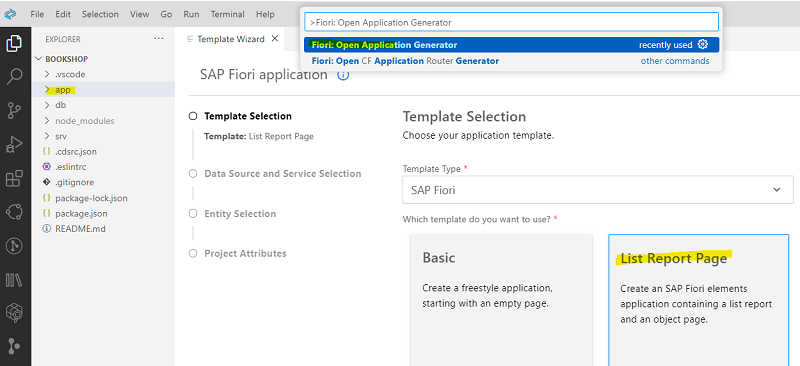
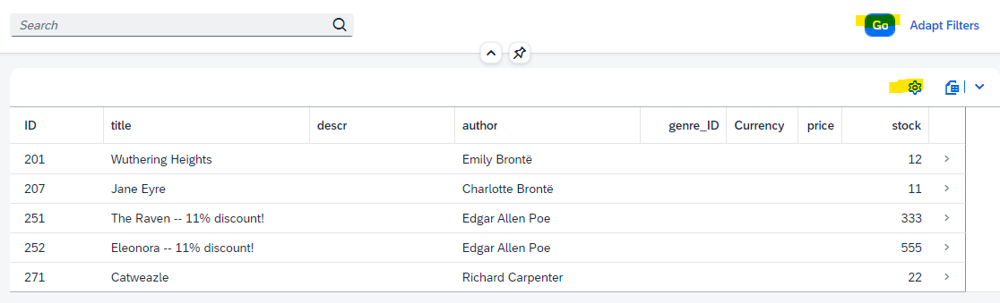
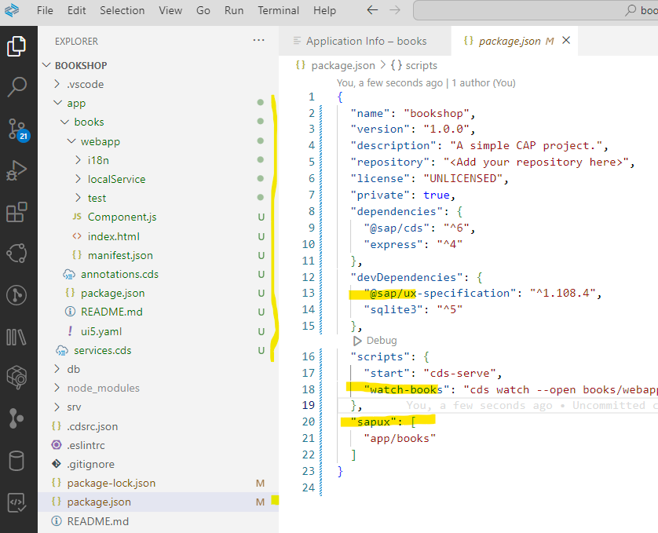
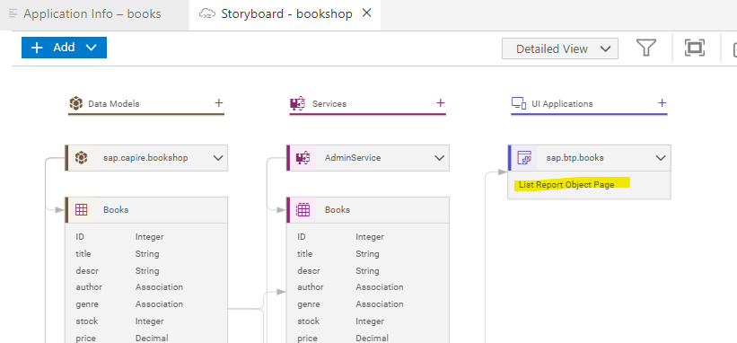

# Delete or create a Fiori app

### Optional: Delete old Fiori application

If you want to delete a Fiori app, for example to create a new one from scratch, always **use Fiori Tools to delete!**.

1. In BAS command palette (Ctrl + Shift + P) open "**Fiori: Delete Application from CAP Project**"

2. Click **Yes** in confirmation popup.

3. The app-folder will be deleted.

### Optional: Create an new Fiori List Report Page

If you deleted your Fiori app, you need to create a new Fiori app.

You can also add additional Fiori apps in the same CAP project.

1. Open your Dev Space and your project "bookshop". 

2. Open folder **app** and open Command Palette. Type `Fiori: Open Application Generator`.

3. In Fiori Application Generator, select the template **List Report Page**.

   

4. For **Data Source**, select "Use a Local CAP Project".
   
   - Choose "bookshop" as CAP project.
   - Choose CatalogService as OData Service.

5. Choose "Books" as main entity and "none" as Navigation entity. 

   Choose "Yes" to add automatically table columns.

6. Name the module. For example use, name: **books** and leave namespace empty.

7. Choose **Finish**. The application will be generated, the Application Information page will show up, when done. You can reopen it with Command Palette `Fiori: Open Application Info`.

8. Click "Preview Application" on your Application Information.  

   This starts cds watch and adds the path to the Fiori web app. 

   As an alternative you can start "cds watch" in terminal and navigate to the web app.  

   Click **Go** to see the data. Explore the app.

   

9. Explore you project. A Fiori elements app has been added and some project configurations have changed.

   

10. Optional: Commit and push to your git repo.

11. Explore your story board. Open with Command Palette: "Open Storyboard"

    

Congratulations! You have finished this tutorial!

