# Extend your Fiori app booksui

CAP provides out-of-the-box support for SAP Fiori elements front ends.

This guide explains how to extend your SAP Fiori elements app, how to add SAP Fiori elements annotations, and more.

### Using Application Modeler with List Report

1. Open **Fiori Application Modeler** Page Map from storyboard, from the BAS activity bar or from command palette. 

   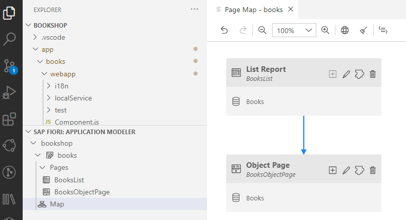

   >Tip: Optional: you can generate this additional Explorer section per dragging the Fiori App Modeler View from the activity bar and dropping it into the Explorer view.

2. Click on "Configure Page" in the **List Report**. 

3. Choose "Table" and search for **"Initial Load"** in the detail page. Set it to **Enabled**.

   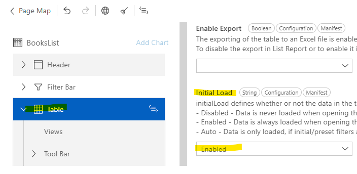

4. Open List Page --> Table --> Columns. Click on **+**.
   Choose "Add Basic Colums". 

   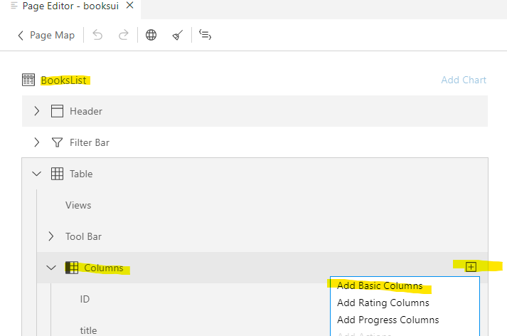
   
5. Select price, stock and currency_code.
   Choose "Add".

   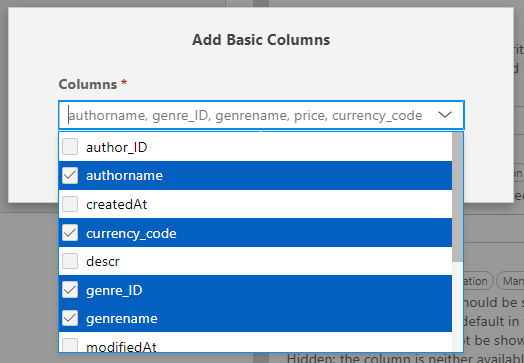

6. Rearrange the columns per drag and drop. Explore the result. 

7. Optional: If you accidentially added the huge descr field, you can delete it or also hide it here.

   Click on the UI.DataField **descr**. Set "Availability" to **Hidden** . 
   You see, the changes will be done in manifest.json.

   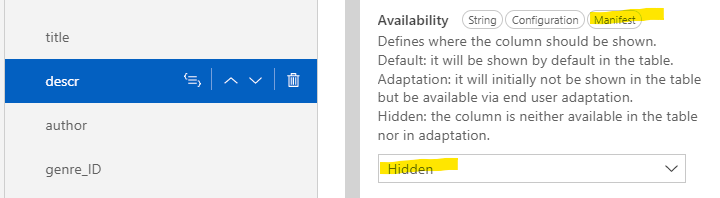

   Using git, you can also track the changes in manifest.json.
 
   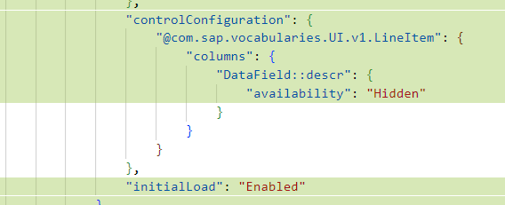

   A different to eliminate "descr" is, to use a different CDS service without the descr field, for example ListOfBooks service.
   
8. Add **additional filter**. 
   Open the Page Map --> Filter Bar and click the **+** icon in Filter Fields.

   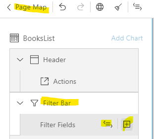

9. Select the filters, for exmple: **"currency_code"** and **"genre_id"**. Explore the result.

   Optional: The small *Code* icon opens the corresponding source file and shows the changes in source code.

### Using Application Modeler with Object Page

1. Open **Fiori Application Modeler** Page Map from storyboard, from the activity bar or from command palette. Click on "Configure Page" in the **Object Page**. 

2. Click on **Header**. Change some elements.
   
3. **Set Header** --> **Title** to `authorname`. Select the "Edit in Source Code" icon to see the changes in your code.

4. **Set Header** --> **Icon URL** to `sap-icon://person-placeholder`. 
   
   Optional: Explore more icons on [Icon Explorer](https://sapui5.hana.ondemand.com/sdk/test-resources/sap/m/demokit/iconExplorer/webapp/index.html). 
   Choose icons from "Sap Icons". 
   They work out of the box.

5. On BooksObjectPage, select **Section -->  General Information --> Form --> Fields**.

   - Change the **Label** to `Description`. De-focus the text input field and the changes will apply. 
   - Optional: You can also add it to app/books/webapp/i18n/i18n.properties by clicking the small **world icon** in the text input field.

6. Add additional fields. Click on the **+** icon.
   
   - Select **Add Basic Fields**.
   - Select additional fields you want to see.

     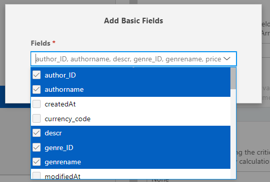

    - Select **Add**.
    - Explore the results.

7. On BooksObjectPage, select **Section**. 
   - Click on the **+** icon and select **Add Form Section**
   - Label it "Details about the author" and select **Add**.
   
8. On BooksObjectPage, select **Section -->  Details about... --> Form --> Fields**.
   - Click on the **+** icon and select **Add Basic Fields**
   - Select the fields you are interested in.
     
     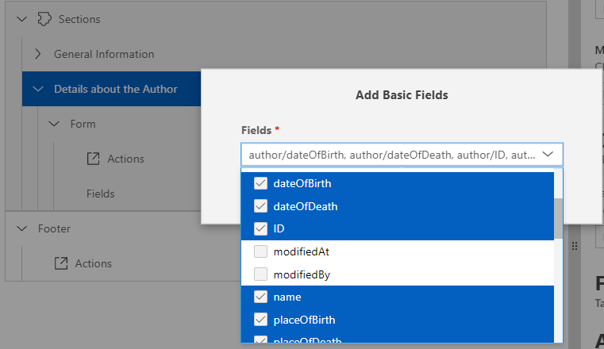

   - Choose **Add**.
   - Explore the results.

9. Re-arrange the fields per drag&drop. Explore the results.

   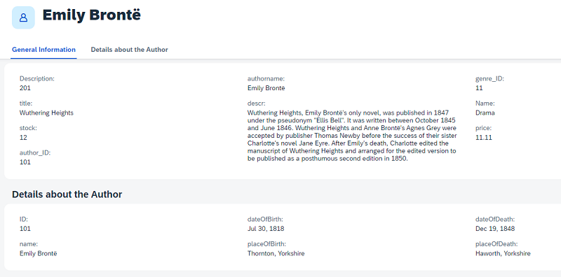

### Using Guided Development with Object Page

SAP Fiori Tools **Guided Development** extension provides access to how-to guides and tutorials that can help you add a feature to your SAP Fiori elements application.

It combines guidance and help with code generation.

In this scenario, you want to add an additional **Section** to the Object Page.

1. Open the Command Palette using CTRL + Shift + P and type: Guided Development.

   Select **Fiori: Open Guided Development**.

2. Enter `add new section` in the search box.

   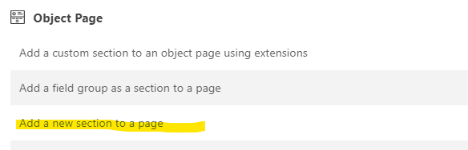
   
3. Select "Add a new section to a page". 
   
   - You get a short description what the guide does and the steps required.
   - Click **Start Guide**.

4. Provide the information for **Service and Entity Parameters**:

   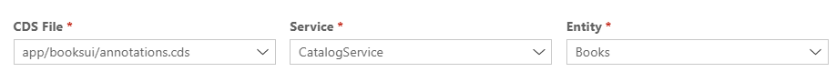

5. Provide **New Section Parameters** and preview the changes it will make to the **annotations.cds** file of your fiori app.  

   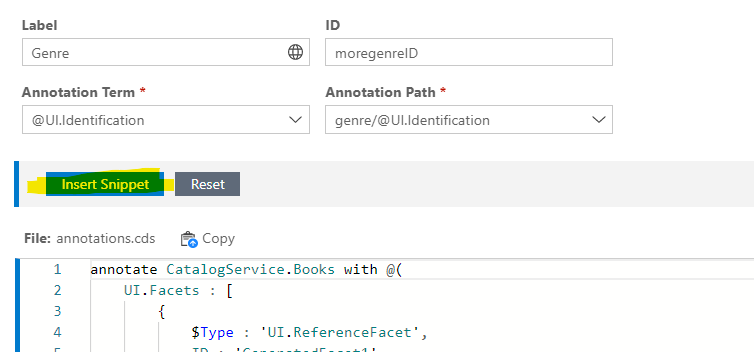

6. Select **Insert Snippet**. 

7. The file `app/books/annotations.cds` open sto the side. 
   - Explore your new annotations.
   - Explore the result in your app

   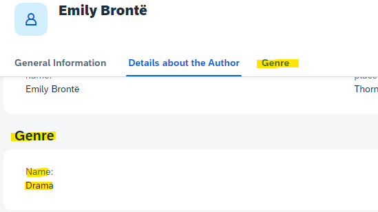

Congratulations, you finished this tutorial.

