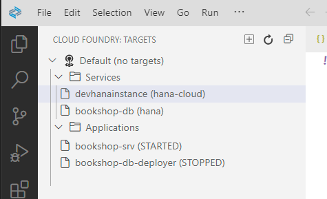
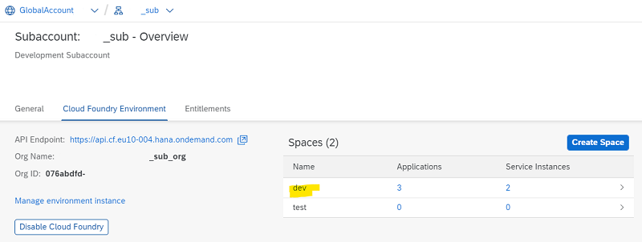
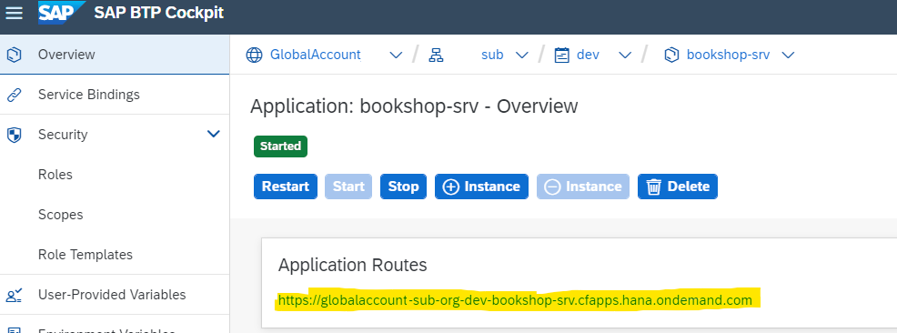
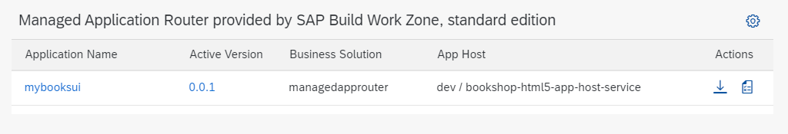
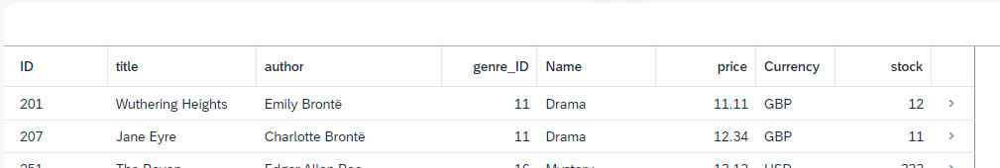
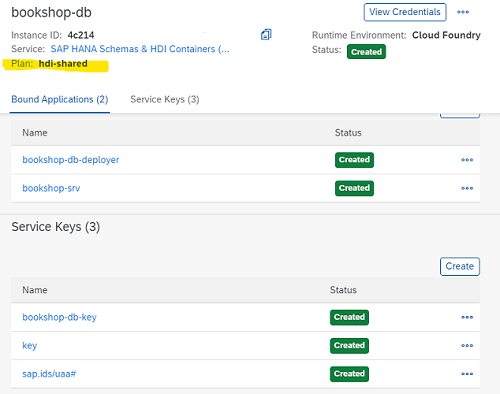
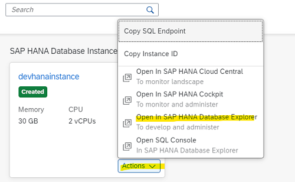
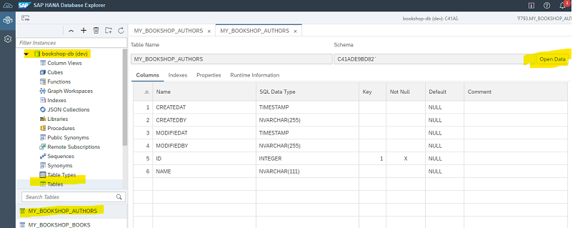

# Deploy bookshop to BTP Cloud Foundry 


After you extended your bookshop application, you are ready to deploy it to BTP **for production**. <br>
If you have already done the first bookshop tutorial, where you created the app from scratch, you can skip some steps.

The essential steps are:

- Optional: Freeze dependencies
- Build
- Deploy to Cloud 


### Configure Business Application Studio

1. Open your Dev Space.

2. Open **Cloud Foundry** in the activity bar or choose **View: Show Cloud Foundry** from Command Palette.

3. Click on **+** **Create Cloud Foundry Target**. 

4. Make sure you use the correct **API Endpoint** from your CF Subaccount. You find it in the Overview page of your Subaccount.

   

5. Enter username (email) and password or SSO Passcode.

6. Select **create a new target**

7. Choose your Subaccount, where you have SAP HANA installed, and your preferred Space. e.g. "dev".

8. Choose **Apply**.

9. Optional: Enter a name for the target.

10. You should see at least your HANA instance plus additional databases you might have already deployed. <BR>
    Remember the name of your hana-cloud instance and remember where to find it in BAS.

    


### Add HANA for production to your project

1. Open the terminal of your bookshop project. 
   First, check the version of installed CAP development kit `@sap/cds-dk`.

   ```Shell
   npm outdated           #> check whether @sap/cds is listed
   npm i @sap/cds         #> if necessary
   ```

   or with global parameter

   ```Shell
   npm -g outdated           #> check whether @sap/cds is listed
   npm i -g @sap/cds         #> if necessary
   ```

   Optional: You can also showk the version of MTA Build Tool in terminal: `mbt -v` and Cloud Foundry CLI `cf-v` 

2. For production, you use SAP managed HANA database. Run in terminal:

    ```shell
    cds add hana --for production
    ```


3. This adds, if not done so already in the hybrid development tutorial, `db/src/.hdiconfig`, `db/undeploy.json` and enhances `package.json` with:
    
   ```json
   "dependencies": {
      "hdb": "^0.19.0"
   }
   ```
    
   it adds a `[production]` profile:

   ```json
   "cds": {
      "requires": {
         "[hybrid]": {
         "db": {
            "kind": "hana-cloud"
         }
         },
         "db": {
         "kind": "sql"
         },
         "[production]": {
         "db": {
            "kind": "hana-cloud"
         }
         }
      }
   }

   ```

   and an empty local **`.env`** configuration for [Cloud Foundry](https://sap.github.io/cloud-sdk/docs/js/guides/bas#case-2-connection-to-cloud-systems), which you don't need for this tuorial:

   ```Shell
   VCAP_SERVICES={}
   ```

4. Run `npm install` in terminal to add the *hdb* driver dependency, if you haven#t so already.

5. You will use Cloud MTA Build Tool to execute the deployment. 
   The modules and services are configured in an mta.yaml deployment descriptor file, which you generate with:

   ```Shell
   cds add mta
   ```
   
   Explore the **mta.yaml** in root folder.


6. Optional: Freeze dependencies. Deployed applications should freeze all their dependencies, including transient ones. 
   You can leave this out in this tutorial.  
   The command to create a package-lock.json file would be: `npm update --package-lock-only` .

7. Install dependencies and optional, build your application. Explore the log:

   ```Shell
   npm i
   ```
   
   ```Shell
   cds build --production
   ```

8. Assemble with **mbt**.

   ```Shell
   mbt build -t ./
   ```

   
9. Deploy with **Cloud Foundry CLI**. Make sure, you are logged-in to BTP Cloud Foundry.

   ```Shell
   cf deploy bookshop_1.0.0.mtar
   ```

   As an alternative, you can also right-click on bookshop_1.0.0.mtar and select "Deploy MTA Archive".
   
10. Explorer your new entities in BTP via the Cloud Foundry View in BAS:

    

<br>

### Explore deployed app in BTP Cockpit

1. Enter SAP BTP Cockpit, your Subaccount and the Cloud Foundry Space, in which you deployed your app. <br>

   

2. You have 2 new applications deployed. ‘DB deployer’ application is stopped. Its sole purpose is to start the SAP HANA deployment.

   Click on the **bookshop-srv**. 

   

3. In the detail window, click on the **Application Routes** URL. This opens the service home page. 

   

   Note, the Fiori preview is missing. It is now in the HTML5 repository.


4. Click on **Books** of the service **browse**. 

   As you configured authentication for this service you cannot run the service directly from a browser anymore.  

   You can set the authentication for testing to `"dummy"` (https://cap.cloud.sap/docs/node.js/authentication#dummy)

5. Go to Global Account --> Subaccount --> HTML5 Applications.

   Start your new Fiori app `mybooksui`. 
   
   

   It should look the same as in dev-environment.

   
   

5. Go to "Services" --> Instances in your CF Space. You see, you generated a new HANA "instance" **bookshop-db** with the service plan **hdi-shared**. 

   If you have done the hybrid testing scenario, you see you added new **bindings** and **keys**.
   Click into the instance and open the detail page. You see the bound applications and service keys:

   

6. In your Cloud Foundry Space, navigate to **SAP HANA Cloud**. Click on Action and "Open in SAP HANA Database Explorer". 

   

7. The Database Explorer opens. Add a new instance of type **HDI Container** to Database Explorer. 
   If you have a connection from hybrid testing, this is not valid anymore. <br>
   Open your bookshop-db schema, select **Tables** and the table **MY_BOOKSHOP_AUTHORS**. Click **Open Data** to explore the data.

   


Congratulations! You have finished this tutorial!
