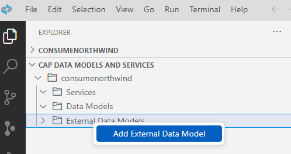
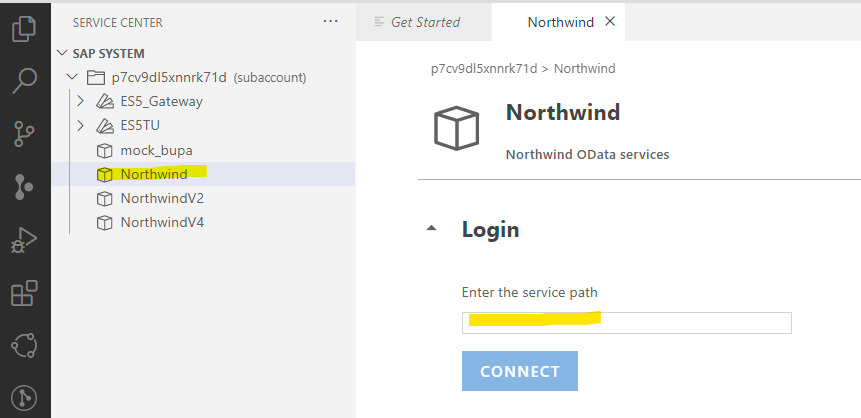
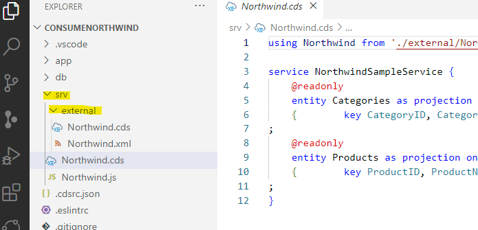
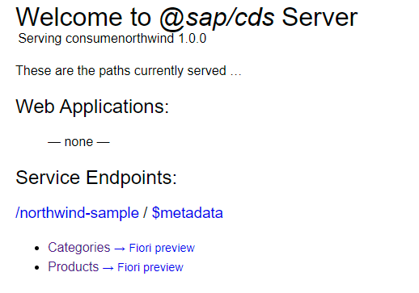
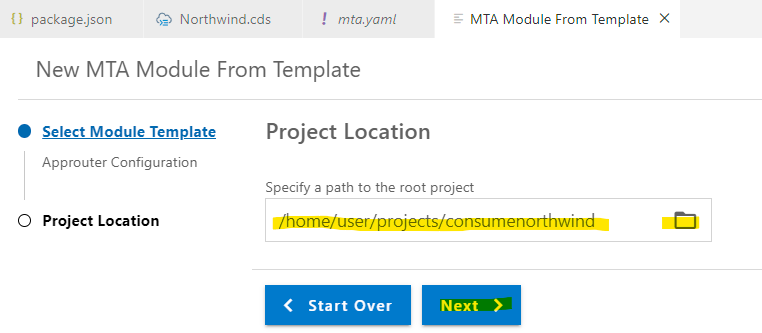
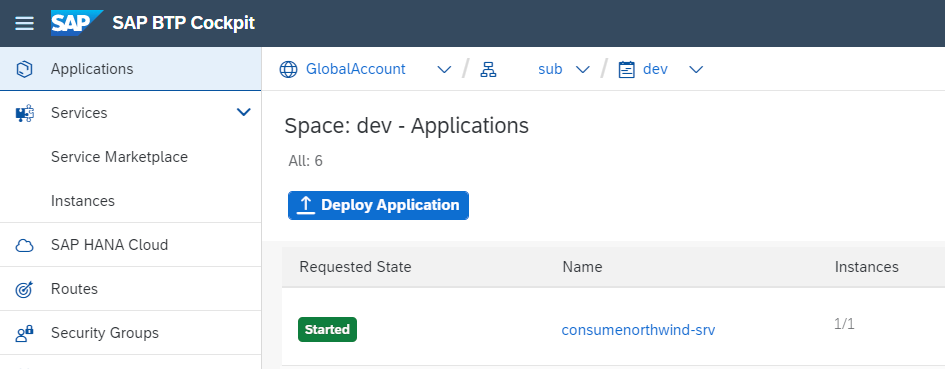

# Optional: Consume a remote service with CAP 

If you want to use data from other services, you need a connection to these remote services. 
As everything in CAP is a service, remote services are modeled the same way as internal services using CDS.


### Create a SAP BTP destination 

In this tutorial, you use a destination from BTP backend.

Open your BTP Cockpit, open your Subaccount and click **Destinations** in the left-handed navigation pane.

In order to create a destination, follow the documentation [Create a Northwind Destination](https://help.sap.com/docs/UI_ADD-ON_FOR_SAP_NETWEAVER_20/b4b7cba328bc480d9b373c7da9335537/3a16c7a2f1e944deb000db49e5ece6be.html?locale=en-US)


### Create a new application for remote service consumption

1. Open your full-stack Dev Space.

2. Create a new project. You use northwind database as a simple approach.

   ```shell
   cds init consumenorthwind
   ```
   
   Open your consumenorthwind folder or workspace.


3. Login to Cloud Foundry. Open in menue bar "View" --> "Command Palette" and select **CF: Login to Cloud Foundry**.

   Choose the right CF Endpoint, provide user and password (or SSO Passcode), Sign in and slect your CF Space.

4. Open the CAP View --> "External Data Models" -_> right-click and select "Add External Data Model".

   

4. The BAS View **Service Center** opens. 

   Open **SAP SYSTEM** and select your Northwind destination from your BTP Cloud Foundry Subaccount

   

5. You use the V4 Northwind service https://services.odata.org/v4/northwind/northwind.svc/.

   So enter `/v4/northwind/northwind.svc/` in the service path and click **CONNECT**.

   The service model of Northwind will be loaded. You can browse the entities.

   


6. Click **Service Actions** and select **Add Data Model to CAP Project**.

7. Select the project where you want to add the data model and choose **Yes** for "Do you want to add a sample service?"

   Select "Categories" and "Products" and click **Add**.

   You get an info popup: "The data model was added to /home/user/projects/consumenorthwind/."

8. Close the windows and see what has been created. 

   

   - The Northwind.xml metadata has been imported to  /srv/externa/ and has been converted to Northwind.cds. 
   - As you selected to add "Categories" and "Products" two service definitions have been created.
   - As this is an external service a custom event handler `Northwind.js` has been created.

   ```javascript
   const cds = require('@sap/cds');

   module.exports = async (srv) => 
   {        
      // Using CDS API      
      const Northwind = await cds.connect.to("Northwind"); 
         srv.on('READ', 'Categories', req => Northwind.run(req.query)); 
         srv.on('READ', 'Products', req => Northwind.run(req.query)); 
   }
   ```

9. You also got a new entry in "cds-requires" of packages.json.
   However the `"destination"` refers to the backend destination.

   For development add a "sandbox"-destination:

   ```json
   "cds": {
      "requires": {
         "Northwind": {
         "kind": "odata",
         "model": "srv/external/Northwind",
         "[production]": {
            "credentials": {
               "destination": "Northwind",
               "path": "/v4/northwind/northwind.svc/"
            }
         },
         "[sandbox]": {
            "credentials": {
               "url": "https://services.odata.org/V4/Northwind/Northwind.svc/"
            }
         }
         }
      }
   }
   ```

### Test your remote service

Time to test the new application

1. Run in terminal

   ```shell
   npm i
   ```

2. Add missing dependencies and packages.

   ```shell
   npm install @sap-cloud-sdk/http-client @sap-cloud-sdk/util
   ```

3. Run in terminal

   ```shell
   cds watch --profile sandbox
   ```

4. Check the results.

   

5. Select Categories. You get a lot of data, including the picture of the category. Remove this picture.

   In Northwind.cds, remove "Picture"
   
   ```javascript
   service NorthwindSampleService {
       @readonly
       entity Categories as projection on Northwind.Categories
       {        key CategoryID, CategoryName, Description, Picture     }    
   ;
   ```
   
   Check the result in your browser.


### Prepare for production

1. Create an mta.yaml for build and deployment information. Run in terminal

   ```shell
   cds add mta
   ```

2. Use an SAP managed application router.

   Right-click on mta.yaml and select **Create MTA Module from Template**. 

   As and alternative open View --> Command Palette and select "Create MTA Module from Template".

3. Select Approuter Configuration and click **Start >**.

4. Select your project location and click **Next**.

   

5. Choose a unique name, for example `consumenorthwindmapprouter` and "Yes" or "No" depending if you want to add a custom Fiori UI.

   Click **Finish** the mamaged approuter will be created.

6. Add now missing authentication dependencies

   ```shell
   cds add xsuaa --for production
   ```

7. You get 2 errors in BAS. One in `mta.yaml`.

   You have now 2 dependencies for authentication 
   (`cds add xsuaa` adds a additional `consumenorthwind-auth`, but does not generate it as an uaa-service is already there)

   ```yaml
   modules:
  - name: consumenorthwind-srv
    
    (...)

    requires:
      - name: consumenorthwind-auth
      - name: uaa_consumenorthwind
   ```

   In addition the "requires" definition for `consumenorthwind-destination-service` is missing. **Replace** the requires section with

   ```yaml
   modules:
   - name: consumenorthwind-srv
    
    (...)

    requires:
      - name: consumenorthwind-destination-service
      - name: uaa_consumenorthwind
   ```
   
8. Add the new npm packages from authentication. Run in terminal

   ```shell
   npm i
   ```

   3 packages will be added. This removes the error in package.json.
   
   
9. Change temporarily your authentication strategy in `package.json`, if you want to test your service in the backend. 

   Set
   
   ```json
   "[production]": {
        "auth": "xsuaa"
      }
   ```
   
   to

   ```json
   "[production]": {
        "auth": "dummy"
      }
   ```


### Build and deploy

1. Right-click your `mta.yaml` and select **Build MTA Project**

2. Right-click `mta_archives/consumenorthwind_1.0.0.mtar` and select **Deploy MTA Archive".

   >Note: The .mtar archive will be deployed to cour Cloud Foundry target from your CF login.

3. After deployment has finished, open your SAP BTP Cockpit and open your deployment target, Subaccount and CF Space.

4. Click on your new service `consumenorthwind-srv`.

   

5. Click on the link provided in **Application Routes**

6. On your service home page, click on Categories. Well done!

   ```json
   {
      "@odata.context": "$metadata#Categories",
      "value": [
           {
           "CategoryID": 1,
           "CategoryName": "Beverages",
           "Description": "Soft drinks, coffees, teas, beers, and ales"
           },
           {
           "CategoryID": 2,
           
           (...)
   ```


Congratulations! You have finished this tutorial!

